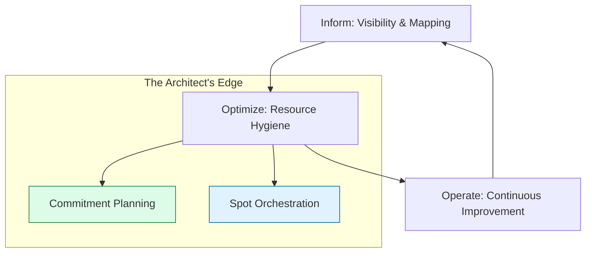

# 💰 FinOps Mastery: The Cloud Economist

> **"Listen up, Junior. In the Beginner phase, you learned how to read a bill. In Phase 3, you learn how to engineer the bill. High-level architecture isn't just about uptime—it's about unit economics."**

---

## 🧠 The Mental Model: The Cloud Economist

**The Junior Struggle**: "I built a high-availability cluster with triple redundancy across 6 regions! Why is my boss yelling at me about the $50,000 bill?"

**The Architect Solution**: You realize that cloud resources are like **Variable Utility Bills**:
- **On-Demand (The Pay-as-you-go Rate)**: The most expensive way to buy power.
- **Savings Plans (The Bulk Discount)**: Committing to a base level of usage to get 50% off.
- **Spot Instances (The Surplus Market)**: Buying "spare capacity" at 90% off, but knowing the power might be cut at any moment.
- **Unit Economics**: Instead of saying "We spent $10k," you say "It cost us $0.05 to process one user order."

---

## 🆚 Junior Way vs. Architect Way

| Feature | The Junior Way (Problematic) | The Architect Way (Strategic) |
|:---|:---|:---|
| **Architecture** | "Build it big so it doesn't fail" | **Right-sized & Elastic** |
| **Visibility** | Looking at the total monthly bill | **Cost-per-unit / Cost-per-team** |
| **Commitment** | Always using On-Demand | **Savings Plans & RI Portfolios** |
| **Efficiency** | Manual cleanup occasionally | **Cost-as-Code** (Infracost/Policies) |
| **Culture** | "Finance handles the money" | **Shared Accountability** |

---

## 🏗️ Visual: The FinOps Lifecycle

---

## 🗺️ Curriculum Path

### 🏗️ [Part 1: Cost Allocation](./01-Cost-Allocation/README.md)
*Junior, follow the money.* 
Tagging governance, showback vs. chargeback models, and mapping cloud spend to business units.

### 🔄 [Part 2: Optimization Strategies](./02-Optimization-Strategies/README.md)
*Cut the fat, keep the muscle.* 
Right-sizing instances, storage tiering (S3 Glacier), and cleaning up "zombie" resources.

### 📉 [Part 3: Reserved Capacity](./03-Reserved-Instances/README.md)
*The Broker's game.* 
Mastering Savings Plans, Reserved Instances (RI), and building a commitment portfolio.

### 🤖 [Part 4: Automation & FinOps-as-Code](./05-Automation/README.md)
*Build the cost guardrails.* 
Using Infracost in CI/CD, automated shutdown scripts, and setting up anomaly detection alerts.

---

## 🏆 Real-World DevOps Story: The $100k NAT Gateway Mistake

**The Scenario**: A Junior engineer deployed a new Kubernetes cluster and accidentally routed all internal traffic through a NAT Gateway instead of using VPC Endpoints.
**The Crisis**: Because NAT Gateways charge per GB processed, the bill spiked by **$100,000** in a single month of "free" internal data transfers. 
**The Fix**: Implemented **VPC Endpoints** (Interface/Gateway) which cost nearly $0 for internal traffic.
**The Lesson**: **Junior, architecture decisions ARE financial decisions. Know your data flow costs.**

---

## 🎤 Interview Preparation (FinOps)

1. **Q: Junior, what are 'Unit Economics' in the cloud?**
   - *A: It's the practice of measuring cloud spend against a business metric (e.g., Cost per Transaction) to determine if your architectural scaling is efficient.*

2. **Q: Explain 'Right-sizing'.**
   - *A: The process of matching instance types and sizes to your workload performance and capacity requirements at the lowest possible cost.*

3. **Q: What is the difference between a Savings Plan and a Reserved Instance?**
   - *A: **Savings Plans** offer flexibility across instance families and regions in exchange for a dollar-per-hour commitment. **Reserved Instances** are more rigid (specific type/region) but can sometimes offer higher discounts.*

4. **Q: What is a 'Zombie Resource'?**
   - *A: Resources that are running and costing money but providing no value (e.g., an unattached Elastic IP, a 2-year-old EBS snapshot, or an idle Load Balancer).*

5. **Q: Explain 'Showback' vs. 'Chargeback'.**
   - *A: **Showback** is "showing" a team how much they spent for awareness. **Chargeback** is actually "charging" that team's budget for their cloud usage.*

6. **Q: What are 'Spot Instances' and when should you NOT use them?**
   - *A: Spot instances are spare capacity at a huge discount. You should NOT use them for stateful databases or any workload that cannot handle a 2-minute termination notice.*

7. **Q: What is 'Tagging Governance'?**
   - *A: A policy that requires every resource to have specific metadata (e.g., `Owner`, `Project`, `CostCenter`) so costs can be accurately allocated.*

8. **Q: What does 'Infracost' do?**
   - *A: It's a tool that sits in your CI/CD pipeline and tells you exactly how much your monthly bill will change BEFORE you merge a Terraform/CloudFormation PR.*

9. **Q: Explain 'Cloud Storage Tiering'.**
   - *A: Moving data from 'Hot' storage (S3 Standard) to 'Cold' storage (S3 Glacier) based on how often it's accessed to save up to 90% on storage costs.*

10. **Q: Junior, how do you handle a 'Cost Anomaly'?**
    - *A: First, identify the service causing the spike via Cost Explorer. Second, find the specific resources using tags. Third, determine if it's a bug (e.g., infinite loop) or a valid business spike.*

---

## 📝 Knowledge Check

1. **Which pricing model offers up to 90% discount but can be reclaimed by the provider?**
   - [x] Spot Instances.

2. **Which metric is a sign of 'Good' FinOps?**
   - [x] Decreasing Cost per Unit.

3. **What is the main goal of 'Inform' phase in FinOps?**
   - [x] Visibility and Cost Allocation.

4. **True/False: You should always use the largest instance size to be safe.**
   - [x] **False**. (Waste of money; use right-sizing).

5. **Which tool helps predict costs in a Pull Request?**
   - [x] Infracost.

6. **What is an 'Error Budget' in FinOps?**
   - [x] Not a standard term, but usually refers to allowed 'Waste' before optimization is required.

7. **Which AWS service helps find idle resources?**
   - [x] Trusted Advisor.

8. **What happens to an unattached Elastic IP?**
   - [x] You are charged for it (to encourage you to release it).

9. **What is 'Data Transfer Out' (DTO)?**
   - [x] The cost of moving data from the cloud provider to the internet (often the most hidden cost).

10. **Which role is responsible for cloud costs in a FinOps culture?**
    - [x] Everyone (Shared Accountability).

---

## 🔗 Next Steps
Junior, you've mastered the books. You are now a High-Level Architect.
1. Return to: **[Phase 3 Hub](../README.md)** →
2. Graduation: **[Advanced Course](../../../README.md)** →

---
## 🧭 Additional Modules
- [04 Showback Chargeback](04-Showback-Chargeback/README.md)
- [06 Interview Questions and Quizzes](06-Interview-Questions-and-Quizzes/README.md)
- [07 Real Life Scenarios](07-Real-Life-Scenarios/README.md)
