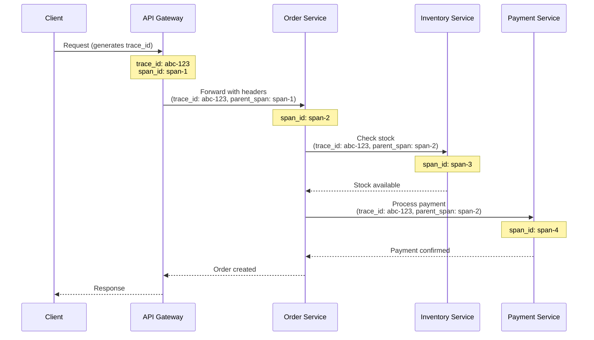
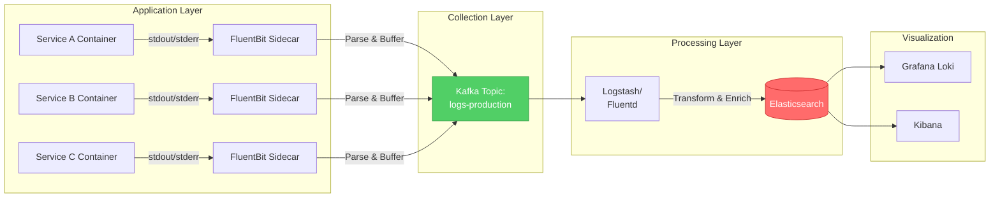
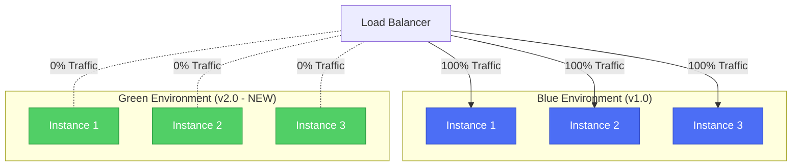
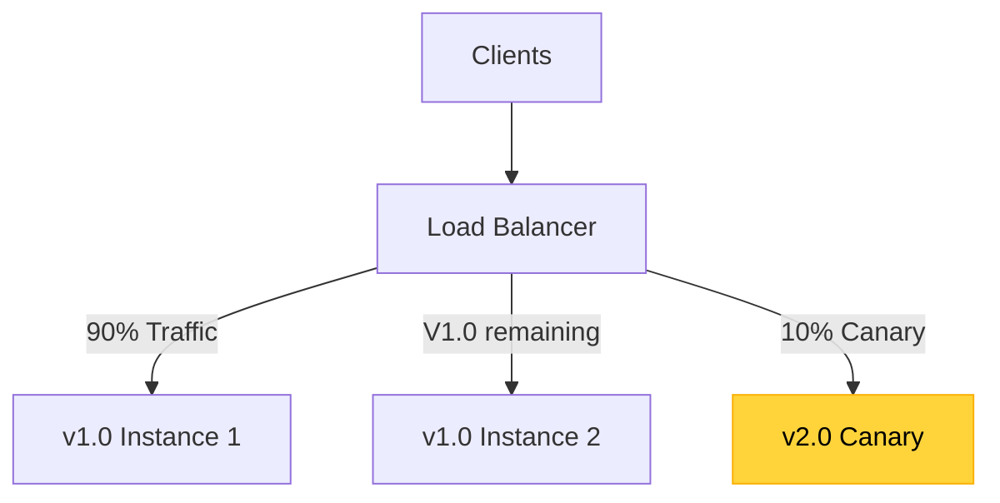
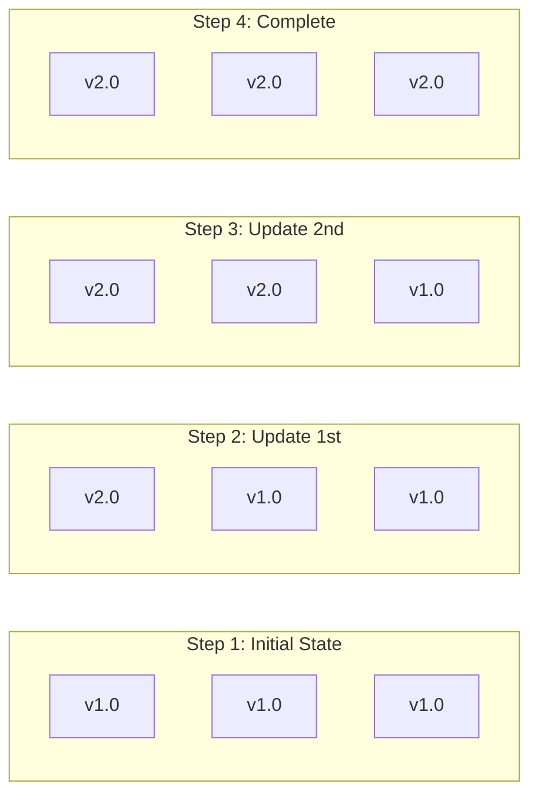
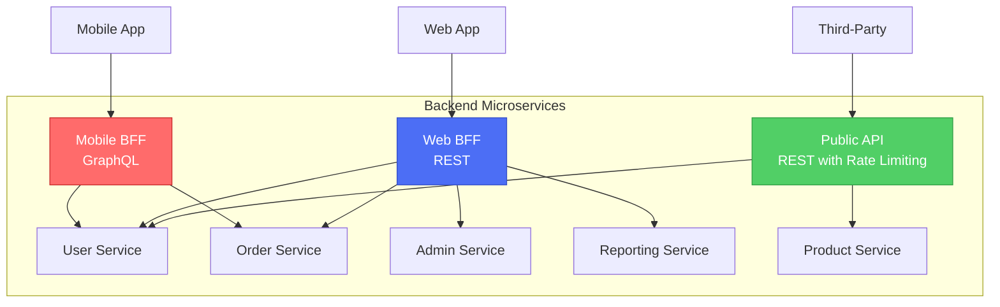
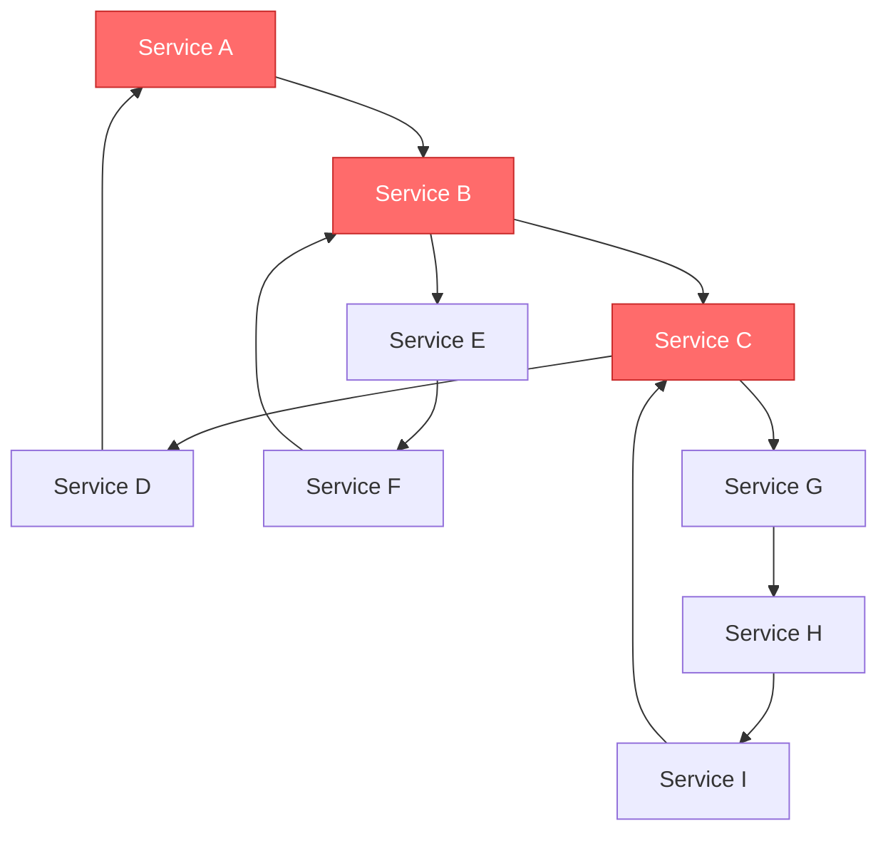

# Missing Sections for Advanced Microservices README  

**Note:** This file contains the remaining sections to be added to the main README.md

---

## 🔍 Observability

### Distributed Tracing

**Problem:** In microservices, a single request spans multiple services. How do you track a request's journey?

**Solution:** Distributed tracing with correlation IDs that flow through all services.

#### How Trace Context Propagation Works



**Key Concepts:**
- **Trace ID**: Unique identifier for entire request flow (`abc-123`)
- **Span ID**: Unique identifier for each service call (`span-1`, `span-2`, etc.)
- **Parent Span**: Links child spans to their parent

#### Implementation with Open Telemetry

**Go Service:**
```go
package main

import (
    "context"
    "go.opentelemetry.io/otel"
    "go.opentelemetry.io/otel/propagation"
    "go.opentelemetry.io/otel/trace"
)

var tracer = otel.Tracer("order-service")

func processOrder(w http.ResponseWriter, r *http.Request) {
    // Extract trace context from incoming request
    ctx := otel.GetTextMapPropagator().Extract(r.Context(), propagation.HeaderCarrier(r.Header))
    
    // Start a new span
    ctx, span := tracer.Start(ctx, "processOrder")
    defer span.End()
    
    // Add attributes to span
    span.SetAttributes(
        attribute.String("order.id", orderID),
        attribute.String("customer.id", customerID),
    )
    
    // Call another service with propagated context
    err := callInventoryService(ctx, orderID)
    if err != nil {
        span.RecordError(err)
        span.SetStatus(codes.Error, "inventory check failed")
        return
    }
    
    span.SetStatus(codes.Ok, "order processed")
}

func callInventoryService(ctx context.Context, orderID string) error {
    ctx, span := tracer.Start(ctx, "callInventoryService")
    defer span.End()
    
    req, _ := http.NewRequestWithContext(ctx, "POST", "http://inventory-service/reserve", body)
    
    // Inject trace context into outgoing request
    otel.GetTextMapPropagator().Inject(ctx, propagation.HeaderCarrier(req.Header))
    
    resp, err := http.DefaultClient.Do(req)
    return err
}
```

**Trace Visualization in Jaeger:**
```
trace_id: abc-123
├── span-1: API Gateway (100ms total)
    ├── span-2: Order Service (80ms)
        ├── span-3: Inventory Service (20ms)
        └── span-4: Payment Service (40ms)
```

---

### Log Aggreg ation

**Problem:** Logs scattered across hundreds of containers. How to search "all logs for trace_id abc-123"?

**Solution:** Centralized logging pipeline.



**FluentBit Configuration Example:**
```yaml
apiVersion: v1
kind: ConfigMap
metadata:
  name: fluent-bit-config
data:
  fluent-bit.conf: |
    [SERVICE]
        Flush        1
        Daemon       Off
        Log_Level    info
        Parsers_File parsers.conf

    [INPUT]
        Name              tail
        Path              /var/log/containers/*.log
        Parser            docker
        Tag               kube.*
        Refresh_Interval  5
        Mem_Buf_Limit     5MB
        Skip_Long_Lines   On

    [FILTER]
        Name                kubernetes
        Match               kube.*
        Kube_URL            https://kubernetes.default.svc:443
        Kube_Tag_Prefix     kube.var.log.containers.
        Merge_Log           On
        Keep_Log            Off
        K8S-Logging.Parser  On
        K8S-Logging.Exclude On

    [OUTPUT]
        Name  kafka
        Match *
        Brokers kafka-broker:9092
        Topics logs-production
```

**Structured Logging (JSON):**
```go
import "go.uber.org/zap"

logger, _ := zap.NewProduction()
defer logger.Sync()

logger.Info("order processed",
    zap.String("trace_id", traceID),
    zap.String("order_id", orderID),
    zap.Duration("duration", duration),
    zap.String("status", "success"),
)

// Output:
// {"level":"info","ts":1705690995.123,"msg":"order processed","trace_id":"abc-123","order_id":"ORD-456","duration":0.245,"status":"success"}
```

**Querying Logs by Trace ID:**
```json
// Elasticsearch Query
GET /logs-*/_search
{
  "query": {
    "match": {
      "trace_id": "abc-123"
    }
  },
  "sort": [
    { "@timestamp": "asc" }
  ]
}
```

---

### Metrics & Monitoring

**Three Pillars of Observability:**
1. **Logs**: What happened? (events)
2. **Metrics**: How much? (numbers over time)
3. **Traces**: Where did the request go? (distributed flow)

**Key Metrics for Microservices:**

**RED Method (for request-driven services):**
- **R**ate: Requests per second
- **E**rrors: Error rate (%)
- **D**uration: Latency (p50, p95, p99)

**USE Method (for resources):**
- **U**tilization: % resource used
- **S**aturation: Queue length
- **E**rrors: Error count

**Prometheus Metrics Example:**
```go
import (
    "github.com/prometheus/client_golang/prometheus"
    "github.com/prometheus/client_golang/prometheus/promauto"
)

var (
    httpRequestsTotal = promauto.NewCounterVec(
        prometheus.CounterOpts{
            Name: "http_requests_total",
            Help: "Total number of HTTP requests",
        },
        []string{"service", "method", "status"},
    )
    
    httpRequestDuration = promauto.NewHistogramVec(
        prometheus.HistogramOpts{
            Name:    "http_request_duration_seconds",
            Help:    "HTTP request latency",
            Buckets: prometheus.DefBuckets,
        },
        []string{"service", "method"},
    )
)

func metricsMiddleware(next http.Handler) http.Handler {
    return http.HandlerFunc(func(w http.ResponseWriter, r *http.Request) {
        start := time.Now()
        
        // Wrap response writer to capture status code
        wrapped := &responseWriter{ResponseWriter: w, statusCode: 200}
        
        next.ServeHTTP(wrapped, r)
        
        duration := time.Since(start).Seconds()
        
        httpRequestsTotal.WithLabelValues(
            "order-service",
            r.Method,
            strconv.Itoa(wrapped.statusCode),
        ).Inc()
        
        httpRequestDuration.WithLabelValues(
            "order-service",
            r.Method,
        ).Observe(duration)
    })
}
```

**Grafana Dashboard Query:**
```promql
# Request rate (per second)
rate(http_requests_total{service="order-service"}[5m])

# Error rate (%)
sum(rate(http_requests_total{status=~"5.."}[5m])) / 
sum(rate(http_requests_total[5m])) * 100

# P95 latency
histogram_quantile(0.95, 
  rate(http_request_duration_seconds_bucket[5m])
)
```

---

## 🚀 Deployment Strategies

### Blue/Green Deployment

**Concept:** Maintain two identical production environments. Switch traffic between them.



**Kubernetes Implementation:**
```yaml
# Blue Deployment (Current Production - v1.0)
apiVersion: apps/v1
kind: Deployment
metadata:
  name: order-service-blue
  labels:
    version: v1.0
spec:
  replicas: 3
  selector:
    matchLabels:
      app: order-service
      version: v1.0
  template:
    metadata:
      labels:
        app: order-service
        version: v1.0
    spec:
      containers:
      - name: order-service
        image: order-service:1.0
---
# Green Deployment (New Version - v2.0)
apiVersion: apps/v1
kind: Deployment
metadata:
  name: order-service-green
  labels:
    version: v2.0
spec:
  replicas: 3
  selector:
    matchLabels:
      app: order-service
      version: v2.0
  template:
    metadata:
      labels:
        app: order-service
        version: v2.0
    spec:
      containers:
      - name: order-service
        image: order-service:2.0
---
# Service (Initially points to Blue)
apiVersion: v1
kind: Service
metadata:
  name: order-service
spec:
  selector:
    app: order-service
    version: v1.0  # Change to v2.0 to switch to Green
  ports:
    - port: 80
      targetPort: 8080
```

**Deployment Steps:**
1. Deploy Green environment (v2.0) alongside Blue
2. Test Green internally (smoke tests, integration tests)
3. Switch Service selector from `version: v1.0` → `version: v2.0`
4. Monitor for issues
5. If successful: delete Blue. If issues: switch back to v1.0

**Pros:**
- ✅ Zero downtime
- ✅ Instant rollback (just switch selector back)
- ✅ Test production environment before cutover

**Cons:**
- ❌ Requires 2x infrastructure (expensive)
- ❌ Database migrations complex (must be backward compatible)

---

### Canary Deployment

**Concept:** Gradually roll out to a small percentage of users, monitor, then increase.



**Istio VirtualService for Canary:**
```yaml
apiVersion: networking.istio.io/v1beta1
kind: VirtualService
metadata:
  name: order-service-canary
spec:
  hosts:
    - order-service
  http:
  - match:
    - headers:
        x-canary-user:
          exact: "true"
    route:
    - destination:
        host: order-service
        subset: v2
      weight: 100
  
  - route:
    - destination:
        host: order-service
        subset: v1
      weight: 90
    - destination:
        host: order-service
        subset: v2
      weight: 10  # 10% canary traffic
---
apiVersion: networking.istio.io/v1beta1
kind: DestinationRule
metadata:
  name: order-service
spec:
  host: order-service
  subsets:
  - name: v1
    labels:
      version: v1.0
  - name: v2
    labels:
      version: v2.0
```

**Progressive Rollout:**
```
Phase 1: 5% to v2.0  (monitor for 1 hour)
Phase 2: 25% to v2.0 (monitor for 1 hour)
Phase 3: 50% to v2.0 (monitor for 30 min)
Phase 4: 100% to v2.0 (complete)
```

**Automated Canary with Flagger:**
```yaml
apiVersion: flagger.app/v1beta1
kind: Canary
metadata:
  name: order-service
spec:
  targetRef:
    apiVersion: apps/v1
    kind: Deployment
    name: order-service
  progressDeadlineSeconds: 600
  service:
    port: 8080
  analysis:
    interval: 1m
    threshold: 5
    maxWeight: 50
    stepWeight: 10
    metrics:
    - name: request-success-rate
      thresholdRange:
        min: 99
      interval: 1m
    - name: request-duration
      thresholdRange:
        max: 500
      interval: 1m
```

---

### Rolling Updates

**Concept:** Gradually replace instances one by one.



**Kubernetes Native:**
```yaml
apiVersion: apps/v1
kind: Deployment
metadata:
  name: order-service
spec:
  replicas: 3
  strategy:
    type: RollingUpdate
    rollingUpdate:
      maxSurge: 1        # Max 1 extra pod during update
      maxUnavailable: 1  # Max 1 pod can be unavailable
  template:
    spec:
      containers:
      - name: order-service
        image: order-service:2.0
        readinessProbe:
          httpGet:
            path: /ready
            port: 8080
          initialDelaySeconds: 10
          periodSeconds: 5
```

**Rollout Commands:**
```bash
# Update image
kubectl set image deployment/order-service order-service=order-service:2.0

# Monitor rollout
kubectl rollout status deployment/order-service

# Pause if issues detected
kubectl rollout pause deployment/order-service

# Resume
kubectl rollout resume deployment/order-service

# Rollback
kubectl rollout undo deployment/order-service
```

---

## 🎨 BFF (Backend for Frontend)

**Problem:** Mobile and Web clients have different needs. One API size doesn't fit all.

**Solution:** Dedicated backends optimized for each frontend.



**Why BFF?**
- **Mobile**: Limited bandwidth → Optimized GraphQL queries, smaller payloads
- **Web**: Rich UI → More data, server-side rendering
- **Public API**: Third-party integrations → Strict rate limiting, versioning

**Example: Mobile BFF (GraphQL):**
```graphql
# Mobile app query - minimal data
query GetOrderSummary($orderId: ID!) {
  order(id: $orderId) {
    id
    status
    total
    items {
      name
      price
    }
  }
}
```

**Example: Web BFF (REST):**
```javascript
// Web app - rich data for dashboard
GET /api/orders/123?include=customer,items,shipping,invoices

// Response:
{
  "id": "123",
  "status": "shipped",
  "customer": { "id": "456", "name": "John Doe", "address": "..." },
  "items": [ {/* full item details */} ],
  "shipping": { "trackingNumber": "...", "carrier": "..." },
  "invoices": [ {/* invoice PDFs */} ]
}
```

---

## 💸 The Cost of Microservices

### Death Star Architecture

**Problem:** When services call each other in complex, circular patterns.



**Symptoms:**
- ❌ Can't deploy any single service independently
- ❌ Cascading failures (one service down = all down)
- ❌ Debugging nightmare (where did the request fail?)
- ❌ Performance degradation (10+ hops for simple request)

**How to Avoid:**

1. **Service Dependency Mapping:**
   ```bash
   # Use tools like:
   - Istio Service Graph (Kiali)
   - Jaeger dependency graph
   - AWS X-Ray service map
   ```

2. **Enforce Layered Architecture:**
   ```
   Presentation Layer → Business Layer → Data Layer
   (No cross-layer calls allowed)
   ```

3. **Apply Domain-Driven Design:**
   - Identify bounded contexts
   - Minimize inter-context dependencies
   - Use events for cross-context communication

---

### Distributed Monolith Anti-Pattern

**Definition:** You have microservices architecture but none of the benefits.

**Signs You Have a Distributed Monolith:**
- ❌ All services must be deployed together
- ❌ Shared database across services
- ❌ Synchronous coupling (Service A waits for B, C, D)
- ❌ No team ownership (one team owns all services)
- ❌ Same release cycle for all services

**Comparison:**

| Aspect | True Microservices | Distributed Monolith |
|--------|-------------------|---------------------|
| **Deployment** | Independent | Must deploy all together |
| **Database** | Per service | Shared |
| **Failure** | Isolated | Cascading |
| **Scaling** | Granular | All or nothing |
| **Teams** | Autonomous | Centralized |

**How to Fix:**
1. Identify bounded contexts (DDD)
2. Split shared databases
3. Replace sync calls with async events
4. Assign team ownership per service

---

### When NOT to Use Microservices

**Anti-Indicators:**

❌ **Small Team (< 10 engineers)**
- Overhead of maintaining multiple services outweighs benefits
- Better: Modular monolith with clear boundaries

❌ **Unclear Domain Boundaries**
- If you can't identify bounded contexts, you'll create wrong services
- Better: Wait until domain is understood

❌ **Low Traffic Application**
- Microservices add latency (network calls)
- Better: Monolith with good caching

❌ **No DevOps Maturity**
- Requires: CI/CD, monitoring, service mesh, centralized logging
- Better: Build operational maturity first

**Decision Tree:**
```
Do you have > 20 engineers?
├─ NO → Modular Monolith
└─ YES → Do you have clear bounded contexts?
    ├─ NO → Modular Monolith (prepare for future split)
    └─ YES → Do you have mature DevOps?
        ├─ NO → Invest in DevOps first
        └─ YES → Microservices are appropriate
```

---

## 🛠️ Health Check Patterns

### Liveness vs Readiness Probes

**Liveness Probe:** "Is the container alive?"
- If fails → Kubernetes restarts the container
- Use case: Detect deadlocks, infinite loops

**Readiness Probe:** "Can the container handle traffic?"
- If fails → Kubernetes removes from load balancer (but doesn't restart)
- Use case: Startup dependencies, database connections

```yaml
apiVersion: apps/v1
kind: Deployment
metadata:
  name: order-service
spec:
  template:
    spec:
      containers:
      - name: order-service
        image: order-service:1.0
        
        # Liveness: Is process alive?
        livenessProbe:
          httpGet:
            path: /health/live
            port: 8080
          initialDelaySeconds: 30
          periodSeconds: 10
          failureThreshold: 3
        
        # Readiness: Can it serve traffic?
        readinessProbe:
          httpGet:
            path: /health/ready
            port: 8080
          initialDelaySeconds: 5
          periodSeconds: 5
          failureThreshold: 3
```

**Implementation (Go):**
```go
package main

import (
    "database/sql"
    "encoding/json"
    "net/http"
    "sync"
)

type HealthCheck struct {
    db *sql.DB
    cache Cache
    mu sync.RWMutex
    ready bool
}

// Liveness: Just check if process is running
func (h *HealthCheck) LivenessHandler(w http.ResponseWriter, r *http.Request) {
    w.WriteHeader(http.StatusOK)
    json.NewEncoder(w).Encode(map[string]string{
        "status": "UP",
    })
}

// Readiness: Check dependencies
func (h *HealthCheck) ReadinessHandler(w http.ResponseWriter, r *http.Request) {
    h.mu.RLock()
    defer h.mu.RUnlock()
    
    checks := make(map[string]string)
    allHealthy := true
    
    // Check database
    if err := h.db.Ping(); err != nil {
        checks["database"] = "DOWN"
        allHealthy = false
    } else {
        checks["database"] = "UP"
    }
    
    // Check cache
    if !h.cache.IsConnected() {
        checks["cache"] = "DOWN"
        allHealthy = false
    } else {
        checks["cache"] = "UP"
    }
    
    if allHealthy {
        w.WriteHeader(http.StatusOK)
        json.NewEncoder(w).Encode(map[string]interface{}{
            "status": "READY",
            "checks": checks,
        })
    } else {
        w.WriteHeader(http.StatusServiceUnavailable)
        json.NewEncoder(w).Encode(map[string]interface{}{
            "status": "NOT_READY",
            "checks": checks,
        })
    }
}
```

---

**End of Missing Sections**

These sections should be inserted into the main README.md before the "Interview Preparation" section.
