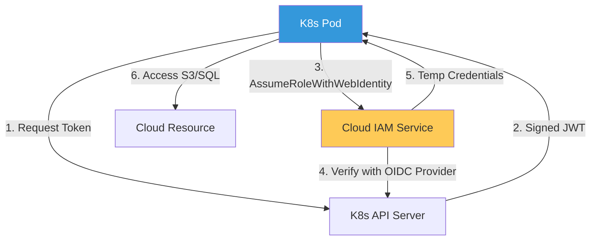

# Identity Governance & Security (IAM) Reference

**Doc Version:** 1.0.0
**Role:** Identity Architect / Security Principal
**Scope:** IAM, RBAC, OIDC, and Workload Identity Federation

---

## 1. The Identity-First Security Model

In the cloud, "Identity is the new Perimeter." Firewalls (IP-based) are secondary to cryptographic identity (AuthN/AuthZ).

- **Human Identity**: Developers and Operators (OIDC/SAML).
- **Machine Identity**: Pods, CI/CD runners, and Cloud Services (ServiceAccounts / IAM Roles).
- **Workload Identity**: Cryptographically verifiable identity for every single microservice (SPIFFE/mTLS).

---

## 2. Workload Identity Federation

Connecting Kubernetes identities to Cloud identities without long-lived static keys.

### A. IRSA (IAM Roles for Service Accounts) - AWS
1.  **Pod Agent**: Requests a token from the K8s API.
2.  **Trust**: The AWS IAM service trusts the OIDC provider of the EKS cluster.
3.  **Assume Role**: AWS exchanges the K8s token for a temporary AWS IAM credential.

### B. Workload Identity - GCP/Azure
Similar flows that allow a GKE ServiceAccount to act as a Google Cloud IAM Service Account.

---

## 3. RBAC Hierarchy (Least Privilege)

Permissions should be granted at the most granular level possible.

1.  **Level 1: Cloud-Level**: Who can create/delete clusters and VPCs?
2.  **Level 2: Cluster-Level (K8s RBAC)**: Who can view logs or edit deployments?
3.  **Level 3: Namespace-Level**: isolating teams so they only see their own resources.
4.  **Level 4: Service-Level**: Which microservice can talk to which Database?

---

## 4. Visualizing the Identity Exchange

---

## 5. Just-In-Time (JIT) Access Governance

Long-lived administrative permissions are a security risk.
- **Access Requests**: Users request "Admin" access through a portal (e.g., Okta or Entra ID).
- **Time-Bound**: Access is granted for 1-4 hours and automatically revoked.
- **Audit**: Every action taken during the elevated session is recorded in a high-priority audit log.

---

## 6. Enterprise Governance Standards

- **Zero Static Keys**: No IAM User "Access Keys" are allowed in CI/CD or application code. Everything must use OIDC-based federation.
- **Identity Consistency**: Human identities must be synced from a single Source of Truth (HR System -> Okta -> Cloud). 
- **Automated IAM Scanning**: Frequent audits for "Over-permissioned" roles using tools like IAM Access Analyzer to strip unused permissions.

> **Enterprise Pattern**: Implement **The "Impersonation-Only" SRE**. In Production, no human has direct "Write" access. If an emergency occurs, the SRE must "Assume" a highly-audited rescue role that triggers a "Security Incident" workflow automatically. All normal changes MUST go through the GitOps pipeline, which uses its own machine identity.
