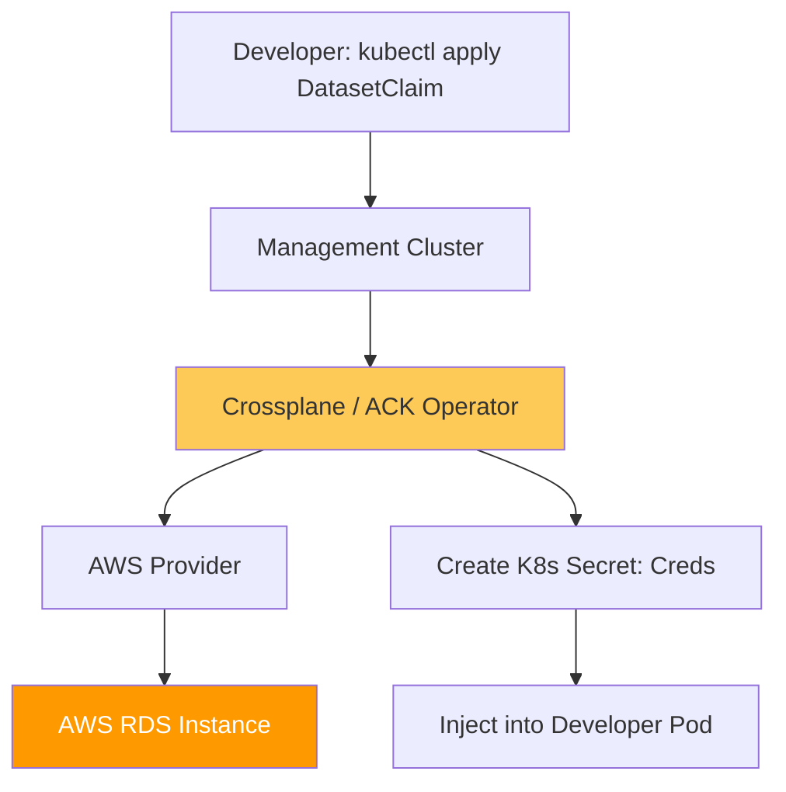

# Database SRE \u0026 DBaaS Platform Reference

**Doc Version:** 1.0.0
**Role:** Database Reliability Engineer / Platform Lead
**Scope:** Internal DBaaS, Kubernetes Operators, and State Management

---

## 1. The DBaaS Philosophy (Database-as-a-Service)

Platform Engineering aims to hide the complexity of database management (clustering, backups, patching) behind a declarative API, allowing developers to consume databases like they consume cloud resources.

- **Developer Goal**: "I need a PostgreSQL 14 database in Prod with 100GB storage."
- **Platform Reality**: Automation handles AWS RDS provisioning, Security Groups, IAM roles, and connection secret injection into K8s.

---

## 2. Infrastructure as Code vs. Infrastructure as Data

### Crossplane \u0026 Controllers
Crossplane allows developers to provision "Cloud Resources" (like RDS) using native Kubernetes YAML.
- **Provider**: The plugin connecting K8s to the cloud (AWS/GCP).
- **Composite Resource (XR)**: A high-level, custom definition (e.g., `CompositeDatabase`) created by the Platform team.
- **Claim**: The developer's request (e.g., `DatabaseClaim`) for a database instance.

---

## 3. High-Availability (HA) and Replication Patterns

A platform-managed database must be resilient by default.

- **Multi-AZ Replication**: Synchronous replication to a secondary instance in a different Availability Zone.
- **Read Replicas**: Asynchronous replication for scaling read-heavy workloads.
- **Automatic Failover**: The platform handles the DNS/Endpoint switch when the primary instance fails.

---

## 4. Visualizing the Managed Database Flow

---

## 5. State Management & Lifecycle

Managing state is more complex than managing compute.
1.  **Backup Governance**: Automatic snapshotting on a defined schedule (e.g., every 6 hours) with cross-region replication for DR.
2.  **Point-In-Time Recovery (PITR)**: Enabling developers to "Rewind" their database to a specific second in the past.
3.  **Expansion Logic**: Monitoring disk space and automatically increasing storage capacity when thresholds are reached (Auto-Scaling Storage).

---

## 6. Enterprise Governance Standards

- **Encryption at Rest**: Mandatory AES-256 encryption for all managed database instances and their backups.
- **Private Access Internal**: Databases MUST never have a public IP. Access is only permitted through VPC Endpoints or strictly controlled Security Groups.
- **Secret Rotation**: Utilizing **AWS Secrets Manager** or **HashiCorp Vault** to automatically rotate database credentials every 30-90 days without application human intervention.

> **Enterprise Pattern**: Implement **The "Self-Healing State" Control**. Use a Kubernetes Operator (like CrunchyData Postgres or Zalando Postgres) to manage life-cycle directly on K8s. This allows the cluster itself to detect a database node failure and trigger an election or recovery without waiting for an AWS API call, reducing MTTR for the data layer.
