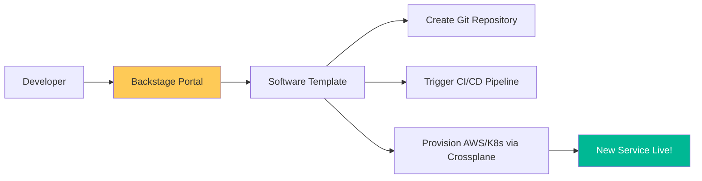

# Internal Developer Platforms (IDP) & Backstage Reference

**Doc Version:** 1.0.0
**Role:** Platform Engineer / IDP Architect
**Scope:** Developer Experience (DevEx), Backstage, and Software Cataloging

---

## 1. The IDP vs. The Portal

Advanced platform engineering distinguishes between the underlying infrastructure and the interface developers interact with.

- **The Platform (IDP)**: The set of tools, services, and APIs that automate infrastructure, CI/CD, and deployment (e.g., Crossplane, ArgoCD, Terraform).
- **The Portal (Backstage)**: The single pane of glass that provides a visual interface for developers to discover services, create new projects, and view system health.

---

## 2. Backstage: The "Golden Path" Engine

Backstage (created by Spotify) is the primary framework for building an internal portal. It organizes complexity through four main pillars:

### A. Software Catalog
A centralized repository of metadata for every service, website, and library in the organization.
- **`catalog-info.yaml`**: The source of truth for service ownership, dependencies, and documentation.
- **System Modeling**: Grouping services into "Systems" and "Domains" to provide an architectural overview.

### B. Software Templates (Scaffolding)
Self-service project creation that follows company standards.
- **Zero to Production**: A developer fills out a form, and Backstage creates the Git repo, clones a best-practice template, sets up the CI pipeline, and provisions the initial Dev environment.

### C. TechDocs
"Documentation as Code." Documentation lives next to the code in Markdown and is automatically rendered into a beautiful, searchable site in the portal.

### D. Search and Discovery
An integrated search engine that breaks down silos, allowing developers to find internal APIs and knowledge quickly.

---

## 3. Visualizing the Golden Path

---

## 4. Platform Maturity Model

1.  **Ticket-Based**: Developers open a Jira ticket; SRE manually provisions. (Velocity: Days/Weeks)
2.  **Self-Service Scripts**: SRE provides scripts; developers run them manually. (Velocity: Hours)
3.  **Basic Portal**: Automated provisioning through a GUI. (Velocity: Minutes)
4.  **Golden Path Engine**: Unified discovery, documentation, and automated lifecycle management. (Velocity: Seconds)

---

## 5. DevEx Metrics (Measuring the Platform)

- **Time to First PR**: How long it takes a new hire to merge their first piece of code.
- **On-Call Frequency**: Whether the "Golden Path" reduced the number of manual interventions required.
- **NPS (Net Promoter Score)**: Developer satisfaction with the internal toolchain.

---

## 6. Enterprise Governance Standards

- **Ownership Enforcement**: Every service in the catalog MUST have a defined `owner` (Team/Group). Unowned resources are automatically flagged for deletion.
- **Template Versioning**: Ensuring that "New Service" templates are version-controlled and updated with the latest security and architectural patterns (e.g., Log4j patches).
- **Single Sign-On (SSO)**: Integrating the portal with the corporate Identity Provider (Okta/AD) to manage permissions and visibility.

> **Enterprise Pattern**: Implement **The Scoring System**. Use a plugin (like "SoundCloud Backstage Quality") to assign a "Health Score" to every service based on its security scan results, test coverage, and documentation status. Use this score to gamify engineering excellence across teams.
