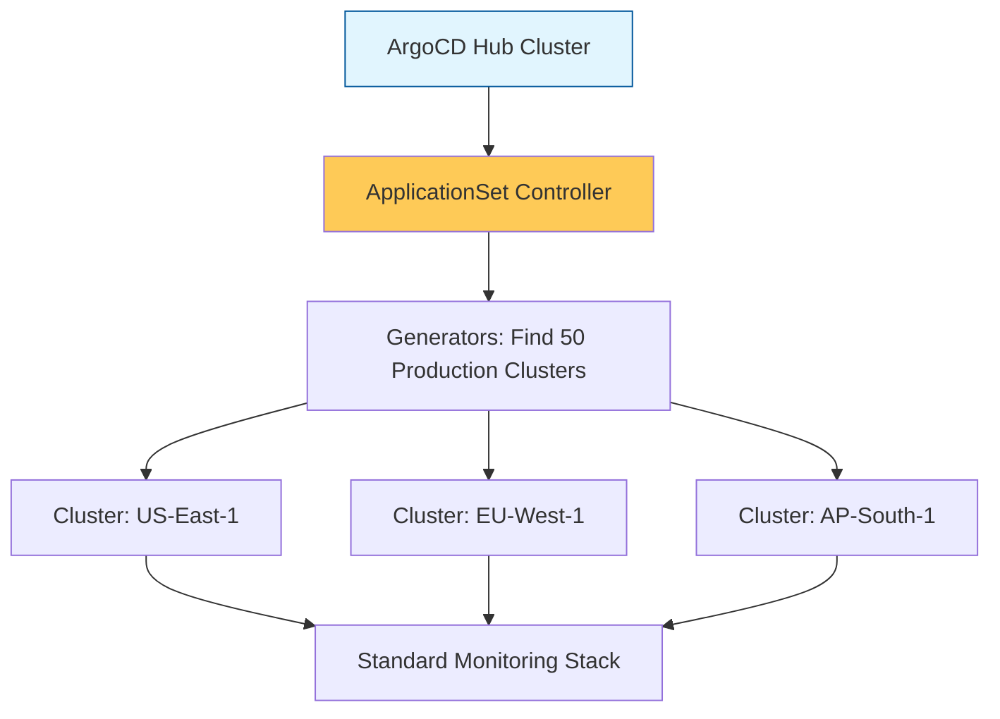

# Fleet Management & Multi-Cluster Scale Reference

**Doc Version:** 1.0.0
**Role:** Fleet Engineer / Platform Architect
**Scope:** ApplicationSets, Multi-cluster Sync, and Cluster Abstraction

---

## 1. Moving from Cluster to Fleet

As clusters proliferate, managing them individually leads to "Snowflake Clusters." **Fleet Management** aims to treat clusters as Cattle, not Pets.

### The Objective:
- **Consistency**: High-level policies applied to 1,000 clusters simultaneously.
- **Automation**: New clusters automatically receive their required "Baseline" (Security, Networking, Monitoring) upon creation.
- **Portability**: Moving workloads from one region/cluster to another with zero configuration changes.

---

## 2. ArgoCD ApplicationSets

The **ApplicationSet** is the primary engine for scaling GitOps to a fleet.

- **Generators**: Dynamic logic that "discovers" clusters or repositories.
    - **List Generator**: Hardcoded list of clusters.
    - **Cluster Generator**: Uses labels on Kubernetes `Secret` objects to find target clusters.
    - **Git Generator**: Uses directory structures in Git to determine what to deploy.
- **Template**: The boilerplate `Application` definition that is applied to every item found by the Generator.

---

## 3. Multi-Cluster Synchronization Strategies

### A. Centralized (Hub-and-Spoke)
- **The Hub**: A central ArgoCD cluster that manages many remote clusters.
- **Pros**: Single pane of glass, centralized secrets management.
- **Cons**: High dependency on the Hub's connectivity and throughput.

### B. Decentralized (Local instances)
- **Local instance**: Each cluster runs its own ArgoCD instance.
- **Pros**: Survivability (if the hub dies, the cluster keeps syncing).
- **Cons**: Configuration drift is harder to monitor globally.

---

## 4. Visualizing Fleet Orchestration

---

## 5. Security & Isolation in a Fleet

- **RBAC Sync**: Ensuring that developer identities (OIDC) have consistent, restricted access across the entire fleet.
- **Cluster Registration**: Using short-lived tokens or certificates to securely join a new cluster to the management hub.

---

## 6. Enterprise Governance Standards

- **Baseline Enforcement**: Utilizing **ApplicationSets** to force-deploy a "Core Foundation" (e.g., Dynatrace Agent, Falco, OPA Gatekeeper) to every cluster in the fleet.
- **Tag-Based Deployment**: Using cluster labels (e.g., `environment: prod`, `region: emea`) to dynamically control which versions of software are deployed to which clusters.
- **Automated Cluster Lifecycle**: Integrating Cluster API (CAPI) with GitOps, so that deleting a YAML file in Git automatically de-provisions the cloud resources and cluster.

> **Enterprise Pattern**: Implement **The Bootstrap Repository**. Ensure every cluster in your fleet is initialized with a single "Seed" Application. This application points to a Git directory containing the ApplicationSets for the entire platform. This ensures that no cluster is ever "blank" and that security guardrails are immediate.
