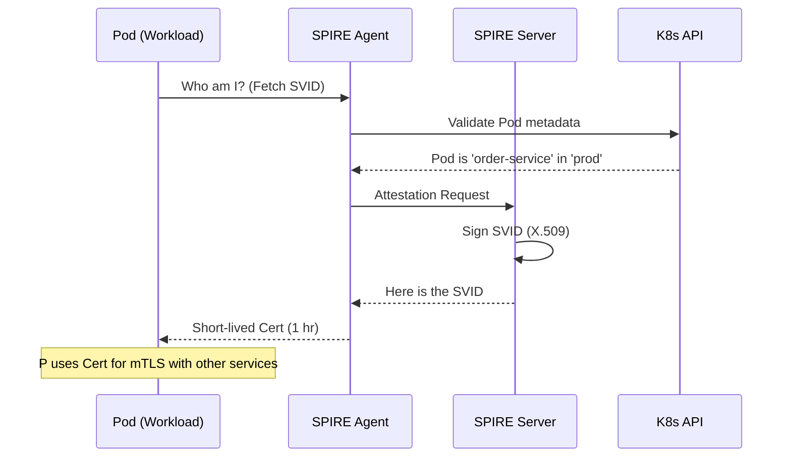

# 🔒 Service Mesh Security (mTLS & SPIFFE)

> **"Don't just encrypt the perimeter. Encrypt every single packet between your services."**

## 📚 Overview

In a cloud-native environment, "trust" cannot be based on IP addresses. **Service Mesh Security** treats the network as hostile and implements **Zero Trust** via **mTLS (Mutual TLS)** and **SPIFFE (Secure Production Identity Framework for Everyone)**. This module focuses on how to automate identity issuance and traffic encryption between microservices using Istio and SPIRE.

## 🎯 Learning Objectives

- ✅ Understand the **mTLS Handshake** and certificate lifecycle.
- ✅ Implement **SPIFFE ID** for platform-agnostic workload identity.
- ✅ Configure **Istio PeerAuthentication** to enforce strict mTLS.
- ✅ Use **SPIRE** to issue short-lived SVIDs to non-K8s workloads.
- ✅ Audit service-to-service communication with **Mutual Auth logs**.

## 🗺️ Module Structure

1. **[🔴 01-mTLS-Fundamentals](README.md)**
   - Certificate Authorities (CA) in Kubernetes.
   - Enforcing Strict vs. Permissive mTLS modes.
2. **[🔴 02-SPIRE-Workload-Identity](README.md)**
   - Workload Attestation: How SPIRE proves who a pod is.
   - Using the SPIRE Agent and Server.

---

## 🏗️ Visual: SPIFFE/SPIRE Identity Flow



---

## 🛠️ YAML: Istio Strict mTLS Policy

```yaml
apiVersion: security.istio.io/v1beta1
kind: PeerAuthentication
metadata:
  name: default
  namespace: istio-system
spec:
  mtls:
    mode: STRICT # Block all non-mTLS traffic cluster-wide
```

## 📋 Professional Pattern: "Identity Over Identity"
Never use API Keys for internal service-to-service communication. Use the **Workload SVID** handled by SPIRE. By baking identity into the connection itself (via mTLS), you remove the risk of leaked keys and simplify your secret management—as the "secret" is a short-lived certificate rotated every few hours.

---
**Next Step**: Start with [mTLS Fundamentals](README.md) 🚀
