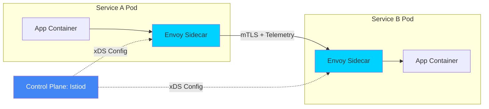

# Service Mesh Architecture & Data Plane Reference

**Doc Version:** 1.0.0
**Role:** Service Mesh Architect / Platform Lead
**Scope:** Istio, Envoy Proxy, and Traffic Management Paradigms

---

## 1. The Mesh Architecture: Control vs. Data Plane

A Service Mesh decouples how services communicate from how those communications are managed.

- **The Data Plane (Envoy)**: A fleet of high-performance sidecar proxies (Envoy) deployed alongside every service instance. They intercept all network traffic (East-West and North-South), providing mTLS, retries, and telemetry.
- **The Control Plane (Istiod)**: The "Brain" of the mesh. It manages and configures the proxies to route traffic, enforce policies, and collect telemetry. It converts high-level routing rules into low-level Envoy configuration (xDS API).

---

## 2. Advanced Traffic Management (Istio)

Istio uses Custom Resources (CRDs) to define complex traffic behavior.

### A. VirtualService
- **Purpose**: Defines *how* requests are routed to a service within the mesh.
- **Capabilities**: Header-based routing, path rewriting, weighting (for Canary), and fault injection (for Chaos Engineering).

### B. DestinationRule
- **Purpose**: Defines *what happens* to traffic for that destination after routing has occurred.
- **Capabilities**: Load balancing pools, TLS settings, and **Circuit Breakers** (shedding load when a service becomes unhealthy).

### C. Gateway (Ingress/Egress)
- **Purpose**: Manages traffic entering (Ingress) or leaving (Egress) the mesh.
- **Benefit**: Provides a unified entry point with consistent mTLS and observability for all external traffic.

---

## 3. The Proxy Lifecycle & Sidecar Injection

### Injection Mechanism:
1.  **Selection**: A namespace is labeled with `istio-injection=enabled`.
2.  **Admission**: When a Pod is created, the Kubernetes **Mutating Admission Webhook** intercepts the request.
3.  **Mutation**: The webhook injects the `istio-proxy` container and an `init-container` (to setup iptables rules) into the Pod spec.
4.  **Execution**: All traffic entering or leaving the application container is now transparently redirected through the Envoy sidecar.

---

## 4. Visualizing the Mesh Traffic Flow

---

## 5. Ambient Mesh (Sidecar-less)

The next evolution of Service Mesh (Istio Ambient) removes the need for sidecars.
- **Ztunnel**: A node-level proxy for secure L4 connectivity (mTLS).
- **Waypoint Proxy**: A namespace-level proxy for L7 processing (Policy/Routing).
- **Benefit**: Reduced CPU/Memory overhead and simplified lifecycle management.

---

## 6. Enterprise Governance Standards

- **Default Sidecar Policy**: Every production namespace MUST have sidecar injection enabled or justify an exception.
- **Global Mesh Visibility**: Mandatory integration with **Kiali** for real-time service topology mapping and **Jaeger** for distributed tracing.
- **Circuit Breaking Defaults**: Every DestinationRule must include a baseline Outlier Detection (Circuit Breaker) to prevent "Cascading Failures" across the microservices estate.

> **Enterprise Pattern**: Implement **Egress Control**. Do not allow pods to talk directly to the internet. Use an **Egress Gateway** to whitelist specific external domains (e.g., `*.amazonaws.com`). This prevents "Data Exfiltration" if a container is compromised.
