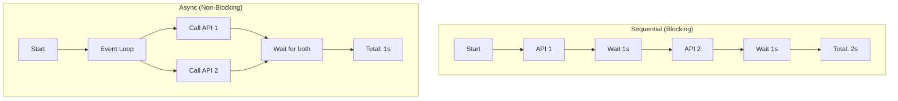

# Async Programming with asyncio
*High-Concurrency Automation*

In modern DevOps, waiting for network I/O (API calls, HTTP requests, SSH connections) is the biggest performance killer. `asyncio` allows you to run thousands of these operations concurrently within a single thread, dramatically increasing the throughput of your automation tools.

---

## 🏗️ Core Concepts

### Coroutines (async/await)
A coroutine is a function that can "pause" its execution to wait for something else without blocking the whole program.

```python
import asyncio

async def check_api(service):
    print(f"Checking {service}...")
    await asyncio.sleep(1) # Simulates a network call
    print(f"Finished {service}!")

async def main():
    # Run multiple checks concurrently
    await asyncio.gather(
        check_api("GitHub"),
        check_api("AWS"),
        check_api("Slack")
    )

asyncio.run(main())
```

---

## 📊 Logic Flow: Sequential vs Async



---

## 🛠️ Hands-On Challenges

Master asynchronous execution by building these high-performance tools.

| Challenge | Topic | Description | Starter Code | Solution |
| :--- | :--- | :--- | :--- | :--- |
| **01. Bulk Site Pinger** | I/O Concurrency | Build an async script using `aiohttp` to ping 50 websites simultaneously. | [Link](./challenges/challenge_01_bulk_pinger.py) | [Link](./challenges/solutions/solution_01_bulk_pinger.py) |
| **02. Async Task Queue** | Producers/Consumers | Implement a Task Queue where multiple "worker" coroutines process an async `Queue`. | [Link](./challenges/challenge_02_async_queue.py) | [Link](./challenges/solutions/solution_02_async_queue.py) |
| **03. Throttled Scanner** | Semaphores | Use `asyncio.Semaphore` to limit the number of concurrent connections to 5. | [Link](./challenges/challenge_03_throttled_scanner.py) | [Link](./challenges/solutions/solution_03_throttled_scanner.py) |

---

## ❓ Interview Questions

1. **What is the "Event Loop" in asyncio?**
   * *Answer*: It's the central manager that schedules and runs asynchronous tasks. It monitors the state of coroutines and switches between them when they are waiting for I/O.
2. **What does `await` actually do?**
   * *Answer*: It pauses the execution of the current coroutine until the awaited "Awaitable" (like a task or another coroutine) completes, yielding control back to the event loop so other tasks can run.
3. **Can you use `requests` inside an `async def` function?**
   * *Answer*: You *can*, but it's a "bad practice." `requests` is a blocking library. If you `await` it, it will block the entire event loop, defeating the purpose of async. Use `aiohttp` instead.

---

**Next Step**: [Concurrent Futures & Parallelism →](../02-Concurrent-Futures/README.md)
