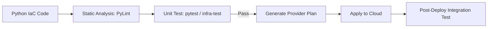

# Python for Infrastructure as Code (IaC)
*Programming Your Cloud instead of Scripting it*

Traditional IaC (Terraform HCL, CloudFormation YAML) is declarative. **Advanced Python IaC** is about using real programming languages to define your cloud. This allows for logic, loops, unit testing, and IDE autocomplete that static YAML files cannot provide. We focus on the **Pulumi Automation API** and **CDK (Cloud Development Kit)**.

---

## 🏗️ Core Patterns: Why Python for IaC?

1.  **Complexity Handling**: Use `for` loops to create 100 subnets instead of copy-pasting YAML.
2.  **Unit Testing**: Use `pytest` to verify that your "Security Group" class ALWAYS blocks Port 22 before it even hits the cloud.
3.  **Abstraction**: Create a custom class `MyEnterpriseVPC` that automatically includes logging, encryption, and flow logs, shared across your entire company.

### Example: Pulumi Python Instance
```python
import pulumi
from pulumi_aws import ec2

# Logic inside IaC
instance_type = "t3.medium" if pulumi.get_stack() == "prod" else "t3.micro"

server = ec2.Instance('web-server',
    instance_type=instance_type,
    ami="ami-0c55b159cbfafe1f0"
)
```

---

## 📊 Logic Flow: Testing IaC



---

## 🛠️ Hands-On Challenges

Master programmatic infrastructure by building these typed cloud managers.

| Challenge | Topic | Description | Starter Code | Solution |
| :--- | :--- | :--- | :--- | :--- |
| **01. Dynamic Multi-Region**| Abstraction | Write a Python script that iterates over a list of regions and provisions an S3 bucket in each using a single class. | [Link](./challenges/challenge_01_multi_region.py) | [Link](./challenges/solutions/solution_01_multi_region.py) |
| **02. Compliance Unit Test** | Quality | Use `pytest` to audit an IaC declaration and raise an error if an S3 bucket is defined without `public_access_block`. | [Link](./challenges/challenge_02_iac_test.py) | [Link](./challenges/solutions/solution_02_iac_test.py) |
| **03. Auto-Tagging Engine** | Mixins | Implement a base IaC class that automatically adds `Owner` and `CostCenter` tags to every resource it creates. | [Link](./challenges/challenge_03_auto_tags.py) | [Link](./challenges/solutions/solution_03_auto_tags.py) |

---

## ❓ Interview Questions

1. **What is the difference between 'Declarative' and 'Imperative' IaC?**
   * *Answer*: Declarative (HCL/YAML) focuses on the "What" (state). Imperative (Python) focuses on the "How" (logic). Tools like Pulumi and CDK are "Declarative languages written in an Imperative style"—the result is a state file, but the generation uses logic.
2. **How do you unit test infrastructure code?**
   * *Answer*: We use mocks. Instead of calling the real AWS API, we check that the "Resource Object" created by our Python code has the correct attributes (e.g., `encryption=True`) before it is sent to the cloud provider.
3. **What is 'State Drift' in the context of Python IaC?**
   * *Answer*: It occurs when someone manually changes a resource in the AWS Console. The Python code (the source of truth) no longer matches the actual cloud state. Programmatic tools must handle "Refresh" operations to detect this.

---

**Next Step**: [Terraform CDK with Python →](README.md)
