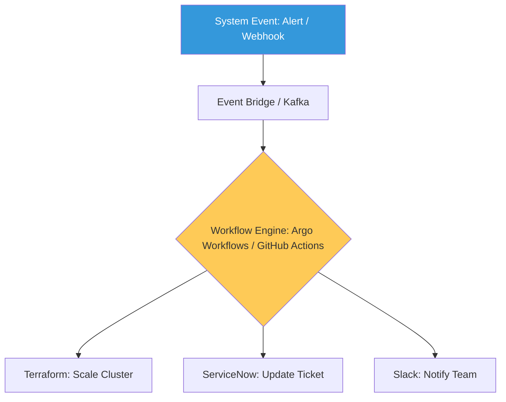

# Advanced Automation Patterns & Orchestration Reference

**Doc Version:** 1.0.0
**Role:** Automation Architect / Principal Engineer
**Scope:** Hyper-automation, Event-Driven Workflows, and Advanced CI/CD

---

## 1. The Automation Continuum

Advanced automation moves from "Scripting" to "Orchestration" and "Self-Healing."

- **Level 1 (Scripting)**: Bash/Python scripts run manually by engineers.
- **Level 2 (Pipelines)**: Automated CI/CD (Jenkins/GitHub Actions) for build and deploy.
- **Level 3 (Orchestration)**: Cross-system workflows (e.g., Jira -> Terraform -> Slack).
- **Level 4 (Autonomous)**: Event-driven automation that reacts to system state without human triggers.

---

## 2. Event-Driven Automation Patterns

Moving away from polling to real-time, reactive systems.

### A. The Webhook Pattern
External systems (GitHub, DockerHub) trigger workflows via HTTP callbacks.

### B. The Operator Pattern
Custom Kubernetes Controllers that watch for resource changes and reconcile the actual state with the desired state (e.g., Crossplane).

### C. The Serverless Bridge
Using AWS Lambda or Google Cloud Functions to connect legacy systems to cloud-native APIs.

---

## 3. High-Performance Build Strategies

Optimizing the CI/CD pipeline for developer velocity.

1.  **Kaniko / Buildah**: Building container images without root privileges (daemonless).
2.  **Remote Caching**: Sharing build layers across the entire team to reduce build times from minutes to seconds.
3.  **Parallel Execution**: Running unit tests, linting, and security scans in parallel stages.

---

## 4. Visualizing the Automation Hub

---

## 5. Performance Testing at Scale

Automation isn't just for deployment; it's for validation.
- **Load Generation**: Using K6 or Locust to simulate 100k concurrent users.
- **Continuous Profiling**: Automatically capturing CPU/Memory profiles during load tests to identify bottlenecks.
- **Chaos-Integrated Testing**: Running performance tests while simultaneously injecting network latency to see the "Knee of the curve."

---

## 6. Enterprise Governance Standards

- **Idempotency Requirement**: Every automation script/workflow must be able to run multiple times without changing the result if the system is already in the desired state.
- **No Manual Overrides**: Changes made outside of the automation pipeline (ClickOps) must be automatically detected and reverted.
- **Secret Hygiene**: Zero-tolerance for hardcoded credentials in automation logic; use OIDC-based federation (GitHub OIDC -> AWS IAM) for all cross-system calls.

> **Enterprise Pattern**: Implement **The "Golden Path" Template**. Provide a "Service Blueprint" that developers can use to bootstrap a new microservice. This blueprint should include the code repository, CI/CD pipeline, monitoring dashboards, and security scanning—all pre-configured and compliant with company standards.
