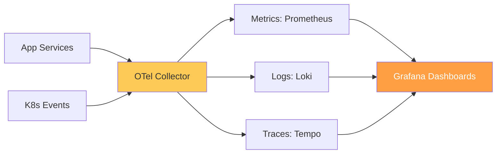

# Enterprise Observability Strategy & Architecture Reference

**Doc Version:** 1.0.0
**Role:** SRE Architect / Platform Engineer
**Scope:** Prometheus, Grafana, OpenTelemetry, and Metrics Governance

---

## 1. The Observability Maturity Model

Observability is not just about having dashboards; it's about the ability to understand the internal state of a system from its external outputs.

- **Level 1 (Reactive)**: Basic uptime monitoring (Ping/Health checks). Alerts based on "Service Down."
- **Level 2 (Proactive)**: Dashboard-driven monitoring. Teams look at CPU/RAM usage.
- **Level 3 (Insightful)**: SLO/SLI driven. Metrics are tied to business outcomes and user experience.
- **Level 4 (Observability)**: High-cardinality data, distributed tracing, and automated anomaly detection (AIOps).

---

## 2. The Three Pillars vs. The Unified Data Model

Traditional observability focused on three silos: **Metrics, Logs, and Traces**. Modern enterprise strategy uses **OpenTelemetry (OTel)** to unify these.

### A. Metrics (Prometheus/Cortex/Thanos)
- **Focus**: Quantitative data about resources and applications.
- **Retention**: Short-term high-resolution (Prometheus) vs. Long-term historical (Thanos/Cortex).

### B. Traces (Jaeger/Tempo)
- **Focus**: The journey of a single request across microservices.
- **Value**: Identifying "The Slowest Link" in a complex call chain.

### C. Logs (Loki/FluentBit)
- **Focus**: Qualitative data (events and errors).
- **Optimization**: "Log-to-Metric" conversion to reduce storage costs.

---

## 3. SLO-Based Governance

Infrastructure should be managed by **Service Level Objectives (SLOs)** rather than arbitrary alerts.

1.  **Service Level Indicator (SLI)**: The metric (e.g., Response Time).
2.  **Service Level Objective (SLO)**: The target (e.g., 99.9% of requests < 500ms).
3.  **Error Budget**: The amount of "allowable pain." Once the budget is exhausted, releases are halted to focus on stability.

---

## 4. Visualizing the Observability Pipeline

---

## 5. Metrics Cardinality & Cost Management

High cardinality (too many unique labels) can crash a Prometheus server and inflate cloud costs.
- **Governance**: Restrict the use of `user_id` or `order_id` as Prometheus labels.
- **Sampling**: Use intelligent sampling for traces (e.g., keep 100% of errors, but only 1% of successful requests).

---

## 6. Enterprise Governance Standards

- **Uniform Labeling**: Every metric/log MUST include `env`, `region`, `team`, and `service_name` labels.
- **Self-Healing Alerts**: Alerts should link directly to the relevant Runbook/Playbook.
- **Dashboard-as-Code**: Grafana dashboards must be stored in Git and deployed via Terraform or ConfigMaps (to prevent manual configuration drift).

> **Enterprise Pattern**: Implement **The Unified Collector**. Deploy an OpenTelemetry Collector as a DaemonSet on every node. Apps send all data (Otlp) to the local collector, which then handles buffering, filtering, and routing to the appropriate backend. This abstracts the backend (Prometheus/Datadog/NewRelic) away from the developers.
