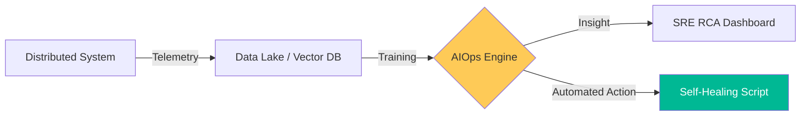

# AIOps & Intelligent Automation Reference

**Doc Version:** 1.0.0
**Role:** AI Operations Lead / Data SRE
**Scope:** Machine Learning for Ops, Anomaly Detection, and Predictive Scaling

---

## 1. Defining AIOps

AIOps (Artificial Intelligence for IT Operations) combines big data and machine learning to automate IT operations processes, including event correlation, anomaly detection, and causality determination.

- **Observe**: Collecting massive volumes of data (Metrics, Logs, Events).
- **Engage**: Using ML to filter noise and identify patterns that humans would miss.
- **Act**: Triggering automated remediation or providing intelligent insights to SREs.

---

## 2. Core Capabilities of Intelligent Systems

### A. Anomaly Detection
Moving from static thresholds (e.g., "Alert if CPU > 80%") to dynamic baselines that account for seasonality and business cycles.

### B. Event Correlation
Reducing "Alert Fatigue" by grouping 500 individual service alerts into a single "Incident" based on temporal and topological similarity.

### C. Predictive Scaling
Forecasting resource needs based on historical traffic patterns to scale clusters *before* the traffic spike arrives.

---

## 3. The AIOps Data Pipeline

1.  **Ingest**: Pulling data from Prometheus, Loki, CloudWatch, and K8s Events.
2.  **Clean**: Normalizing data formats and removing outliers.
3.  **Analyze**: Applying ML models (Random Forest, ARIMA, Transformers).
4.  **Visualize**: Providing root-cause analysis (RCA) dashboards.

---

## 4. Visualizing the Intelligent Feedback Loop

---

## 5. Challenges in AIOps

- **Data Quality**: "Garbage In, Garbage Out." Inconsistent logging makes model training impossible.
- **Explainability (XAI)**: SREs need to know *why* an AI made a decision (e.g., "Why did the AI scale down the database during a sale?").
- **Model Drift**: ML models can become less accurate over time as systems evolve.

---

## 6. Enterprise Governance Standards

- **Human-in-the-Loop (HITL)**: High-impact AI decisions (like deleting infrastructure) must be confirmed by a human until the model reaches a 99% confidence score.
- **Data Privacy**: Logs used for AI training MUST be scrubbed of all PII and sensitive tokens.
- **Auditability**: Every AI-triggered action must be logged with the model version and confidence score for post-incident review.

> **Enterprise Pattern**: Implement **The "Intelligence-First" Alerting**. Configure your monitoring system to only alert humans for "Subtle Anomalies" (e.g., "Latency is 10% higher than last Tuesday at this time"). Standard "Binary" failures (e.g., "Pod is dead") should be handled by standard Kubernetes self-healing, not the AI engine.
