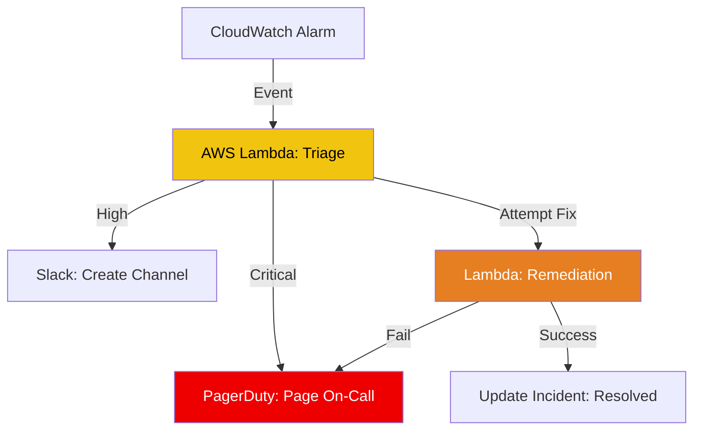

# 📟 Serverless Incident Management

> **"Scale your incident response at the speed of your cloud. Automate the boring parts of being on-call."**

## 📚 Overview

Incident Management is often a high-friction process involving manual alerting, ticket creation, and triage. **Serverless Incident Management** uses event-driven architecture (AWS Lambda, PagerDuty APIs, Slack Webhooks) to automate the lifecycle of an incident—from first detection to auto-remediation and post-mortem data collection.

## 🎯 Learning Objectives

- ✅ Automate **PagerDuty** incident creation via API.
- ✅ Implement **Closed-Loop Auto-Remediation** using AWS Lambda.
- ✅ Build dynamic **Slack Incident Rooms** via automation.
- ✅ Orchestrate multi-stage escalated alerts based on severity.

## 🗺️ Module Structure

1. **[🔴 01-PagerDuty-API-Automation](README.md)**
   - Managing API Tokens and Routing Keys.
   - Sending custom event payloads to PagerDuty.
2. **[🔴 02-Lambda-Auto-Remediation](README.md)**
   - Triggering Python functions from CloudWatch Alarms.
   - Using `boto3` to restart services or rotate keys automatically.

---

## 🏗️ Visual: The Incident Automation Flow



---

## 🛠️ Code: PagerDuty Incident Trigger (Python)


```python
import requests
import json

def trigger_incident(routing_key, summary, source):
    url = "https://events.pagerduty.com/v2/enqueue"
    payload = {
        "routing_key": routing_key,
        "event_action": "trigger",
        "payload": {
            "summary": summary,
            "source": source,
            "severity": "critical"
        }
    }
    
    response = requests.post(url, data=json.dumps(payload))
    return response.status_code

# Example Usage
# trigger_incident("YOUR_KEY", "CPU High on Prod-DB", "cloudwatch-monitor")
```

## 📋 Professional Pattern: "Silence the Noise"
Never automate every alarm to trigger a call. Use a **Triage Lambda** to de-duplicate events and check for maintenance windows before escalating to a human. If a service is known to be flaky but non-critical, automate the restart and only page a human if the restart fails 3 times.

---
**Next Step**: Start with [PagerDuty API Automation](README.md) 🚀
