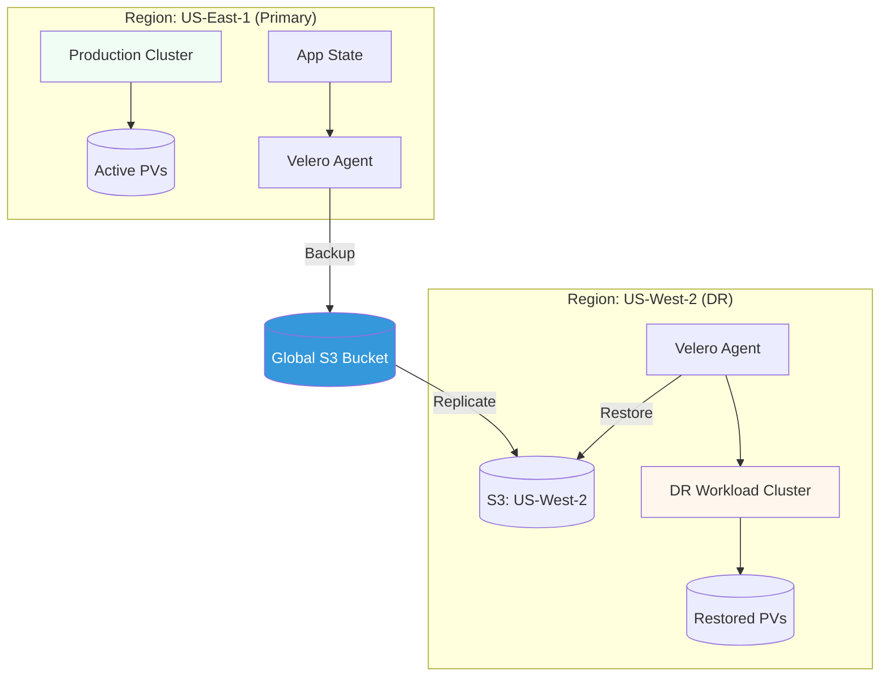

# Business Continuity & Disaster Recovery (DR) Reference

**Doc Version:** 1.0.0
**Role:** DR Coordinator / SRE Lead
**Scope:** Velero, Cross-Region Replication, and Recovery Time Objectives (RTO)

---

## 1. Defining DR Strategies

Disaster Recovery is about recovering your data and infrastructure after a catastrophic failure.

- **Backup/Restore**: Periodic backups of data and metadata. (High RTO/RPO).
- **Pilot Light**: Minimal version of the environment is always running in another region.
- **Warm Standby**: A scaled-down version of the fully functional environment is always running.
- **Multi-Site (Active-Active)**: Both regions handle traffic. (Zero RTO).

---

## 2. Kubernetes Backup with Velero

Velero is the standard tool for backing up Kubernetes cluster resources and persistent volumes.

### A. Metadata Backup
Backing up all YAML manifests (Deployments, Services, ConfigMaps, Secrets) from the etcd state to an object bucket (S3/GCS).

### B. Persistent Data Backup
Using CSI snapshots or Restic to back up the actual data inside Persistent Volumes (PVs).

### C. Migration Side-Effect
Velero can also be used to migrate workloads from one cluster to another (e.g., On-prem to Cloud or EKS to GKE).

---

## 3. RTO vs. RPO: The DR Metrics

1.  **Recovery Time Objective (RTO)**: How long can the system be down? (e.g., "We must be back up in 4 hours").
2.  **Recovery Point Objective (RPO)**: How much data can we afford to lose? (e.g., "We can lose 15 minutes of new data").

---

## 4. Visualizing Cross-Region Recovery

---

## 5. State Management & Consistency

The most difficult part of DR is stateful data.
- **Database Replication**: Ensure your databases (Postgres/MySQL) use synchronous or near-synchronous replication to the DR region.
- **Configuration Drift**: Use GitOps (ArgoCD) to ensure the infrastructure in the DR region is identical to the primary.

---

## 6. Enterprise Governance Standards

- **The Quarterly DR Drill**: DR plans are useless if they aren't tested. Conduct mandatory quarterly drills where the Primary region is simulated as "Down."
- **Immutable Backups**: Ensure backup buckets have "Object Lock" enabled to prevent Ransomware from deleting your backups.
- **Automated DNS Failover**: Use Global Server Load Balancing (GSLB) or Route53 Health Checks to automatically shift user traffic to the DR region upon failure.

> **Enterprise Pattern**: Implement **The "Infrastructure Garbage Collector"**. When a disaster is declared and traffic shifts to the DR region, the primary infrastructure should be marked for "Re-provisioning." Do not try to "fix" the broken environment; use ClusterAPI to delete and re-create it from scratch while the DR region holds the fort.
