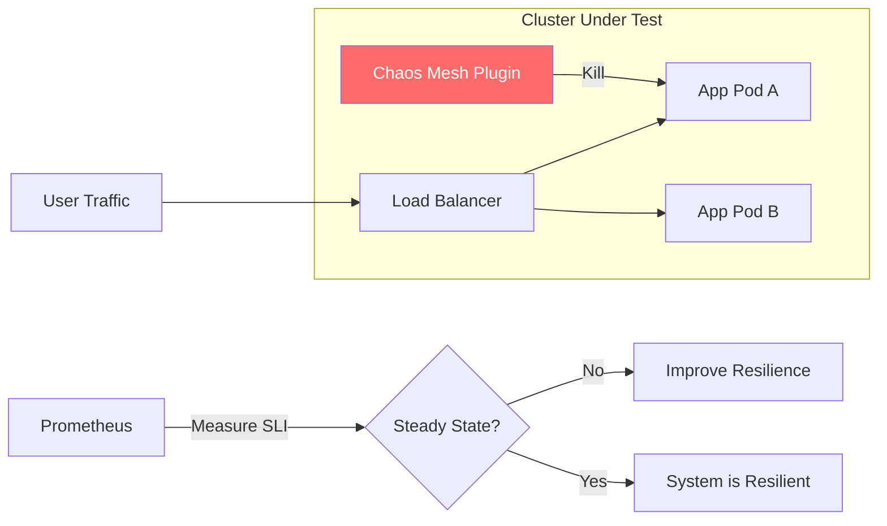

# Chaos Engineering & System Resilience Reference

**Doc Version:** 1.0.0
**Role:** Chaos Engineer / Resilience Architect
**Scope:** Controlled Experiments, Fault Injection, and Steady State Analysis

---

## 1. The Principles of Chaos Engineering

Chaos engineering is the discipline of experimenting on a software system in production in order to build confidence in the system's capability to withstand turbulent and unexpected conditions.

- **Hypothesis**: "If we kill one node in the cluster, the traffic will failover to other nodes without user impact."
- **Steady State**: Defining what "Normal" looks like (e.g., 200 OK responses, < 100ms latency).
- **Blast Radius**: Minimizing the impact of an experiment so it doesn't break the entire system.
- **Fault Injection**: Intentionally introducing failures (Network latency, Pod kills, Resource exhaustion).

---

## 2. Controlled Fault Injection Types

Resilience is tested by injecting failures at different layers of the stack.

### A. Infrastructure Layer
- **Node Kill**: Simulating a cloud provider outage or hardware failure.
- **Disk Full**: Testing how the application handles persistence failures.

### B. Network Layer
- **Latency Injection**: Adding 500ms delay to service calls to test timeouts and retries.
- **Packet Loss**: Dropping 5% of packets to test network protocol resilience.

### C. Application Layer
- **HTTP Error Codes**: Forcing 503 errors from a downstream service.
- **Process Crash**: Repeatedly killing a specific application process.

---

## 3. The Resilience Lifecycle

1.  **Define**: Pick a service and define its steady state.
2.  **Experiment**: Run a "Game Day" or automated experiment.
3.  **Analyze**: Compare steady state vs. chaos state.
4.  **Remediate**: Fix the weakness found (e.g., add more replicas, improve timeout logic).

---

## 4. Visualizing the Chaos Experiment

---

## 5. Automated Resilience (Chaos-as-Code)

Moving from manual "Game Days" to continuous resilience testing in CI/CD.
- **Chaos Mesh / Litmus**: Native K8s operators that manage experiments via YAML.
- **Validation Gates**: If a chaos experiment in the Stage environment causes an SLO breach, the automated pipeline blocks the promotion to Production.

---

## 6. Enterprise Governance Standards

- **No Unplanned Chaos**: Chaos experiments in Production must be scheduled and communicated to the SOC (Security Operations Center).
- **Blast Radius Control**: Use Kubernetes Namespaces and ResourceQuotas to ensure a chaos experiment cannot consume all cluster resources.
- **Rollback first**: Every experiment MUST have an automated "Abort" button that immediately reverts all fault injections.

> **Enterprise Pattern**: Implement **The "Anti-Fragile" Pipeline**. Every large-scale architectural change must undergo a "Resilience Audit" where standard chaos experiments (Node kill, Network lag) are run against the new architecture. The "Architecture Review Board" won't sign off on a design that hasn't proven its failure-recovery paths.
