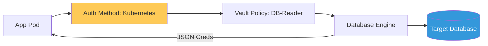

# Enterprise Secrets Management \u0026 Vault Reference

**Doc Version:** 1.0.0
**Role:** DevSecOps Lead / Security Architect
**Scope:** HashiCorp Vault, Dynamic Secrets, and Key Management

---

## 1. The Secrets Management Maturity Model

Managing credentials moves from "Hardcoded" to "Infrastructure-Level" security.

- **Level 1 (Insecure)**: Secrets in environment variables or hardcoded in Git.
- **Level 2 (Static Management)**: Using K8s Secrets or AWS Secrets Manager to store static, long-lived credentials.
- **Level 3 (Vault Centralization)**: Using a central vault for all environments with strict RBAC.
- **Level 4 (Dynamic Credentials)**: Generating short-lived, just-in-time credentials for every application and database transaction.

---

## 2. HashiCorp Vault Core Architecture

Vault is more than a password manager; it is an identity-driven security hub.

### A. Secret Engines
- **KV (Key-Value)**: Storing static secrets.
- **Database**: Dynamically creating DB users that expire after 1 hour.
- **PKI**: Running an internal Certificate Authority to issue mTLS certificates.
- **Transit**: Providing "Encryption as a Service" without exposing the raw encryption keys to applications.

### B. Auth Methods
- **Kubernetes Auth**: Connecting a Pod's ServiceAccount identity directly to a Vault policy.
- **AppRole**: For non-K8s applications and CI/CD runners.
- **OIDC/LDAP**: For human access.

---

## 3. The Lifecycle of a Dynamic Secret

1.  **Request**: Application Pod identifies itself to Vault via its K8s ServiceAccount.
2.  **Validation**: Vault checks the Pod's identity against the K8s API server.
3.  **Generation**: Vault connects to the Database, creates a temporary user with restricted permissions, and returns the credentials to the Pod.
4.  **Lease**: The credential is valid only for the duration of the "Lease."
5.  **Revocation**: When the Pod dies or the lease expires, Vault automatically deletes the user from the database.

---

## 4. Visualizing the Identity-Driven Security

---

## 5. Transit Encryption (Cryptography as Code)

Applications should not handle encryption logic.
- **Process**: App sends plaintext data to Vault's `/transit/encrypt` endpoint. Vault returns ciphertext.
- **Benefit**: The application never touches the Master Key. If the application is compromised, the attacker cannot decrypt historical data.

---

## 6. Enterprise Governance Standards

- **Zero-Persistence Policy**: No long-lived passwords (like "admin123") are allowed in any environment. Every production secret MUST have a TTL (Time-To-Live).
- **Seal Management**: Implementing "Auto-Unseal" using Cloud KMS (AWS/Azure/GCP) to ensure the Vault can restart without manual intervention from shard-holders in emergencies.
- **Audit Trails**: Every secret request MUST be logged to a write-once SIEM. Any attempt to access a secret without proper authorization must trigger a high-priority SOC alert.

> **Enterprise Pattern**: Implement **The "Broken Glass" Strategy**. Define a "Root" token that is split into 5 manual shards held by 5 different executives. This key is stored in physical hardware safes and is ONLY used to unseal the vault in a catastrophic failure where all cloud KMS systems have failed.
