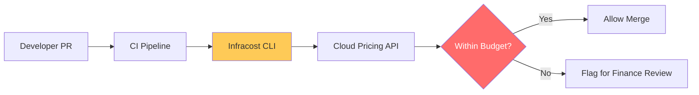

# Cost Governance & Automated Reporting Reference

**Doc Version:** 1.0.0
**Role:** Finance Lead / Cloud Governance Manager
**Scope:** Infracost, Cloud Billing APIs, and Budgetary Guardrails

---

## 1. Shift-Left Cost Governance

Traditionally, cost was a "Month-End" surprise. Shift-left governance brings cost visibility into the developer workflow.

- **Reactive governance**: Looking at the bill at the end of the month.
- **Proactive governance**: Estimating cost during the Pull Request phase.
- **Preventative governance**: Blocking infrastructure changes that exceed budgets.

---

## 2. Infracost Architecture

Infracost parses Terraform plans and maps resources to cloud provider pricing APIs.

### The Pipeline:
1.  **Code Change**: Developer modifies `main.tf`.
2.  **Estimate**: Infracost runs in CI, generating a JSON/Markdown report of the cost delta.
3.  **Comment**: The report is posted as a PR comment (e.g., "This change will increase spend by $42.50/mo").
4.  **Guardrail**: If the change violates a policy (e.g., "No NAT Gateways in Dev"), the CI build is marked as failed.

---

## 3. Cloud Provider Budgets & Alerts

Implementing native guardrails as a last line of defense.

- **AWS Budgets**: Monitoring spend and sending alerts at 50%, 80%, and 100% of forecast.
- **GCP Quotas**: Limiting the total number of CPUs or GPUs a project can consume.
- **Azure Cost Management**: Automatically disabling resources if a hard budget limit is reached (extreme measure).

---

## 4. Visualizing the Governance Gate

---

## 5. Identifying "Cloud Waste" (The low-hanging fruit)

- **Unattached Volumes**: EBS volumes that exist but are not attached to any VM.
- **Snapshots**: High-frequency snapshots of low-change databases.
- **Load Balancers**: Orphanned ALBs/NLBs from deleted trials.
- **Idle Nodes**: Running 32-core machines for services that use 0.5 cores.

---

## 6. Enterprise Governance Standards

- **Infrastructure as a Product**: Cost is a first-class citizen in the Software Development Life Cycle (SDLC).
- **Reserved Instances (RI) / Savings Plans Strategy**: Centrally managed by the FinOps team to ensure maximum coverage across all business units.
- **Anomaly Detection**: Automated alerts triggered by sudden "spikes" in spend (e.g., a Bitcoin miner exploit in a compromised namespace).

> **Enterprise Pattern**: Implement **The Automated Cost Policy (OPA for Infracost)**. Combine Open Policy Agent (OPA) with Infracost. Use Rego policies to enforce rules like: "Total monthly cost for the 'Testing' environment cannot exceed $2,000" or "Individual resource cost increase cannot exceed 20% without VP approval."
