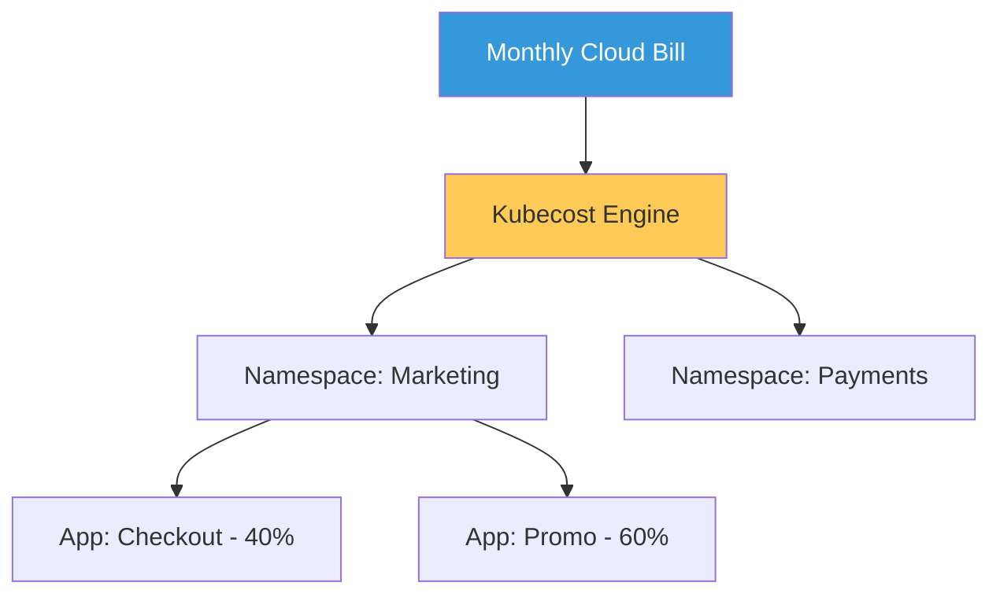

# Enterprise FinOps & Cloud Optimization Reference

**Doc Version:** 1.0.0
**Role:** FinOps Practitioner / Cloud Economist
**Scope:** K8s Cost Allocation, Resource Optimization, and Cloud Spend Management

---

## 1. The FinOps Journey: Inform, Optimize, Operate

FinOps is an evolving cloud financial management discipline and cultural practice that enables organizations to get maximum business value.

- **Inform**: Gaining visibility into spend with granularity (Namespace, Team, Application).
- **Optimize**: Identifying waste (idle pods, oversized nodes) and taking action.
- **Operate**: Embedding cost-awareness into the engineering culture (continuous improvement).

---

## 2. Kubernetes Cost Allocation (Kubecost)

Kubernetes abstracts away VMs, making it difficult to know how much a single microservice costs.

### A. Direct Costs
- **CPU/RAM Request**: What the pod "reserved."
- **Storage**: Persistent Volumes and snapshot costs.
- **Egress**: Data transfer costs between regions or out to the internet.

### B. Indirect (Shared) Costs
- **Management Plane**: Cost of the EKS/GKE control plane.
- **System Services**: Costs for Logging, Monitoring, and Security agents.
- **Idle Capacity**: The "Unallocated" space on nodes that must still be paid for.

---

## 3. Optimization Strategies

How to reduce spend without impacting performance.

1.  **Right-Sizing (VPA)**: Using Vertical Pod Autoscaler to match requests/limits to actual usage.
2.  **Spot Instances**: Utilizing excess cloud capacity for non-critical workloads (up to 90% savings).
3.  **Governance through Quotas**: Implementing `ResourceQuotas` to prevent "Cost Bombs" caused by misconfigured deployments.

---

## 4. Visualizing the Cost Flow

---

## 5. The Unit Economics of Kubernetes

Shifting from "Total Cost" to "Cost per Business Metric."
- **Example**: "It costs us $0.05 in infrastructure for every order processed."
- **Benefit**: If infrastructure costs rise but "orders processed" rise faster, the business is actually becoming more efficient.

---

## 6. Enterprise Governance Standards

- **Mandatory Labeling (Cost Centers)**: No cluster or namespace can be created without a `cost-center` and `owner` tag.
- **Automatic Shutdown (Environment Gating)**: Non-production environments MUST be scaled to zero or hibernated outside of business hours to save up to 70% of spend.
- **Showback/Chargeback**: Automated monthly reports sent to department heads detailing their exact cloud consumption.

> **Enterprise Pattern**: Implement **The "Budget Breach" Guardrail**. Use Infracost in CI/CD pipelines to estimate the cost of a Terraform change *before* it is applied. If a PR increases monthly spend by more than $500, require a manual approval from the Finance/FinOps team before merging.
