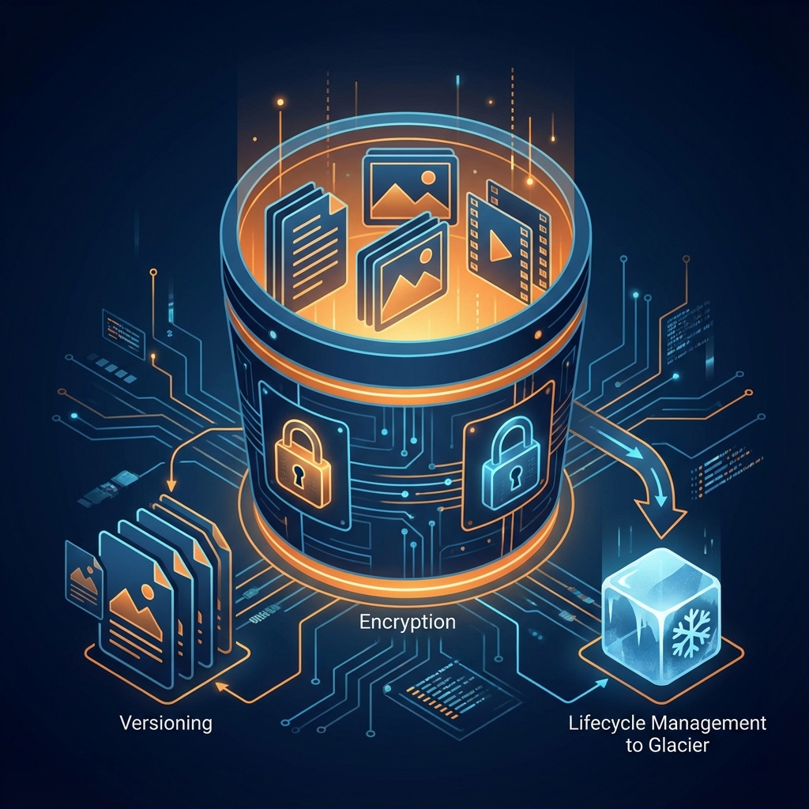
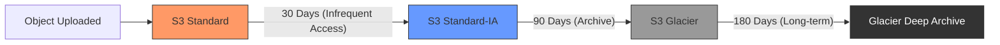

# AWS S3 Bucket - Fundamentals & Terraform

Amazon S3 (Simple Storage Service) is the cornerstone of AWS storage. It is an **object storage** service offering industry-leading scalability, data availability, security, and performance.

---

## 🏗️ S3 Architecture Overview

S3 is not a traditional file system; it's a key-value store for objects. Unlike EBS which is "Block Storage" (structured like a hard drive), S3 is "Object Storage".

### Visual Architecture


### Key Concepts
- **Buckets**: Containers for objects. Names must be **globally unique**.
- **Objects**: The files themselves (up to 5TB each).
- **Keys**: The full path/name of the object.
- **Metadata**: Key-value pairs describing the object.
- **Versioning**: Storing multiple variants of an object in the same bucket.

---

## 📑 Information Phases of S3 Management

To implement S3 effectively, follow these four distinct phases:

1. **Phase 1: Planning & Identification**
   - Determine bucket naming (globally unique).
   - Select the target AWS Region (proximity to users vs. cost).
   - Identify data sensitivity levels.

2. **Phase 2: Configuration & Security**
   - Enable **Versioning** for data protection.
   - Configure **Server-Side Encryption** (AES256 or KMS).
   - Apply **Public Access Block** to prevent data leaks.

3. **Phase 3: Integration & Implementation**
   - Provision resources using **Terraform** or **AWS CLI**.
   - Manage IAM roles/policies for application access.
   - Test connectivity and upload/download workflows.

4. **Phase 4: Maintenance & Optimization**
   - Monitor usage with **CloudWatch** and **S3 Storage Lens**.
   - Implement **Lifecycle Policies** for cost transition.
   - Perform periodic security audits.

---

## 📊 S3 Workflow & Lifecycle



---

## 🛠️ Infrastructure as Code (Terraform)

This directory contains a production-ready Terraform module to deploy a secured S3 bucket.

### Module Files
- [main.tf](./main.tf) - Core resources (Bucket, Versioning, Encryption).
- [variables.tf](./variables.tf) - Configuration options (Project Name, Environment).
- [outputs.tf](./outputs.tf) - Results (Bucket ARN, ID, URL).

### Basic Usage
```hcl
module "s3_bucket" {
  source       = "./s3-bucket"
  project_name = "my-devops-project"
  environment  = "dev"
}
```

---

## 🛡️ Security Best Practices

1. **Block Public Access**: Always keep this enabled unless you are hosting a public website.
2. **Encryption at Rest**: Use SSE-S3 or SSE-KMS.
3. **IAM Policies**: Use the "Principle of Least Privilege".
4. **MFA Delete**: Require a physical device to delete versions/buckets.
5. **VPC Endpoints**: Keep S3 traffic within the AWS network.

---

## ❓ Interview Questions

**Q1: What is the difference between S3 and EBS?**
*Answer: S3 is object storage (accessible via web/API, global), while EBS is block storage (can only be attached to one EC2 instance at a time, local to an AZ).*

**Q2: How do you achieve 11-9s of durability in S3?**
*Answer: AWS automatically replicates your data across a minimum of three physical Availability Zones (AZs) within a region.*

**Q3: What is a Pre-signed URL?**
*Answer: A temporary URL that grants permission to download or upload an object without requiring AWS credentials.*

**Q4: Can you use S3 as a boot volume for an EC2 instance?**
*Answer: No, EC2 instances require block storage (EBS) or Instance Store to boot.*

**Q5: How can you prevent accidental deletion of important objects in S3?**
*Answer: Enable Versioning and MFA (Multi-Factor Authentication) Delete.*

---

## 📝 Knowledge Check (20+ Questions)

<b>1. S3 bucket names must be unique:</b>
<details>
<summary>Show Answer</summary>
Answer: Globally across all AWS accounts.
</details>

<b>2. Maximum size of a single object in S3?</b>
<details>
<summary>Show Answer</summary>
Answer: 5 TB.
</details>

<b>3. Which storage class is best for data accessed once every 6 months with 12-hour retrieval?</b>
<details>
<summary>Show Answer</summary>
Answer: S3 Glacier Deep Archive.
</details>

<b>4. What is the minimum storage duration for S3 Standard-IA?</b>
<details>
<summary>Show Answer</summary>
Answer: 30 Days.
</details>

<b>5. Does enabling versioning on a bucket increase your storage costs?</b>
<details>
<summary>Show Answer</summary>
Answer: Yes, because every version of an object is stored and charged.
</details>

<b>6. Which S3 feature allows you to automatically move objects to cheaper storage classes?</b>
<details>
<summary>Show Answer</summary>
Answer: Lifecycle Management.
</details>

<b>7. To host a static website on S3, which file is typically defined as the index?</b>
<details>
<summary>Show Answer</summary>
Answer: index.html.
</details>

<b>8. S3 Transfer Acceleration uses which AWS infrastructure?</b>
<details>
<summary>Show Answer</summary>
Answer: Amazon CloudFront's Edge Locations.
</details>

<b>9. Which SSE type handles the keys entirely within AWS S3?</b>
<details>
<summary>Show Answer</summary>
Answer: SSE-S3 (AES-256).
</details>

<b>10. Can you change the region of an existing S3 bucket?</b>
<details>
<summary>Show Answer</summary>
Answer: No, you must create a new bucket in the desired region and move the data.
</details>

<b>11. What is the consistency model for S3 after a new object is created?</b>
<details>
<summary>Show Answer</summary>
Answer: Strong read-after-write consistency.
</details>

<b>12. Which S3 feature can be used to monitor all API calls made to your buckets?</b>
<details>
<summary>Show Answer</summary>
Answer: AWS CloudTrail.
</details>

<b>13. How many buckets can you have per AWS account by default?</b>
<details>
<summary>Show Answer</summary>
Answer: 100 (though this can be increased).
</details>

<b>14. Does S3 support locking files for editing like a traditional file server?</b>
<details>
<summary>Show Answer</summary>
Answer: No, S3 is object storage (GET/PUT), not a distributed file system.
</details>

<b>15. Which S3 class is designed for data that can be easily recreated but needs low cost?</b>
<details>
<summary>Show Answer</summary>
Answer: S3 One Zone-IA.
</details>

<b>16. What is "Intelligent-Tiering"?</b>
<details>
<summary>Show Answer</summary>
Answer: A storage class that automatically moves objects between frequent and infrequent tiers based on access patterns.
</details>

<b>17. Can you use S3 to store Terraform state files?</b>
<details>
<summary>Show Answer</summary>
Answer: Yes, it is the recommended remote backend for Terraform.
</details>

<b>18. What is the purpose of S3 Object Lock?</b>
<details>
<summary>Show Answer</summary>
Answer: To prevent an object from being deleted or overwritten for a fixed amount of time (Compliance/WORM).
</details>

<b>19. Which CLI command is used to list the contents of a bucket?</b>
<details>
<summary>Show Answer</summary>
Answer: `aws s3 ls s3://bucket-name`.
</details>

<b>20. To reduce costs for multiple versions, you should:</b>
<details>
<summary>Show Answer</summary>
Answer: Configure a lifecycle rule to expire non-current versions.
</details>

<b>21. Is S3 region-specific or global in the AWS Management Console?</b>
<details>
<summary>Show Answer</summary>
Answer: The S3 service is Global, but individual buckets are created in specific Regions.
</details>

## ⚡ Quick Start: Create Bucket via AWS CLI

Follow these steps to create and secure a bucket via the terminal:

### 1. Create the Bucket
```bash
# syntax: aws s3 mb s3://[bucket-name] --region [region]
aws s3 mb s3://my-unique-devops-bucket-2026 --region us-east-1
```

### 2. Verify existence
```bash
aws s3 ls
```

### 3. Apply Security Baseline
```bash
# Enable Versioning
aws s3api put-bucket-versioning \
  --bucket my-unique-devops-bucket-2026 \
  --versioning-configuration Status=Enabled

# Enable Default Encryption (AES256)
aws s3api put-bucket-encryption \
  --bucket my-unique-devops-bucket-2026 \
  --server-side-encryption-configuration '{
    "Rules": [{
      "ApplyServerSideEncryptionByDefault": {"SSEAlgorithm": "AES256"}
    }]
  }'
```

---

## 🔗 Related Resources
- [S3 CLI Deep Dive](./s3-cli-guide.md)
- [S3 Bucket Policies (Intermediate)](../../../../../../2-Intermediate/02-Phase-2/01-Infrastructure-Automation/03-Cloud-Platforms/04-Data-and-Automation/02-Storage-and-Lifecycle-Management/s3-bucket-policies.md)
- [S3 Static Web Hosting (Intermediate)](../../../../../../2-Intermediate/02-Phase-2/01-Infrastructure-Automation/03-Cloud-Platforms/04-Data-and-Automation/02-Storage-and-Lifecycle-Management/s3-static-website.md)
- [AWS Storage Overview](../README.md)
