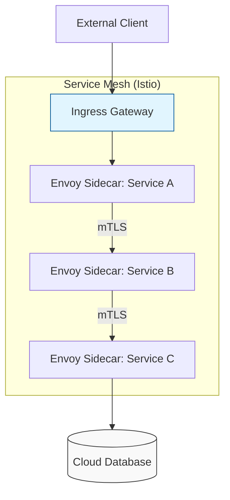

# Container & Service Mesh Networking Architecture Reference

**Doc Version:** 1.0.0
**Role:** Cloud-Native Engineer / Infrastructure Lead
**Scope:** CNI, Service Mesh, and Overlay Networks

---

## 1. Container Networking Interface (CNI)

The CNI is the standard that governs how containers receive network identities and connect to each other.

### A. The Bridge Model (Docker Default)
- **Mechanism**: A virtual bridge (`docker0`) is created. Containers get a private IP on a NATed network.
- **Port Mapping**: Accessing the container requires mapping a host port to a container port (e.g., `-p 8080:80`).

### B. The Native Cloud Model (AWS VPC CNI)
- **Mechanism**: Containers receive actual IP addresses from the VPC subnet.
- **Benefit**: No NAT overhead; pods are "first-class citizens" in the VPC. Easier integration with Security Groups and Flow Logs.

### C. The Overlay Model (Calico / Flannel)
- **Mechanism**: Encapsulates container packets inside host packets (VXLAN/UDP).
- **Use Case**: When the underlying cloud network doesn't support enough IP addresses or when operating in environments where you don't control the physical switches.

---

## 2. Service Mesh: Layer 7 Visibility

A Service Mesh (Istio, Linkerd) handles communication *between* services (East-West traffic) by injecting a "Sidecar" proxy (Envoy) into every pod.

### Key Capabilities:
- **mTLS (Mutual TLS)**: Automatically encrypting all traffic between microservices without changing application code.
- **Retries & Timeouts**: Moving resilience logic from the code into the infrastructure.
- **Traffic Shifting**: Performing **Canary Deployments** (e.g., "Send 5% of traffic to the new version").
- **Observability**: Generating automated distributed traces and metrics for every request.

---

## 3. Ingress & Egress Control

### Ingress (North-South Traffic)
How traffic enters the cluster.
- **NodePort**: Opening a high port (30000+) on every node.
- **LoadBalancer**: Provisioning a cloud LB (NLB/ALB) that points to the nodes.
- **Ingress Controller**: A Layer 7 proxy (Nginx, Traefik, Istio Gateway) that handles path-based routing (`example.com/api`) and TLS termination.

### Egress (Exfiltration Control)
How traffic leaves the cluster.
- **Standard**: NAT Gateway.
- **Advanced**: Egress Gateway (Istio) to restrict which external domains a container is allowed to talk to (e.g., "Only allow Java to talk to maven.org").

---

## 4. Visualizing the Mesh Architecture

---

## 5. Network Performance in Kubernetes

- **The "Hops" Problem**: Every proxy (Envoy, Ingress) adds microseconds of latency. For high-frequency trading or real-time gaming, a mesh may be too heavy.
- **eBPF (Extended Berkeley Packet Filter)**: A modern alternative (Cilium) that replaces standard iptables rules with high-performance code running directly in the Linux Kernel.
- **Benefit**: Faster routing, lower CPU usage, and deep security visibility.

---

## 6. Enterprise Governance Standards

- **Policy as Code (Network)**: Using **Cilium Network Policies** or **Kubernetes NetworkPolicies** to enforce a "Default Deny" posture in every namespace.
- **Certificate Rotation**: Handing off TLS certificate management to the Service Mesh control plane (e.g., Istiod) to ensure certificates are rotated every 24 hours.
- **Visibility Standard**: Requiring that all inter-service traffic metrics are exported to a central Prometheus/Grafana instance for real-time latency monitoring.

> **Enterprise Pattern**: Implement **Protocol Identification**. Use your Service Mesh to identify and block unauthorized protocols. For example, if a developer tries to use unencrypted HTTP between services, the mesh can be configured to automatically "Upgrade" the connection to mTLS or reject the request entirely based on compliance settings.
