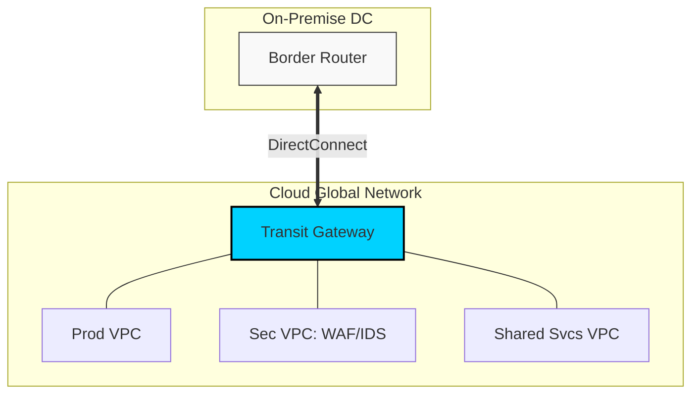

# Hybrid Cloud & Enterprise Networking Reference

**Doc Version:** 1.0.0
**Role:** Network Architect / Lead Site Reliability Engineer
**Scope:** Multi-Cloud Connectivity, Hybrid Patterns, and Performance Tuning

---

## 1. Enterprise Connectivity Patterns

Connecting on-premises data centers to cloud providers requires high-bandwidth, stable, and secure links.

### A. Site-to-Site VPN (IPsec)
- **Use Case**: Low-to-medium traffic, fast setup, encrypted over the public internet.
- **Protocol**: IKEv2 / IPsec.
- **Limitation**: Subject to internet latency and jitter.

### B. Dedicated Interconnect (Direct Connect / ExpressRoute)
- **Use Case**: High-traffic production workloads, predictable performance.
- **Physical**: Dedicated cross-connect in a provider-neutral facility (e.g., Equinix).
- **Speed**: 1G to 100G+.

### C. SD-WAN (Software Defined WAN)
- **Use Case**: Connecting satellite offices directly to cloud resources.
- **Benefit**: Dynamically routes traffic across multiple paths (LTE, Broadband, MPLS) based on application priority.

---

## 2. Advanced Routing & Transit

### Transit Gateway (TGW) / Virtual WAN
In a non-transit architecture, peering $N$ VPCs requires $N(N-1)/2$ connections. A Transit Gateway acts as a central "hub" to simplify this to a "hub-and-spoke" model.
- **Centralized Inspection**: Route all inter-VPC traffic through a central security VPC containing Palo Alto/Check Point appliances.
- **Route Propagation**: Automatically dynamic updates via BGP.

### BGP (Border Gateway Protocol)
The routing protocol of the global internet, used in enterprise clouds to:
- **Advertise CIDR blocks** between on-prem and cloud.
- **Path Selection**: Use AS-Path prepending to influence which link is preferred for incoming traffic.

---

## 3. High-Performance Networking (HPC & Low Latency)

### A. SR-IOV (Single Root I/O Virtualization)
Allows a device (like a NIC) to be shared by multiple virtual machines, bypassing the hypervisor's software switch for near-native line speed.
- **AWS Equivalent**: Enhanced Networking (ENA).

### B. DPDK (Data Plane Development Kit)
A set of libraries that allow applications to process packets directly from the NIC in "user space," bypassing the Linux kernel network stack.
- **Benefit**: Drastic reduction in CPU overhead for high-PPS (packets per second) applications like Firewalls or 5G cores.

### C. MTU & Jumbo Frames
- **Standard MTU**: 1500 bytes.
- **Jumbo Frames**: 9001 bytes.
- **Best Practice**: Use Jumbo Frames inside a VPC or over Direct Connect to reduce the number of packets required for large file transfers (e.g., DB replication).

---

## 4. Visualizing the Enterprise Hybrid Mesh

---

## 5. Network Performance Monitoring (NPM)

- **RTT (Round Trip Time)**: Measuring latency between regions.
- **Packet Loss**: Even 0.1% loss can kill TCP throughput due to "congestion window" shrinkage.
- **Jitter**: Variation in latency, critical for VoIP and Real-time data.
- **Top Talkers**: Identifying which IP/Service is consuming the most bandwidth using Flow Logs.

---

## 6. Enterprise Governance Standards

- **CIDR Hygiene**: Centrally managing a global "IP Space" spreadsheet to prevent CIDR overlaps between different cloud regions and on-prem.
- **Zero Trust Boundaries**: Implementing **Micro-segmentation** where every application tier (Web, App, DB) is separated by its own security group, even within the same subnet.
- **Egress Filtering**: Mandating that all outbound traffic passes through a **NAT Gateway** or **Forward Proxy** to block unauthorized data exfiltration.

> **Enterprise Pattern**: Implement **Network Air-Gapping**. For highly sensitive workloads (e.g., payment processing), use a private-only VPC with $zero$ internet gateways and $zero$ NAT gateways. Access is only possible via a Bastion host in a separate Management VPC or through a private Direct Connect link.
