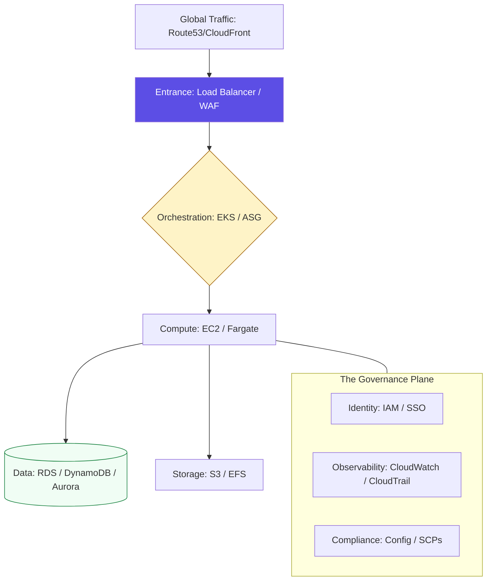

# 📔 Cloud Platform Engineering: The Keyword Encyclopedia

Welcome to the central reference hub for **Platform Engineering and Cloud Architecture**. This guide provides the technical foundation for building global, resilient, and secure infrastructures across major cloud providers (AWS, Azure, GCP).

---

## 🏗️ Technical Reference Manuals

### 1. [🛠️ Compute & Storage](./compute-storage-keywords.md)
Elasticity, Instance Types, Block vs. Object Storage, and High-Availability patterns.

### 2. [🛡️ Networking & Identity](./networking-identity-keywords.md)
VPC design, Transit Gateways, DNS, and the IAM (Identity & Access Management) hierarchy.

### 3. [🔐 Governance & Cost](./governance-cost-keywords.md)
The Well-Architected Framework, Shared Responsibility, SCPs, and FinOps principles.

### 4. [📊 Architecture Frameworks](./well-architected-framework-ref.md)
Deep dive into the five pillars of high-quality cloud design.

---

## 🛠️ The "Staff Level" Platform Bar

In a production organization, cloud platforms are judged by their **Scalability**, **Observability**, and **Security Hardening**.

| Junior Level | Staff Engineer Level |
| :--- | :--- |
| Deploys single EC2 instances manually. | Deploys **Self-Healing Auto-Scaling Groups** across multiple Availability Zones. |
| Hardcodes security group rules (0.0.0.0/0). | Enforces **Least-Privilege Networking** and Zero-Trust identity. |
| Uses a single 'Admin' account for everything. | Implements **Multi-Account Strategies** using Organizations and SCPs. |
| Ignores cloud costs until the bill arrives. | Implements **FinOps Visibility** and automated cost-saving policies (Spot/Reserved). |
| Backs up data manually. | Enforces **Cross-Region Replication** and automated Point-in-Time recovery. |

---

## 🏗️ The Cloud Architecture Stack

---

[⬅️ Back to Cloud Platforms Index](../readme.md)

---
## 🧭 Additional Modules
- [samples](samples/readme.md)
