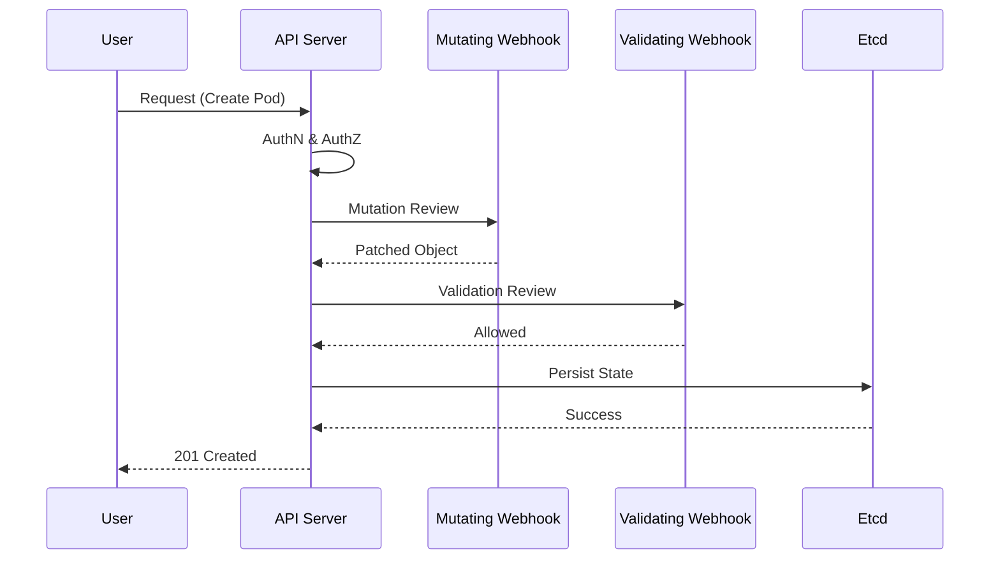

# Advanced Kubernetes: Production, Security & Scale

Welcome to the pinnacle of container orchestration. This module covers the deep technical expertise required to manage mission-critical, high-scale Kubernetes clusters in production environments.

### Learning Path
1. [K8s Overview](./readme.md)
2. [📺 YouTube Lessons](./youtube-lessons.md)
3. [❓ Interview Questions & Quiz](./interview-questions-and-quiz.md)

---

## 🏗️ Control Plane & Internals

Understanding the "Brain" of Kubernetes is essential for troubleshooting and optimization.

- **[Control Plane Deep Dive](./control-plane/)**: Inside the API Server, Scheduler, Controller Manager, and ETCD.
- **[Admission Controllers](./admissioncontrollers/)**: Intercepting and validating requests before they are persisted.
- **[Certificates & PKI](./certificates/)**: Managing cluster-wide TLS and certificate rotation.

---

## 🛡️ Security & Governance
Hardening the cluster against internal and external threats.
- **[RBAC (Role-Based Access Control)](./rbac/)**: Granular permission management following the principle of least privilege.
- **[Network Policies](./networkpolicies/)**: Pod-level firewalling for secure East-West communication.
- **[Compliance & Policy (OPA/Gatekeeper)](./compliance/)**: Enforcing baseline and restricted security standards across the cluster.

---

## 📈 Scalability & Performance

Managing resource consumption and automated scaling.
- **[Autoscaling (HPA/VPA)](./autoscaling/)**: Dynamic scaling of pods and resource request adjustments.
- **[Advanced Scheduling](./scheduling/)**: Using Taints, Tolerations, and Affinity to control pod placement.
- **[High-Performance Storage (CSI)](./csi/)**: Managing volume snapshots and backup/restore strategies.

---

## 🏛️ Advanced Architecture

Handling complex stateful applications and cloud-native services.
- **[StatefulSets](./statefulsets/)**: Managing databases and distributed systems with stable identities.
- **[DaemonSets](./daemonsets/)**: Running specialized agents (metrics, logging) on every node.
- **[Service Mesh (Istio/Linkerd)](./servicemesh/)**: Advanced traffic management, mutual TLS, and observability.

---

## ☁️ Cloud Specific: EKS Deep Dive

- **[EKS with Terraform](./eks/eks-tf/)**: Provisioning production-ready AWS EKS clusters with managed node groups and VPC integration.

---

## 📖 Best Practices
1. **Immutable Infrastructure**: Changes should be made to templates and images, not running pods.
2. **Observability First**: Always deploy metrics and tracing before going to production.
3. **Automate Everything**: Use GitOps patterns to manage your cluster state (see the [GitOps Module](../../../../readme.md)).

---
**Next Step**: Learn how to bridge these clusters with enterprise-scale automation in the [Advanced Automation Module](../../../../readme.md).

---
## 🧭 Additional Modules
- [BackupRestore](backuprestore/readme.md)
- [CNI](cni/readme.md)
- [CRI](cri/readme.md)
- [GitOps](gitops/readme.md)
- [VolumeSnapshots](volumesnapshots/readme.md)
