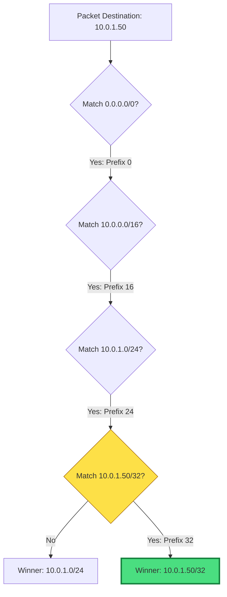

# 🎯 Module 04.02: Priority Logic & Longest Prefix Match (LPM)

> **"In a world of multiple paths, the router follows the most specific map. Longest Prefix Match is the ultimate law of the network—the more you know about the destination, the higher your priority."**

## 📚 Overview

When a packet needs to be routed and there are multiple matching rules in a route table, how does AWS decide which one to follow? The answer is **Longest Prefix Match (LPM)**. This module dives into the decision-making "brain" of the VPC router, teaching you how to predict packet flow and how to use specificity to override default behaviors for security or troubleshooting.

## 🎓 Learning Objectives

By the end of this module, you will:

- ✅ Master the **LPM Rule**: Specificity always wins.
- ✅ Rank routes by **Hierarchy** (from /0 to /32).
- ✅ Understand the **Tie-Breaking Order** (Static vs. Propagated).
- ✅ Implement **Override Routes** for emergency traffic redirection.
- ✅ Predict routing behavior in **Multi-VPC** peering environments.

---

## 🏗️ The Law of Specificity

LPM means that the router will choose the route with the most specific destination (the one with the largest CIDR prefix/number after the slash). 

| Destination | CIDR Number | Meaning | Priority |
| :--- | :--- | :--- | :--- |
| **10.0.1.25/32** | **32** | A single specific server. | **Highest (The Sniper)** |
| **10.0.1.0/24** | **24** | A neighborhood (Subnet). | **High (The Street)** |
| **10.0.0.0/16** | **16** | A city (The VPC). | **Medium (The Town)** |
| **0.0.0.0/0** | **0** | The entire world (Internet). | **Lowest (The Map)** |

---

## 🚀 Professional Pattern: The Static Override

Sometimes you have two routes with the exact same prefix length (e.g., two different paths to `/24`). In this case, AWS uses a strict hierarchy:

1.  **Static Routes**: Routes you manually typed into the table.
2.  **Propagated Routes**: Routes learned automatically (via BGP) from a VPN or Direct Connect.

**The Pro Standard**:
- If you have a Direct Connect (Propagated) and a VPN (Propagated), and the Direct Connect fails, the VPN will take over automatically.
- If you need to **force** traffic away from the automated path, add a **Static Route** for the same CIDR. Because Static > Propagated, VPC will follow your manual instruction immediately.

---

## 🏆 Real-World DevOps Story: The Peering Conflict

**The Scenario**: A company had a general route to the internet (`0.0.0.0/0 -> igw`). They partnered with a data provider and set up a VPC Peering connection, adding a route for the provider's range (`172.16.0.0/12 -> pcx-123`).
**The Crisis**: Some developers complained they could no longer reach an "external" API they used to talk to via the internet.
**The Discovery**: The external API just happened to have an IP of `172.16.5.1`. Because `/12` is more specific than `/0`, the VPC was trying to send that API traffic through the Peering connection to the partner, who was then dropping it because it wasn't meant for them.
**The Fix**: The team added a highly specific route: `172.16.5.1/32 -> igw-xxxx`.
**The Impact**: Because `/32` is longer than `/12`, the traffic for that specific API went back to the internet, while the rest of the `172.16.x.x` traffic continued to the partner.
**The Lesson**: **LPM is a double-edged sword.** It gives you precision, but if your partner's internal range overlaps with public services you use, you must use `/32` overrides to fix the conflict.

---

## ❓ Interview Preparation (LPM Logic)

1. **Q: If a route table has 10.0.0.0/16 pointing to 'local' and 10.0.1.0/24 pointing to a 'NAT Gateway', what happens to traffic for 10.0.1.5?**
    *A: It goes to the NAT Gateway. Because `/24` is a more specific (longer) match than `/16`, LPM dictates that the NAT Gateway route wins.*

2. **Q: What is the 'sniper route'?**
    *A: It is a slang term for a `/32` route. It targets one specific IP address and overrides every other possible rule in the table, making it an essential tool for troubleshooting or security isolation.*

3. **Q: If you have two routes of the exact same length (e.g. both /24), how does AWS decide?**
    *A: It looks at the origin. A **Static** route (manually added) will always win over a **Propagated** route (learned via BGP/VPN). If both are the same origin, AWS uses BGP metrics to decide.*

4. **Q: Can you create a route more specific than the 'local' route for an internal VPC address?**
    *A: **Yes.** You can create a `/32` route for an internal IP and point it to a specific Network Interface or Gateway. This is how "Inline Security Appliances" work—they intercept traffic by being more specific than the default local route.*

5. **Q: Why is 0.0.0.0/0 called the 'Route of Last Resort'?**
    *A: Because it has a prefix length of **0**. It is the absolute least specific route possible. The router will only follow it if a packet matches NOTHING else in the table.*

---

## 📝 Knowledge Check

1. **Which route will be chosen for a packet going to 172.16.10.5?**
    - [ ] a) 172.16.0.0/12
    - [x] b) 172.16.10.0/24
    - [ ] c) 0.0.0.0/0
    - [ ] d) 10.0.0.0/8

2. **In a tie between a /24 Static route and a /24 Propagated route, which wins?**
    - [x] a) Static Route
    - [ ] b) Propagated Route
    - [ ] c) Neither (Traffic is dropped)
    - [ ] d) The one added most recently

3. **What is the CIDR prefix for a route that targets a single EC2 instance?**
    - [ ] a) /0
    - [ ] b) /16
    - [ ] c) /24
    - [x] d) /32

4. **True or False: The router chooses the route with the SHORTEST prefix match.**
    - [ ] True
    - [x] False (It chooses the LONGEST)

5. **If no matching route is found in the table, what happens to the packet?**
    - [ ] a) It is sent to the Main Route Table
    - [ ] b) It is sent to the Internet Gateway
    - [x] c) It is dropped (discarded)
    - [ ] d) It is broadcast to all subnets

---

## 🔗 Next Steps

You've mastered the logic. Now let's explore the "Middleboxes"—advanced routes that allow you to inspect traffic before it reaches its destination.

Proceed to: **[03. Gateway Routing and Middleboxes](../../../../../readme.md)** →