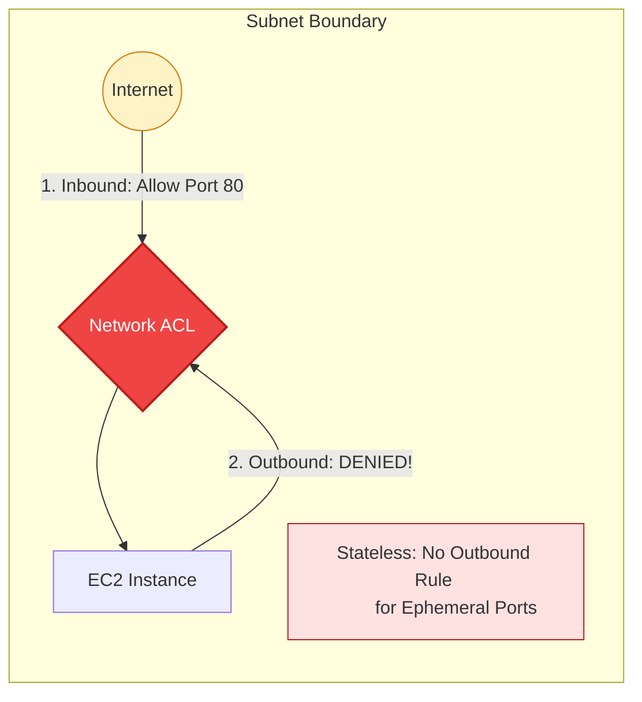

# 🚪 Module 05.02: Network ACLs (Stateless Subnet Filtering)

> **"A Network ACL is the gatekeeper of the entire street. It doesn't care who you are or where you're going; it only cares if your name is on the list for both entry and exit. It is the ultimate tool for broad security enforcement."**

## 📚 Overview

A **Network Access Control List (NACL)** is an optional layer of security for your VPC that acts as a firewall for controlling traffic in and out of one or more subnets. Unlike the surgical, instance-level protection of Security Groups, NACLs are the "Broad Swords" of cloud security, operating at the **Subnet Level** with a strictly **Stateless** logic.

## 🎓 Learning Objectives

By the end of this module, you will:

- ✅ Define and identify **Stateless Behavior**.
- ✅ Master the **Rule Numbering** evaluation logic.
- ✅ Implement **Deny Rules** for specific malicious CIDRs.
- ✅ Configure **Ephemeral Port Ranges** for return traffic.
- ✅ Identify the **Defaults** for custom vs. default NACLs.

---

## 🏗️ The Pillars of Network ACLs

### 1. Statelessness (No Memory)
NACLs do not preserve the state of a connection. If a user sends a request to your web server (Inbound), the NACL checks its inbound rules and lets them in. When the server tries to respond (Outbound), the NACL **does not remember** the previous interaction. It checks its outbound rules again. If there is no rule allowing the return traffic, the packet is crushed.

### 2. Rule Hierarchy (Lowest to Highest)
Rules are evaluated in order, starting with the **Lowest Number**. 
- **Rule 10**: `Deny 1.2.3.4`
- **Rule 100**: `Allow 0.0.0.0/0`
- **Result**: Traffic from `1.2.3.4` is blocked because 10 is evaluated before 100.
- **Stop-on-Match**: As soon as a packet matches a rule, evaluation stops.

### 3. The Power of "Deny"
Security Groups can only "Allow." NACLs are the only VPC component that can explicitly "Deny" a range. This makes them the primary tool for blocking DDoS botnets, blacklisted countries, or compromised internal ranges.

---

## 🚀 Professional Pattern: The "Rule of 100"

Senior network engineers always leave gaps in their rule numbering to allow for future emergency changes.

**The Pro Standard**:
1. **The Gap**: Never number rules 1, 2, 3. Instead, use increments of 100 (100, 200, 300).
2. **Emergency Room**: If you need to block a specific IP address *immediately*, you can add **Rule 50** or **Rule 99**. Since these are lower than your main "Allow" rules (100+), they will take effect instantly without you having to reorder your entire table.
3. **The Ephemeral Rule**: Every custom NACL in production almost always has an Outbound Rule (e.g., Rule 1000) that allows Port Range **1024-65535** to handle the stateless return traffic.

---

## 🏆 Real-World DevOps Story: The Bot Blocker

**The Scenario**: A major retail site's inventory API was being hammered by an aggressive scraper from a specific data center in another country. The scraper was rotating User-Agents and headers, making it hard to block at the Application Load Balancer.
**The Crisis**: The web server CPUs were hitting 95%, causing a slow-down for real customers during a holiday sale.
**The Fix**: The DevOps team identified the scraper's source CIDR block (`192.0.2.0/24`). They added **Rule 10** to their public subnet NACL with an **ACTION: DENY**.
**The Impact**: The traffic was dropped at the VPC edge. The web servers never even saw the packets, their CPU dropped to 20%, and the legitimate customers regained full speed.
**The Lesson**: **Defense at the Edge.** Don't make your app servers work to find out a request is malicious. Use NACLs to drop garbage traffic before it costs you compute power.

---

## ❓ Interview Preparation (Network ACLs)

1. **Q: What is the significance of the rule number in a NACL?**
    *A: Rules are evaluated in numerical order, starting from the lowest number. The first rule that matches the traffic is applied, and all remaining rules (even if they conflict) are ignored. This is why explicit 'Deny' rules for specific IPs should have lower numbers than broad 'Allow' rules.*

2. **Q: How many NACLs can be associated with a single subnet?**
    *A: A subnet can be associated with **exactly one** NACL at a time. However, one NACL can be associated with many different subnets.*

3. **Q: Why do stateless firewalls require 'Ephemeral Port' rules?**
    *A: Because a stateless firewall doesn't track connections. When an instance sends a request (Outbound), the responding server sends data back on a high port (usually between 1024 and 65535). Without an inbound rule allowing this range, the response will be blocked even if the initial request was successful.*

4. **Q: What is the behavior of the default NACL that comes with every VPC?**
    *A: The default NACL is permissive by default—it allows all inbound and outbound traffic. This ensures that you aren't blocked by the NACL while you are setting up your Security Groups.*

5. **Q: Can a NACL reference a Security Group ID in its rules?**
    *A: **No.** Network ACLs only understand **CIDR blocks** (IP ranges). They cannot see Security Group IDs or instance tags because they operate at the subnet boundary, not the instance level.*

---

## 📝 Knowledge Check

1. **In a NACL, if Rule 100 Allows 80 and Rule 50 Denies 80, what happens to traffic on port 80?**
    - [ ] a) It is Allowed
    - [x] b) It is Denied (Rule 50 is evaluated first)
    - [ ] c) evaluation continues to Rule 101
    - [ ] d) The NACL errors out

2. **Which range represents the standard 'Ephemeral Ports' for most modern operating systems?**
    - [ ] a) 1-1024
    - [ ] b) 80-443
    - [x] c) 1024-65535
    - [ ] d) 3306-5432

3. **What is the default action of a custom NACL's catch-all (*) rule?**
    - [ ] a) Allow
    - [x] b) Deny
    - [ ] c) Log Only
    - [ ] d) Redirect

4. **True or False: A single NACL can be associated with multiple subnets.**
    - [x] True 
    - [ ] False

5. **Which layer of the OSI model does a Network ACL operate at?**
    - [ ] a) Layer 2 (Data Link)
    - [x] b) Layer 3 (Network)
    - [ ] c) Layer 4 (Transport)
    - [ ] d) Layer 7 (Application)

---

## 🔗 Next Steps

You've mastered the gatekeeper and the guard. Now let's see how to combine them into a bulletproof defense strategy.

Proceed to: **[03. Layered Defense Strategies](../../../../../readme.md)** →