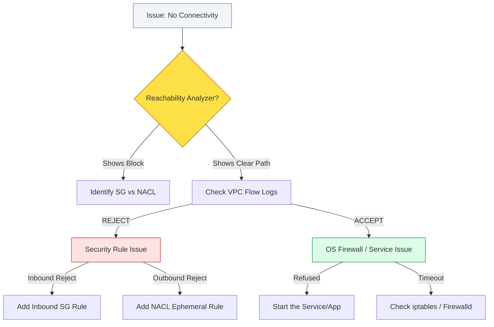

# 🔍 Module 05.04: Advanced Troubleshooting (Security)

> **"A network that doesn't talk back is usually a network that is keeping a secret. Debugging is the art of asking the right questions with the right tools until the silence is broken."**

## 📚 Overview

Debugging network security in AWS requires a systematic approach. Most "broken" connections are not caused by hardware failure, but by a misunderstanding of stateful vs. stateless behavior or the notorious **"Ephemeral Port Trap."** This module provides a diagnostic framework and the toolset needed to solve the most complex connectivity puzzles in the cloud.

## 🎓 Learning Objectives

By the end of this module, you will:

- ✅ Master the **Ephemeral Port Trap** (Stateless return paths).
- ✅ Differentiate between **Timeout** and **Connection Refused**.
- ✅ Analyze **VPC Flow Logs** (ACCEPT vs. REJECT).
- ✅ Utilize **VPC Reachability Analyzer** for path validation.
- ✅ Debug **OS-level Firewalls** (iptables/ufw).

---

## 🏗️ The Ephemeral Port Trap

When a client connects to a server, it uses a well-known port (like 80 or 443) on the server. However, the client itself opens a temporary **Ephemeral Port** (usually between 1024-65535) to receive the response.

### Why this breaks NACLs
Because NACLs are **stateless**, they don't know that an outbound packet is a response to an allowed inbound request.
- **Inbound**: You allow Port 443 in the NACL.
- **Outbound**: Your server tries to send the response to the client's high port (e.g., 55000).
- **Failure**: If your Outbound NACL only has `Allow 443`, it doesn't match port 55000. The response is **blocked**, and the user sees a "Timed Out" error.

---

## 🚀 Professional Pattern: The Diagnostic Order

Senior DevOps engineers always follow a "bottom-up" troubleshooting order:

1. **VPC Reachability Analyzer**: Check the infrastructure path first. 90% of failures are here (wrong SG, wrong NACL, wrong Route).
2. **VPC Flow Logs**: If the path is clear, look at the packet results.
    - **REJECT**: The security rule is definitely the culprit.
    - **ACCEPT**: The AWS infrastructure is working perfectly. The problem is inside your EC2 instance.
3. **OS Check**: SSH into the instance and run `netstat -tulpn`. Is the app even listening on the port? Is `iptables` or `ufw` blocking it internally?

---

## 🏆 Real-World DevOps Story: The Ephemeral Blackhole

**The Scenario**: A financial firm switched to a custom, "Highly Secure" NACL for their payment processing tier. They allowed only Port 443 and Port 22 in both directions.
**The Crisis**: Customer transactions started failing with `Connection Timeout`. The monitoring logs on the servers showed they were receiving requests, but they couldn't seem to "talk back" to the customers.
**The Discovery**: A junior admin used `tcpdump` and saw that the servers were trying to send packets to ports like `32768`, `49152`, and `52000`. These weren't 443, so the "Secure" Outbound NACL rule was dropping them. 
**The Fix**: They added an Outbound NACL rule for range `1024 - 65535`.
**The Impact**: Transactions resumed instantly.
**The Lesson**: **Statelessness requires empathy for the client.** You must allow the client's destination port (ephemeral range) to get a response back to them.

---

## ❓ Interview Preparation (Troubleshooting)

1. **Q: What is the difference between a 'Connection Timeout' and 'Connection Refused' error?**
    *A: **Connection Timeout** means the packet was dropped silently (usually by a firewall like an SG or NACL). The client waited but never heard back. **Connection Refused** means the packet reached the target, but the server explicitly reset the connection because no application was listening on that port (or a service like `iptables` rejected it).*

2. **Q: What does a 'REJECT' entry in a VPC Flow Log tell you?**
    *A: It tells you that the packet was blocked by either a **Security Group** or a **Network ACL**. It confirms the issue is in the AWS networking layer, not inside the instance's operating system.*

3. **Q: How does the VPC Reachability Analyzer speed up troubleshooting?**
    *A: It performs a static configuration analysis of the path between two resources. It will literally point to the specific Security Group ID or NACL rule number that is causing the drop, saving you from manually auditing dozens of tables.*

4. **Q: What is the ephemeral port range for most Linux distributions and AWS NAT Gateways?**
    *A: The standard range is **1024 - 65535**. Some older systems use 32768 - 65535.*

5. **Q: If ping (ICMP) works between two instances but HTTP (Port 80) fails, what is the likely cause?**
    *A: The Routing and NACLs are likely correct, but the **Security Group** (or an OS-level firewall) only has an allow rule for the ICMP protocol and is missing the TCP Port 80 rule.*

---

## 📝 Knowledge Check

1. **Which tool would you use to see if a port is listening on a remote server?**
    - [ ] a) Ping
    - [x] b) Netcat (nc)
    - [ ] c) Reachability Analyzer
    - [ ] d) CloudWatch

2. **In a Flow Log, if you see 'ACCEPT' but the user still can't connect, where is the problem?**
    - [ ] a) Security Group
    - [ ] b) Network ACL
    - [x] c) Inside the OS (App or local firewall)
    - [ ] d) Internet Gateway

3. **To solve the Ephemeral Port Trap, which change is needed?**
    - [ ] a) Add a Deny rule to the SG
    - [x] b) Add an Outbound NACL rule for ports 1024-65535
    - [ ] c) Change the instance type
    - [ ] d) Reboot the NAT Gateway

4. **Which error message is typical of a Security Group dropping an inbound packet?**
    - [x] a) Connection Timed Out
    - [ ] b) Connection Refused
    - [ ] c) 404 Not Found
    - [ ] d) 500 Internal Server Error

5. **True or False: Security Groups are evaluated BEFORE NACLs on the OUTBOUND path.**
    - [x] True 
    - [ ] False

---

## 🔗 Next Steps

You've learned how to secure and troubleshoot. Now let's explore how to give your VPC a "Global Voice"—the DNS and DHCP systems that power human-readable cloud networking.

Proceed to: **[01-DNS-DHCP](../../../../../readme.md)** →
Node: This link points to the next phase in the curriculum structure.