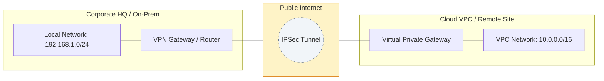

# 🔐 Module 05: VPN Technologies

> **"A VPN isn't just a tunnel; it's a bridge between untrusted worlds. It allows us to extend our private boundaries across the chaos of the public internet."**

## 📚 Overview

As infrastructure becomes increasingly distributed, the ability to securely connect remote workers and separate data centers is critical. **Virtual Private Networks (VPNs)** provide the encrypted "tunnels" that make a distributed network feel like a single, local office. This module covers the foundational protocols of secure transit: **IPSec** for site-to-site connectivity and **SSL/TLS (OpenVPN/WireGuard)** for remote access. We will explore how to architect these solutions for high availability, performance, and modern "Zero Trust" needs.

## 🎓 Learning Objectives

By the end of this module, you will:

- ✅ Implement **Site-to-Site IPSec VPNs** for hybrid cloud connectivity.
- ✅ Configure **Remote Access VPNs** (OpenVPN & WireGuard) for mobile workforces.
- ✅ Understand the difference between **Split-Tunnelling** and **Full-Tunnelling**.
- ✅ Master **IPSec Phase 1 & 2** (IKE) negotiation logic.
- ✅ Optimize VPN performance using **Compression** and **QoS**.
- ✅ Debug encrypted traffic using **Flow Analysis** and diagnostic commands.

---

## 🏗️ Core Technologies

### 1. IPSec (Internet Protocol Security)
The industry standard for site-to-site tunnels.
- **Phase 1 (IKE)**: Establishes a secure management channel (the "handshake").
- **Phase 2 (IPSec)**: Establishes the actual data tunnel where user traffic is encrypted.
- **Protocols**: Uses **ESP** (Encapsulation) and **AES** (Encryption) to protect packets.

### 2. SSL/TLS VPNs (OpenVPN)
Typically used for individual users connecting to an office.
- **Port Flexibility**: Can run over TCP 443, making it look like standard web traffic (harder to block).
- **Client-Based**: Requires software like OpenVPN Connect or Tunnelblick.

### 3. WireGuard
The modern "Speed King" of VPNs.
- **Lightweight**: Uses high-performance cryptography instead of legacy IPSec complexity.
- **Stealthy**: Doesn't respond to scans unless the client has the correct key.

---

## 🚀 Professional Pattern: The "Split-Tunnel" Balance

Many companies force all traffic through the VPN (**Full-Tunnel**). While secure, it kills performance for things like Zoom or YouTube.

**The Pro Standard**:
1. **Split-Tunnelling**: Only send traffic destined for the internal CIDRs (e.g., `10.0.0.0/8`) through the tunnel.
2. **Local Breakout**: Let standard internet traffic (Netflix, Google) go directly through the user's home ISP.
3. **Benefit**: Reduces the load on the corporate VPN gateway by 70% and provides a much faster experience for the end user.

---

## 🏆 Real-World DevOps Story: The Phase 2 Ghost

**The Scenario**: A company connected their Main Office to their new Cloud VPC via a Site-to-Site IPSec VPN. Everything worked for 10 minutes, then the connection would die for 1 minute, then come back.
**The Crisis**: Developers were being kicked off their database sessions constantly. The "Tunnel Status" in the dashboard kept flipping between `Up` and `Down`.
**The Discovery**: The IKE **Phase 2 Lifetime** on the On-Prem router was set to 1 hour, but the Cloud Gateway was expecting 8 hours. When the router tried to "re-key" the tunnel early, the Cloud Gateway rejected it, causing the tunnel to collapse and wait for a full timeout before restarting.
**The Fix**: Synchronizing the lifetimes and encryption algorithms (AES-256/SHA-256) on both sides immediately stabilized the connection.
**The Lesson**: **Phase 1 and Phase 2 are two different dances.** Even if the initial handshake works, a mismatch in the "renewal" settings will cause a "Ghost" failure that only appears after the first re-key.

---

## ❓ Interview Preparation (VPNs)

1. **Q: What is the difference between IPSec Transport Mode and Tunnel Mode?**
    *A: **Transport Mode** only encrypts the payload (the data inside); the original IP header remains visible. It's used for end-to-end security. **Tunnel Mode** encrypts the entire packet (Header + Data) and wraps it in a new IP header. This is the standard for Site-to-Site VPNs.*

2. **Q: Explain 'Split-Tunnelling'.**
    *A: Split-tunnelling is a configuration where only specific traffic (destined for internal company networks) is sent through the VPN, while general internet traffic exits through the user's local internet connection.*

3. **Q: What are Phase 1 and Phase 2 in an IPSec negotiation?**
    *A: **Phase 1 (IKE)** creates a secure channel to negotiate how the real data will be encrypted. **Phase 2 (IPSec)** creates the actual secure tunnels that carry the user data.*

4. **Q: Why is WireGuard considered more 'modern' than IPSec or OpenVPN?**
    *A: It has a much smaller codebase (easier to audit), uses state-of-the-art cryptography by default (no weak ciphers), and is significantly faster and more battery-efficient on mobile devices.*

5. **Q: What is a 'Dead Peer Detection' (DPD)?**
    *A: DPD is a mechanism that allows a VPN gateway to detect if its partner has gone offline. It sends "keepalive" pings. If no response is received, it tears down the tunnel so a new one can be established immediately upon the partner's return.*

---

## 📝 Knowledge Check

1. **Which component of IPSec is responsible for encrypting the data payload?**
    - [ ] a) AH (Authentication Header)
    - [x] b) ESP (Encapsulating Security Payload)
    - [ ] c) IKE (Internet Key Exchange)
    - [ ] d) BGP

2. **What is the standard UDP port for OpenVPN?**
    - [ ] a) 443
    - [ ] b) 500
    - [x] c) 1194
    - [ ] d) 51820

3. **In a Site-to-Site VPN, which mode is used to hide the internal IP addresses of the packets?**
    - [ ] a) Transport Mode
    - [x] b) Tunnel Mode
    - [ ] c) Passthrough Mode
    - [ ] d) Stealth Mode

4. **Which VPN protocol is known for 'Stealth' operation by not responding to unauthorized packets?**
    - [ ] a) IPSec
    - [ ] b) L2TP
    - [x] c) WireGuard
    - [ ] d) PPTP

5. **True or False: SSL VPNs typically require a specialized hardware client for every user.**
    - [ ] True
    - [x] False (They often use standard browsers or lightweight software)

---

## 🔗 Next Steps

You've built the secure tunnels. Now let's see how to distribute traffic across your servers to ensure they never get overwhelmed.

Proceed to: **[06. Load Balancing](readme.md)** →
Node: This link points to the next logical step in the curriculum.