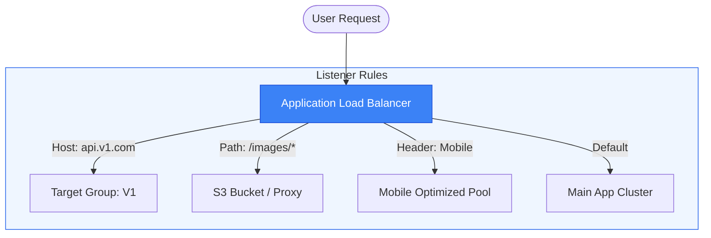

# 🧠 Module 07.02: ALB Deep Dive & L7 Routing

> **"What makes the Application Load Balancer special isn't that it balances traffic; it's that it 'understands' it. Because it reads the HTTP protocol, it becomes the intelligent brain of your microservices architecture."**

## 📚 Overview

The **Application Load Balancer (ALB)** is a highly intelligent, content-aware proxy. Unlike Layer 4 balancers that just blindly pass packets, the ALB terminates the connection, reads the HTTP headers, inspects the cookies, and evaluates the URL path. This allows you to host multiple applications on a single load balancer and direct users to specific microservices based on their request. This module deep dives into **Smart Routing**, **SSL Termination**, and how to protect your app with **AWS WAF**.

## 🎓 Learning Objectives

By the end of this module, you will:

- ✅ Master **Path-Based** and **Host-Based** routing rules.
- ✅ Implement **Weighted Target Groups** for Canary and Blue/Green deployments.
- ✅ Understand **SNI (Server Name Indication)** and multi-certificate hosting.
- ✅ Configure **Redirect Rules** (e.g., HTTP to HTTPS) and **Fixed Responses**.
- ✅ Integrate **AWS WAF** to block Layer 7 attacks (SQLi, XSS).

---

## 🏗️ Intelligence Features

### 1. Smart Routing Rules
ALB evaluates rules on a "Top-Down" basis. The first rule that matches a condition (URL path, Hostname, HTTP Header, or Query String) wins.
- **Example**: `myapp.com/api` goes to the API group, while `myapp.com/*` goes to the static web group.

### 2. SSL/TLS Termination & SNI
- **Termination**: The ALB decrypts traffic once, so your backend servers receive plain HTTP. This saves significant CPU on your instances.
- **SNI**: Allows you to host `site-a.com` and `site-b.com` on the same ALB, using different SSL certificates for each.

### 3. Native Integration
- **WAF**: Block bad bots or malicious request patterns before they reach your code.
- **OIDC/Cognito**: Authenticate users (Login with Google/Facebook) directly at the load balancer.

---

## 🚀 Professional Pattern: The "Blue/Green" Traffic Shift

When deploying a major update, senior engineers don't just "switch the code." They use **Weighted Target Groups**.

**The Pro Standard**:
1. **The Setup**: Create two Target Groups: `TG-Blue` (Old Version) and `TG-Green` (New Version).
2. **The Shift**: Initially, set the weight to 100 for Blue and 0 for Green.
3. **The Canary**: Shift 5% of traffic to Green. Monitor your error logs.
4. **The Completion**: If everything is healthy, shift 10%... then 50%... then 100%.
5. **The Rollback**: If Green crashes, simply shift the weight back to Blue instantly. No DNS propagation wait time.

---

## 🏆 Real-World DevOps Story: The Phishing Bot Defense

**The Scenario**: A fintech startup was being attacked by a botnet trying to scrape user data. The bots were sending requests with a specific custom header: `X-Scanner: Malicious`.
**The Crisis**: The application servers were overwhelmed. Even though the application returned a 403 error, the servers still had to "wake up" and process the request, which was using up all the available connections.
**The Discovery**: They could handle this at the "Gatekeeper" level.
**The Fix**: They added an ALB Rule: *If HTTP Header `X-Scanner` exists, return a **Fixed Response** of 403 Forbidden with a plain text message "Go Away."*
**The Result**: The requests were blocked inside the ALB's infrastructure. The application servers never even saw the packets, and their CPU load dropped from 90% to 5% instantly.
**The Lesson**: **Drop garbage at the door.** Your application should only see valid, filtered traffic.

---

## ❓ Interview Preparation (ALB Smarts)

1. **Q: What is the difference between a 'Forward' and a 'Redirect' action in an ALB?**
    *A: **Forward** sends the request to a backend target group (transparently). **Redirect** sends an HTTP 301/302 back to the user's browser, telling them to visit a different URL (like moving from `http://` to `https://`).*

2. **Q: How many rules can a single ALB Listener handle?**
    *A: By default, you can have up to 100 rules per listener. Rules are prioritized numerically; lower numbers are evaluated first.*

3. **Q: What is a 'Fixed Response'?**
    *A: It is a rule where the ALB returns a custom status code (e.g., 403, 503) and a custom message body directly to the client without ever talking to a backend server. Great for maintenance pages or blocking specific agents.*

4. **Q: How does SNI help save money?**
    *A: Before SNI, you needed a separate Load Balancer for every domain name that had a different SSL certificate. With SNI, you can host hundreds of domains on a single ALB, saving the hourly cost of multiple balancers.*

5. **Q: Can an ALB route traffic based on the client's cookie?**
    *A: **Yes.** ALB routing rules can inspect Cookies, Query Strings, and custom HTTP Headers to make a routing decision. This is highly useful for "A/B Testing" or "Beta Testing" specific users.*

---

## 📝 Knowledge Check

1. **Which routing type allows you to send 'myapp.com/blog' to a different server than 'myapp.com/app'?**
    - [ ] a) Host-based
    - [x] b) Path-based
    - [ ] c) Query-based
    - [ ] d) Protocol-based

2. **What is the HTTP status code typically used for a 'Permanent Redirect' from HTTP to HTTPS?**
    - [ ] a) 200
    - [ ] b) 404
    - [x] c) 301
    - [ ] d) 503

3. **In the ALB rule ranking, which priority level is evaluated first?**
    - [x] a) 1 (Highest Priority)
    - [ ] b) 100
    - [ ] c) 999
    - [ ] d) Default Rule

4. **Which feature allows an ALB to present the correct SSL certificate based on the requested domain name?**
    - [ ] a) HSTS
    - [b] b) SNI (Server Name Indication)
    - [ ] c) OSCP
    - [ ] d) TLS Termination

5. **True or False: Using an ALB allows you to perform 'Canary' deployments by splitting traffic by percentage weight between two versions of your app.**
    - [x] True 
    - [ ] False

---

## 🔗 Next Steps

You've mastered the intelligent "Layer 7" world. Now let's look at the high-performance giants: the NLB and the GLB.

Proceed to: **[03. NLB & GLB Architecture](../03-nlb-and-glb-architecture/readme.md)** →
Node: This link points to the next lesson.