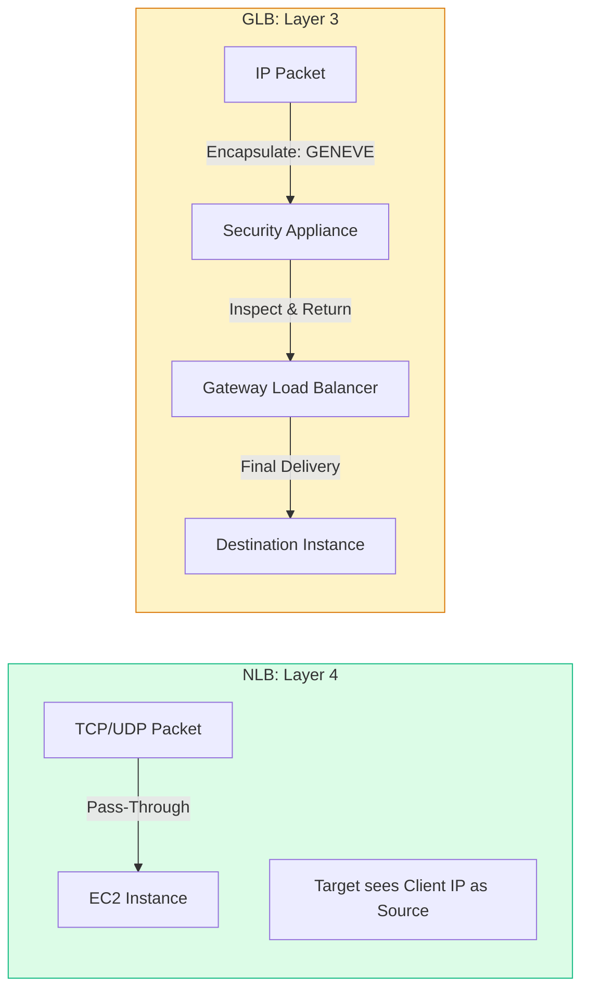

# ⚡ Module 07.03: NLB & GLB Architecture

> **"If the ALB is the intelligent brain of the network, the Network Load Balancer (NLB) is its raw, unbridled muscle. When you need to handle millions of requests with sub-millisecond latency, you don't need a proxy; you need a pass-through."**

## 📚 Overview

While the ALB handles complex application-level logic, the **Network Load Balancer (NLB)** and **Gateway Load Balancer (GLB)** operate at the foundations of the network stack. The NLB is designed for ultra-performance, handling millions of requests per second with volatile traffic patterns. The GLB is a specialized tool for "inserting" security appliances (like firewalls) into your traffic flow without changing your application code. This module explores when to choose "Raw Performance" over "Application Intelligence."

## 🎓 Learning Objectives

By the end of this module, you will:

- ✅ Understand the **Layer 4 (Transport)** mechanics of the NLB.
- ✅ Implement **Static IP Addresses** and Elastic IPs for NLB whitelisting.
- ✅ Master the **GENEVE Protocol** used by Gateway Load Balancers.
- ✅ Identify the "Source IP Preservation" feature of NLBs.
- ✅ Deploy **Transparent Security Appliances** using GLB endpoints.

---

## 🏗️ High Performance vs. Security

### 1. Network Load Balancer (NLB)
- **Static IPs**: Unlike ALB, you can assign an Elastic IP to the NLB, providing a permanent, unchanging entry point for your partners.
- **Latency**: Processes traffic in microseconds. It's essentially "transparent" to your application.
- **Protocol**: Best for TCP, UDP, and TLS. It handles volatile traffic that spikes from zero to millions in seconds.

### 2. Gateway Load Balancer (GLB)
- **Bump-in-the-wire**: Acts as a gateway that "forces" traffic through a fleet of security appliances (Firewalls, IDS/IPS).
- **GENEVE**: It wraps the original packet in a GENEVE header to preserve the source/destination info while the firewall inspects the payload.

---

## 🚀 Professional Pattern: The "Global Whitelist" Egress

Many high-security partners will not accept your traffic unless you provide a **single, static IP address** that they can whitelist in their corporate firewall.

**The Pro Standard**:
1. **The Architecture**: Use a **Network Load Balancer (NLB)** as the entry point for your service.
2. **The IPs**: Assign one **Elastic IP (EIP)** to the NLB in each Availability Zone.
3. **The Result**: Even if your backend instances auto-scale from 5 to 500 nodes, the partner only sees the 2 or 3 static IPs of your NLB.
4. **The Benefit**: Total infrastructure flexibility while maintaining strict security partnerships.

---

## 🏆 Real-World DevOps Story: The Gaming "Lag" Outage

**The Scenario**: A growing competitive e-sport game used an ALB for their game-state sync (running over HTTP). During a tournament, players complained of "random lag spikes" that ruined the matches.
**The Crisis**: Network traces showed that the ALB was adding ~50ms of jitter as it scaled up its own internal "pre-warming" nodes to handle the crowd.
**The Discovery**: Because the ALB is a Layer 7 proxy, it must terminate and re-establish every connection, which introduces a small but variable overhead.
**The Fix**: They migrated the game-state server to a **Network Load Balancer (NLB)** using a custom UDP protocol.
**The Result**: Jitter dropped to zero. Because the NLB is a Layer 4 "pass-through," it doesn't wait to read the application data; it just shunts the packets to the healthy targets immediately.
**The Lesson**: **For real-time systems, L7 is a burden. Stick to L4 (NLB).**

---

## ❓ Interview Preparation (NLB & GLB)

1. **Q: Does an NLB preserve the client's original IP address?**
    *A: **Yes.** Since the NLB is a transparent, non-terminating proxy (Layer 4), the target instance sees the client's IP address as the source of the packet. No `X-Forwarded-For` header is needed.*

2. **Q: What is the GENEVE protocol?**
    *A: It is an encapsulation protocol used by the Gateway Load Balancer. It allows the GLB to "wrap" the original packet into a new header to send it to a security appliance, ensuring the appliance knows exactly where the packet came from and where it needs to go next.*

3. **Q: Can an NLB handle millions of requests per second?**
    *A: Yes. NLBs are built to handle sudden, volatile traffic spikes (like a Super Bowl ad or a flash sale) without the manual "pre-warming" process that an ALB often requires.*

4. **Q: When should you use a Gateway Load Balancer (GLB) instead of a regular NAT Gateway?**
    *A: Use a **GLB** when you need to inspect or filter every packet of north-south (internet) or east-west (inter-VPC) traffic through a third-party firewall or IDS appliance.*

5. **Q: Can you use an NLB for HTTP traffic?**
    *A: Yes. An NLB can handle any TCP traffic, including HTTP. However, you will lose Layer 7 features like Path-based routing and Host-based routing.*

---

## 📝 Knowledge Check

1. **Which load balancer type processes traffic with the absolute lowest latency?**
    - [ ] a) ALB
    - [x] b) NLB
    - [ ] c) GLB
    - [ ] d) CLB

2. **What is the primary architectural use case for a Gateway Load Balancer (GLB)?**
    - [ ] a) Hosting static websites
    - [ ] b) Terminating SSL certificates
    - [x] c) Inserting security appliances (Firewalls/IDS) into traffic flows
    - [ ] d) Caching video content

3. **Which protocol does GLB use to preserve packet metadata during inspection?**
    - [ ] a) HTTP
    - [ ] b) IPsec
    - [x] c) GENEVE
    - [ ] d) GRE

4. **True or False: An NLB can provide a static Elastic IP address for the entire lifetime of the balancer.**
    - [x] True 
    - [ ] False

5. **Where is it best to perform 'Deep Packet Inspection' for security?**
    - [ ] a) On the ALB
    - [ ] b) On the NLB
    - [x] c) On a fleet of instances behind a GLB
    - [ ] d) On the Internet Gateway

---

## 🔗 Next Steps

You've mastered the hardware and the protocols. Now let's see how to squeeze every bit of performance and security out of your Load Balancers with advanced optimization techniques.

Proceed to: **[04. Advanced ELB Optimization](../04-advanced-elb-optimization/readme.md)** →
Node: This link points to the next lesson.