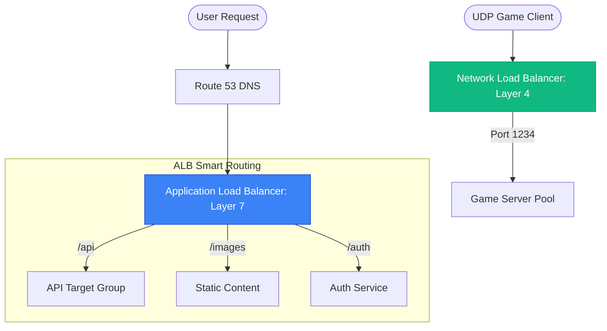

# ⚖️ Cloud Load Balancers (ALB, NLB, GLB)

> **"Junior, putting a server on the internet is like standing in a storm without an umbrella. The Load Balancer (LB) is the shield. It takes the hit, inspects the traffic, and decides if your application server is worthy of receiving the request."**

---

## 🏗️ Junior’s Mission

**Goal**: Transform a chaotic stream of user traffic into a clean, distributed flow.
**Why it matters**: If you send 100% of traffic to Server A and 0% to Server B, you get an outage. The LB prevents this.

---

## 🌍 Operational Reality

**In Theory**: "Round Robin" sends Request 1 to Server A, Request 2 to Server B.
**In Production**:
*   **Sticky Sessions**: A user logs in on Server A. If Request 2 goes to Server B, they are logged out. You must configure the LB to "stick" them to A.
*   **SSL Offloading**: Decrypting HTTPS costs CPU. We let the powerful LB handle the encryption so the web server can focus on code.
*   **The "Zombie" Server**: A server behaves normally but returns `500 Errors`. A basic TCP check says it's healthy. A proper "Deep Health Check" kills it.

---

## 🛠️ The Toolbelt

You debug LBs from the *Outside* and the *Inside*.

| Tool | Command | Purpose |
| :--- | :--- | :--- |
| **curl** | `curl -Iv https://lb-dns-name` | Check Headers (is the LB adding `X-Forwarded-For`?) |
| **openssl** | `openssl s_client -connect lb:443` | Debug SSL Certificate errors on the LB. |
| **access logs** | *CloudWatch / S3* | See why the LB returned a 502/504 error. |

---

## The Cloud LB Family (L4 vs L7)

### 1. Application Load Balancer (ALB) - Layer 7
*   **The "Smart" Router.**
*   **Logic**: Inspects HTTP headers, Cookies, and URLs.
*   **Use Case**: Microservices. "Send `/billing` to the Billing Service, send `/video` to the Video Service."
*   **Feature**: Integrated with **AWS WAF** for security.
*   **Latency**: Higher (Needs to read the whole packet).

### 2. Network Load Balancer (NLB) - Layer 4
*   **The "Fast" Pipe.**
*   **Logic**: Inspects IP and Port numbers only.
*   **Use Case**: Ultra-high performance, UDP Gaming Servers, Static IP requirements.
*   **Speed**: Scales to millions of requests per second instantly.
*   **Latency**: Ultra-low (Passthrough).

### 3. Gateway Load Balancer (GLB) - Layer 3
*   **The Transparent Inspector.**
*   **Logic**: Passes everything to third-party appliances (Firewalls/IPS).
*   **Feature**: Uses **GENEVE** protocol to preserve packet headers.

---

## 🚀 Professional Pattern: The "Two-Phase" Health Check

Junior admins often check if Port 80 is open. If the server is 100% CPU but Port 80 is open, the ELB keeps sending traffic to a "Zombie" server.

**The Pro Standard**:
1.  **The Endpoint**: Create a `/health-check` route in your code.
2.  **The Logic**: Within that route, perform a quick check: *Is the Database reachable? Is the Disk full?*
3.  **The Result**: If the DB is down, the code returns `500 Server Error`. The ELB immediately stops sending users to that node, even though the OS and Port 80 are still "up."
4.  **The Benefit**: True **Application-Aware Failover**.

---

## 🏆 Real-World DevOps Story: The Black Friday "Ghost" Session

**The Scenario**: An e-commerce site was gearing up for Black Friday. They used an ALB and stored user sessions (shopping carts) in the server's local RAM to save money.
**The Crisis**: During the peak sale, users reported that their carts were disappearing randomly. One user would add a TV, click "Checkout," and see an empty cart.
**The Discovery**: The ALB sent the "Add to Cart" request to Server 1. When the user clicked "Checkout," the ALB sent that request to Server 2. Since Server 2 didn't have Server 1's RAM, the cart was empty.
**The Fix**: They tried enabling **Sticky Sessions**, but it caused an uneven load (one server got 80% of users). The ultimate fix was moving sessions to **DynamoDB**.
**The Lesson**: **Stateless is the only way to scale.** A load balancer works best when your servers are identical and "disposable."

---

## > [!IMPORTANT] Senior SRE Pro-Tips

1.  **Stop "TCP" Health Checks**: Checking if Port 80 is open is useless. The web server process might be hung. Always use an HTTP path check like `/healthz` that queries the database.
2.  **Connection Draining**: When you deploy code, you don't just kill the old server. You "Drain" it. The LB stops sending *new* connections but lets existing users finish their checkout.
3.  **The 504 Gateway Timeout**: This is the LB screaming "I sent the request to your backend, but it didn't reply in time." It's rarely a network issue; it's usually valid code that is just too slow.

---

## 🎫 Junior's First Ticket: Incident #303

**Scenario**: "App A users are getting logged out wildly."

**Investigation Steps**:
1.  **Check Stickiness**: "Is Cookie Stickiness enabled on the Target Group?"
    *   *Result*: No.
2.  **Analyze Traffic**: User sends `POST /login` to Server 1. LB sends `GET /dashboard` to Server 2. Server 2 doesn't know the session -> 401 Unauthorized.
3.  **The Fix**: Enable **Duration-Based Stickiness** (or better, move sessions to Redis).

**Scenario**: "Web Site is Down (502 Bad Gateway)."

**Investigation Steps**:
1.  **Check Healthy Host Count**: "Does the LB see any healthy targets?"
    *   *Result*: 0 Hosts.
2.  **Check the Backend**: SSH into a server. `curl localhost:80`.
    *   *Result*: `Connection Refused`. The Nginx process crashed.
3.  **The Fix**: Restart Nginx. The LB Health Check passes. Traffic flows.

---

## ❓ Interview Preparation (Cloud ELB)

1.  **Q: Why does the ALB use a DNS Name instead of a Static IP?**
    *   *A: Because the ALB is a managed, scaling service. AWS transparently adds and removes IP addresses (load balancer nodes) behind that DNS name as your traffic increases or decreases.*

2.  **Q: How does 'Cross-Zone Load Balancing' help with an unbalanced Target Group?**
    *   *A: If you have 2 instances in AZ-A and 10 instances in AZ-B, without cross-zone, the 2 instances in AZ-A would each do 5x the work. With cross-zone enabled, every instance gets an equal share of the total traffic, regardless of its AZ.*

3.  **Q: What is 'Server Name Indication' (SNI) on an ALB?**
    *   *A: SNI allows you to host multiple websites (each with its own SSL certificate) on a single ALB listener. The ALB checks the "Hostname" the user is requesting and presents the correct certificate for that specific site.*

4.  **Q: What is the purpose of the 'X-Forwarded-For' header?**
    *   *A: Since the Load Balancer sits between the user and the server, the server sees the LB's private IP as the source. The ALB adds the `X-Forwarded-For` header so the server can see the user's TRUE public IP for logging and security.*

---

## 📝 Knowledge Check

1.  **Which ELB type should you choose if your application requires a Static IP address for whitelisting?**
    - [ ] a) ALB
    - [x] b) NLB (Network Load Balancer)
    - [ ] c) GLB
    - [ ] d) CLB

2.  **What header allows the backend server to see the User's Real IP?**
    - [ ] a) X-Real-IP
    - [x] b) X-Forwarded-For (Standard for LBs)
    - [ ] c) Host
    - [ ] d) Via

3.  **True or False: An ALB encrypts traffic all the way to the backend server by default.**
    - [ ] True
    - [x] False (It usually terminates TLS at the LB and talks HTTP to the backend to save CPU)

4.  **Which feature allows you to host multiple domains on a single HTTPS listener?**
    - [x] a) SNI (Server Name Indication)
    - [ ] b) Sticky Sessions
    - [ ] c) Cross-Zone Balancing

---

## 🔗 Next Steps

You can distribute traffic. But can you distinguish a friend from a foe?

Proceed to: **[Network Security & Firewalls](../03-cloud-network-security/readme.md)** →

---
## 🧭 Additional Modules
- [01 ELB Types and Fundamentals](01-elb-types-and-fundamentals/readme.md)
- [02 ALB Deep Dive L7 Routing](02-alb-deep-dive-l7-routing/readme.md)
- [03 NLB and GLB Architecture](03-nlb-and-glb-architecture/readme.md)
- [04 Advanced ELB Optimization](04-advanced-elb-optimization/readme.md)
