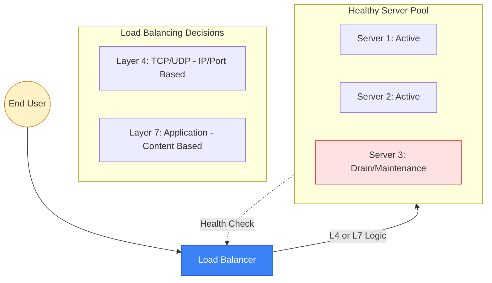

# ⚖️ Module 06: Load Balancing Fundamentals

> **"A load balancer is the traffic cop of the internet. It doesn't just move traffic; it ensures that every packet finds a healthy, capable server to call home, preventing the chaos of a single-point-of-failure."**

## 📚 Overview

In a world where single servers are "cattle, not pets," the **Load Balancer (LB)** is the heart of high-availability architectures. It sits between the user and your infrastructure, distributing traffic based on health, capacity, and application logic. This module explores the crucial differences between **Layer 4 (Transport)** and **Layer 7 (Application)** load balancing, the various algorithms that drive these decisions, and how to maintain user state (sessions) in a distributed world.

## 🎓 Learning Objectives

By the end of this module, you will:

- ✅ Master the architectural difference between **Network (L4)** and **Application (L7)** load balancers.
- ✅ Implement core algorithms: **Round Robin**, **Least Connections**, and **IP-Hash**.
- ✅ Design robust **Health Checks** to automate failover and recovery.
- ✅ Resolve "Split-Brain" sessions using **Sticky Sessions** and **Session Sharing**.
- ✅ Orchestrate **SSL/TLS Termination** at the LB level to reduce server CPU load.
- ✅ Integrate with modern container ingress controllers (Nginx, Traefik).

---

## 🏗️ Core Architectures

### 1. Layer 4: The Speed Demon
Operates at the Transport Layer (TCP/UDP).
- **How it works**: It only looks at the packet's Source/Destination IP and Port. It doesn't "read" the data.
- **Why use it**: Extreme performance and low latency. It’s protocol-neutral (great for Databases, Mail, or Gaming).

### 2. Layer 7: The Intelligent Cop
Operates at the Application Layer (HTTP/HTTPS).
- **How it works**: It terminates the connection, reads the URL, the headers, and the cookies, then makes a decision.
- **Why use it**: Content-based routing. You can send `/api` to one pool and `/static` to another. It handles SSL certificates and manages user sessions.

---

## 🚀 Professional Pattern: The "Stateless" Goal

Junior architects often rely on **Sticky Sessions** (Affinity) to keep a user on the same server. Senior architects strive for a **Stateless Application**.

**The Pro Standard**:
1. **Centralized Sessions**: Store user sessions in a fast, external memory cache like **Redis** or **Memcached**.
2. **The Benefit**: If Server A dies, the Load Balancer can send the user to Server B instantly. Since Server B can read the session from Redis, the user never even notices a failure.
3. **Scale Freedom**: You can spin up 100 servers and shut them down at will without worrying about which user is where.

---

## 🏆 Real-World DevOps Story: The 1% Logout Bug

**The Scenario**: A social media startup noticed that exactly 1% of their users were being randomly logged out every few minutes. They had two web servers and a simple Round Robin load balancer.
**The Crisis**: Logs showed the user's cookie was valid, but the web server would reject it with "Session Not Found."
**The Discovery**: They had "Sticky Sessions" enabled, but their timeout was set to 5 minutes, while the user session was set to 24 hours. If a user was idle for 6 minutes, the Load Balancer "forgot" them and sent them to the *other* server. Since the other server didn't have the session file in its local `/tmp` folder, it forced a logout.
**The Fix**: They moved sessions from the local disk to a **Redis cluster**. Now, it didn't matter which server the user hit; the data was always available.
**The Lesson**: **Local state is the enemy of scale.** Never store critical user data on the individual server's filesystem if you are behind a load balancer.

---

## ❓ Interview Preparation (Load Balancing)

1. **Q: When should you use Least Connections over Round Robin?**
    *A: Use **Least Connections** when requests have varying complexity (e.g., some take 10ms, others take 10s). This prevents a single server from being overwhelmed by many long-running tasks. Use **Round Robin** if all requests are roughly identical in resource cost.*

2. **Q: What is SSL Termination?**
    *A: It is the process of decrypting SSL/TLS traffic at the load balancer before sending it to the backend servers as plain HTTP. This reduces the CPU overhead on the application servers and simplifies certificate management.*

3. **Q: What happens if a backend server fails its health check?**
    *A: The load balancer stops sending new traffic to that server immediately. Once the server passes the required number of consecutive health checks (the "Rise" count), it is automatically put back into the rotation.*

4. **Q: What is a 'Draining' state (or Connection Draining)?**
    *A: It is a graceful shutdown process. When you want to take a server offline for maintenance, the LB stops sending *new* requests but allows *existing* active connections to finish their work before removing the server from the pool.*

5. **Q: What is the difference between a 'Proxy' and a 'Load Balancer'?**
    *A: A **Proxy** primarily acts as an intermediary for a single client or service (often for security or caching). A **Load Balancer** is a specific type of proxy designed to distribute traffic across a *pool* of multiple backends.*

---

## 📝 Knowledge Check

1. **Which load balancing mode provides the highest performance by not inspecting application-layer data?**
    - [ ] a) Layer 7
    - [x] b) Layer 4
    - [ ] c) Layer 2
    - [ ] d) SSL Passthrough

2. **What is 'IP-Hash' primarily used for?**
    - [ ] a) To encrypt the client's IP address
    - [x] b) To ensure a specific client always hits the same backend server (Persistence)
    - [ ] c) To bypass the firewall
    - [ ] d) To block DDoS attacks

3. **A '503 Service Unavailable' error usually indicates what in a load balanced environment?**
    - [ ] a) The client's internet is down
    - [x] b) No healthy backend servers are available in the pool
    - [ ] c) The server found the file but access is denied
    - [ ] d) The SSL certificate has expired

4. **Which algorithm is best for a pool of servers where some have 8 CPUs and others have 2 CPUs?**
    - [ ] a) Round Robin
    - [x] b) Weighted Round Robin
    - [ ] c) IP-Hash
    - [ ] d) Least Response Time

5. **True or False: SSL Passthrough is more secure but more CPU-intensive for the backend servers than SSL Termination.**
    - [x] True (The backend must do the decryption itself)
    - [ ] False

---

## 🔗 Next Steps

You've mastered the theory of traffic distribution. Now let's explore how AWS implements these concepts using ALB, NLB, and GLB.

Proceed to: **[07. Cloud Load Balancers (ALB/NLB)](readme.md)** →
Node: This link points to the next logical step in the curriculum.