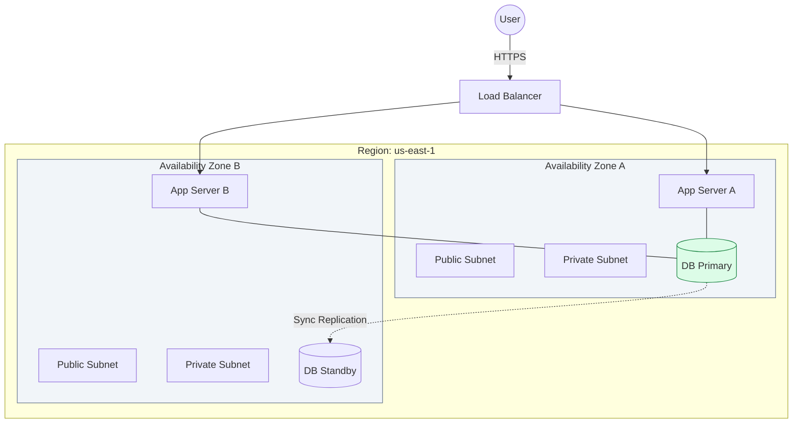

# 🏗️ Module 08.01: HA Fundamentals & Multi-AZ Design

> **"In the cloud, thinking about a single server or a single data center is a recipe for disaster. High Availability (HA) is the art of building systems that view local failures as a minor inconvenience rather than a business-ending event."**

## 📚 Overview

**High Availability (HA)** is the foundation of modern cloud architecture. It ensures that your application remains reachable even if an entire data center loses power or suffers a flood. In AWS, this is achieved through **Availability Zones (AZs)**—physically separate locations within a Region connected by ultra-low-latency fiber. This module covers the core pillars of HA: redundancy, isolation, and automated failover. We will explore how to design "Fault-Tolerant" networks that heal themselves.

## 🎓 Learning Objectives

By the end of this module, you will:

- ✅ Define the difference between **Fault Tolerance** and **High Availability**.
- ✅ Architect Multi-AZ networks with redundant **Subnets** and **Gateways**.
- ✅ Optimize **Inter-AZ Data Transfer** costs while maintaining resilience.
- ✅ Implement **RDS Multi-AZ** for database durability.
- ✅ Use **Auto-Scaling Groups (ASG)** to balance resources across AZs.

---

## 🏗️ The Pillars of Resilience

### 1. Redundancy (The Spare Tire)
Never have just one of anything. In a VPC, this means deploying at least two instances of every component (Load Balancers, NAT Gateways, App Servers) and ensuring they are in different AZs.

### 2. Isolation (Fault Domains)
AZs are designed to have independent power, cooling, and physical security. A failure in `us-east-1a` is architecturally guaranteed to not impact `us-east-1b`.

### 3. Health Management (The Pulse)
HA is useless if you don't know something is broken. You must use **Health Checks** to automatically identify "Zombie" servers and steer traffic to healthy ones.

---

## 🚀 Professional Pattern: The "Zonal" NAT Gateway

A common junior mistake is to put a single NAT Gateway in AZ-A and point your secret servers in AZ-B to use it. If AZ-A goes down, your servers in AZ-B are alive, but "isolated" from the internet.

**The Pro Standard**:
1. **Redundancy**: Deploy one NAT Gateway in **every** public subnet (one per AZ).
2. **Routing**: Create a unique route table for the private subnets in each AZ.
3. **The Link**: Private Subnet A points to NAT GW A. Private Subnet B points to NAT GW B.
4. **The Benefit**: If AZ-A fails, AZ-B remains 100% functional, including its internet egress. This is the **"Isolated Fault Domain"** strategy.

---

## 🏆 Real-World DevOps Story: The "Sync" Bottleneck

**The Scenario**: A high-speed financial trading platform implemented a Multi-AZ database strategy for peace of mind.
**The Crisis**: As soon as they turned on Multi-AZ, their application latency doubled. Users complained of "Hanging" searches.
**The Discovery**: Because they chose **Synchronous Replication**, every single 'Write' had to wait for confirmation from the other AZ (miles away) before the database would return a success message.
**The Fix**: They optimized their application to use **Read Replicas** for non-critical query traffic and only used the synchronous primary for writes. They also ensured their instances were in AZs with the lowest measured fiber-hop latency.
**The Result**: Latency dropped back to acceptable levels while maintaining the durability of a 2-AZ failover.
**The Lesson**: **Durability has a physics cost.** Choose your replication strategy based on your latency requirements.

---

## ❓ Interview Preparation (HA Fundamentals)

1. **Q: What is the difference between a 'Region' and an 'Availability Zone'?**
    *A: A **Region** is a separate geographic area (e.g., North Virginia). An **Availability Zone (AZ)** is one or more discrete data centers within that region, located miles apart to provide isolation from local disasters.*

2. **Q: Does a single VPC span multiple Availability Zones?**
    *A: **Yes.** While subnets are tied to a single AZ, the VPC itself is a regional resource and spans all AZs within that region.*

3. **Q: Why does AWS charge for data transfer between Availability Zones?**
    *A: Traffic between AZs travels over a private, managed fiber network. This infrastructure has its own maintenance and capacity costs, which is why there is typically a $0.01 per GB charge.*

4. **Q: How does RDS Multi-AZ handle failover?**
    *A: It keeps a synchronous standby replica in a different AZ. If the primary fails, RDS automatically updates its DNS record to point to the standby. Most applications recover in 60-120 seconds without code changes.*

5. **Q: What is a 'Fault Domain'?**
    *A: It is a set of resources share a common point of failure. In AWS, the Availability Zone is the primary fault domain. By spreading your app across two AZs, you are putting it in two separate fault domains.*

---

## 📝 Knowledge Check

1. **Which component is NOT a regional resource in AWS?**
    - [ ] a) Virtual Private Cloud (VPC)
    - [ ] b) Security Group
    - [x] c) Subnet (Subnets are Zonal)
    - [ ] d) Internet Gateway

2. **What is the primary benefit of 'Isolated Fault Domains'?**
    - [ ] a) Cheaper networking
    - [ ] b) Faster data transfers
    - [x] c) Ensuring a failure in one location doesn't crash the entire system
    - [ ] d) Simpler management

3. **In a high availability setup, what is the minimum recommended number of AZs?**
    - [ ] a) 1
    - [x] b) 2
    - [ ] c) 3
    - [ ] d) 5

4. **Which service is typically used to automatically replace a failed instance in another AZ?**
    - [ ] a) IAM
    - [ ] b) S3
    - [x] c) Auto Scaling Group (ASG)
    - [ ] d) Direct Connect

5. **True or False: Data transfer between an EC2 instance and an S3 bucket in the same region is usually free.**
    - [x] True 
    - [ ] False

---

## 🔗 Next Steps

You've built a resilient home in one region. Now let's explore how to design for total regional destruction using Disaster Recovery strategies.

Proceed to: **[02. Disaster Recovery Strategies](../02-disaster-recovery-strategies/readme.md)** →
Node: This link points to the next lesson.