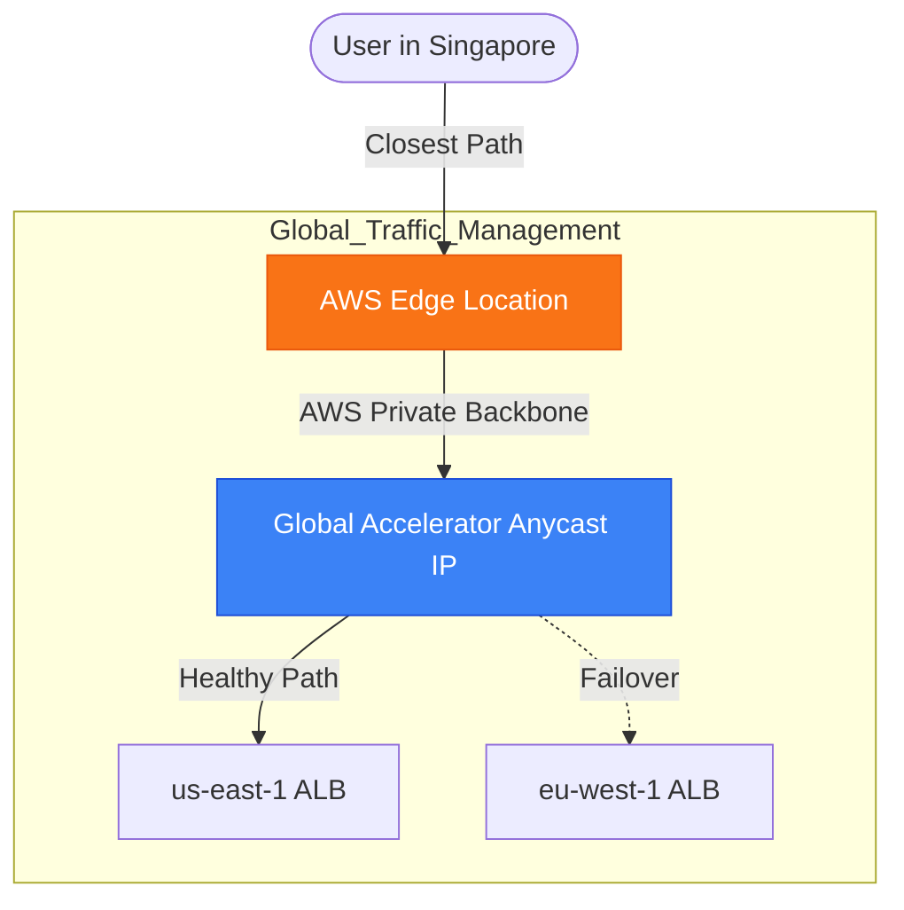

# 🌐 Module 08.03: Global Accelerator & Route 53

> **"In a globalized world, your 'Front Door' isn't in a data center; it's everywhere. Whether you use the intelligence of DNS with Route 53 or the raw speed of the AWS backbone with Global Accelerator, you must ensure your users hit the fastest path to your application."**

## 📚 Overview

To handle global traffic and perform seamless regional failovers, you need a **Global Traffic Manager**. AWS provides two primary tools for this: **Route 53** (DNS-based) and **AWS Global Accelerator** (Network-based). While Route 53 is the industry standard for mapping names to IPs with intelligent routing policies, Global Accelerator provides a "Turbo Boost" by carrying traffic over the private AWS backbone and bypassing the "Dirty DNS" caching issues of the public internet.

## 🎓 Learning Objectives

By the end of this module, you will:

- ✅ Master the differences between **Anycast IP** routing and **DNS-based** routing.
- ✅ Implement **Route 53 Routing Policies** (Latency, Geolocation, Failover).
- ✅ Deploy **AWS Global Accelerator** for sub-30-second regional failover.
- ✅ Optimize global performance by riding the **AWS Private Backbone**.
- ✅ Solve the "ISP DNS Caching" problem in disaster recovery scenarios.

---

## 🏗️ The Global Traffic Toolkit

### 1. Route 53 (The Global Directory)
- **Policy: Latency**: Sends users to the region with the lowest millisecond delay.
- **Policy: Geolocation**: Sends EU users to EU servers to comply with laws (like GDPR).
- **Policy: Failover**: Automatically switches to a backup region if health checks fail.
- **Limit**: Subject to **TTL Caching**. ISPs may ignore your changes for minutes or hours.

### 2. AWS Global Accelerator (The Global Highway)
- **Concept**: Gives you two **Static Anycast IPs**. These IPs are broadcast from every AWS Edge Location worldwide.
- **Backbone**: Once traffic hits an Edge Location, it travels on the private AWS network, not the public internet.
- **Speed**: Failover happens at the network layer in seconds. No DNS propagation required.

---

## 🚀 Professional Pattern: The "Zero-TTL" Failover

Standard DNS failover is unreliable because you cannot control the world's ISPs. Many ignore your 60-second TTL and cache records for 24 hours.

**The Pro Standard**:
1. **The Entry**: Assign your application to an **AWS Global Accelerator**.
2. **The IPs**: Point your `www.myapp.com` CNAME to the Global Accelerator DNS name.
3. **The Logic**: If the primary region (us-east-1) goes down, Global Accelerator detects it via health checks and instantly shifts traffic to the secondary region (eu-west-1) within the AWS backbone.
4. **The Benefit**: The user's browser is still talking to the *same* Anycast IP address. The "Shift" is invisible and instantaneous.
5. **The Outcome**: You achieve a true 30-second RTO for your global entry point.

---

## 🏆 Real-World DevOps Story: The Singapore Stutter

**The Scenario**: A London-based fintech company had users in Singapore. The users complained that the app was "unstable"—connections would frequently drop or hang for 2-3 seconds.
**The Crisis**: Network traces showed that traffic from Singapore to London was jumping through 15 different ISPs across Asia, Europe, and India. Every time a "hop" was unstable, the connection failed.
**The Discovery**: The "Middle Mile" (the public internet) was the source of the failure.
**The Fix**: They deployed **AWS Global Accelerator**.
**The Result**: Singapore users now hit the AWS Edge Location *in Singapore*. From there, the traffic travelled 7,000 miles over the private, stable AWS backbone fiber. Jitter dropped by 60%, and connection drops vanished.
**The Lesson**: **Get onto the backbone as fast as possible.** The public internet is for browsing; the AWS backbone is for business.

---

## ❓ Interview Preparation (Global Traffic)

1. **Q: What is an 'Anycast IP'?**
    *A: It is a single IP address that is broadcast from multiple locations simultaneously. The internet's routing protocols (BGP) automatically send the user to the 'closest' location that is broadcasting that IP.*

2. **Q: Why is Global Accelerator better than Route 53 for 'Failover' timing?**
    *A: Route 53 relies on DNS records, which have a Time-to-Live (TTL). Even if AWS updates the record, a user's ISP might cache the old IP for hours. Global Accelerator uses static IPs that never change; the failover happens inside the AWS network, bypassing the ISP cache entirely.*

3. **Q: What is the difference between 'Geolocation' and 'Geoproximity' routing in Route 53?**
    *A: **Geolocation** is based on the user's location ( Continent/Country). **Geoproximity** is based on the physical distance to the resource and allows you to use a 'Bias' to expand or shrink the geographic 'reach' of a specific region.*

4. **Q: Does Global Accelerator support non-HTTP traffic?**
    *A: **Yes.** Since it operates at Layer 4 (TCP/UDP), it is perfect for gaming (UDP), VOIP, and custom financial protocols that can't be balanced by a standard Layer 7 ALB.*

5. **Q: How many static IPs do you receive when you create a Global Accelerator?**
    *A: You are provided with **two** IPv4 Anycast addresses from independent network zones to ensure maximum availability.*

---

## 📝 Knowledge Check

1. **Which Route 53 policy would you use to ensure users in Germany are always routed to the Frankfurt (eu-central-1) region?**
    - [ ] a) Latency Routing
    - [x] b) Geolocation Routing
    - [ ] c) Failover Routing
    - [ ] d) Weighted Routing

2. **Where do AWS Global Accelerator Anycast IPs originate from?**
    - [ ] a) Availability Zones
    - [ ] b) VPC Subnets
    - [x] c) AWS Edge Locations
    - [ ] d) Direct Connect Gateways

3. **Which service is best for reducing 'TCP Jitter' and packet loss for global users?**
    - [ ] a) Route 53
    - [x] b) AWS Global Accelerator
    - [ ] c) NAT Gateway
    - [ ] d) VPC Peering

4. **What is the typical failover time for AWS Global Accelerator?**
    - [ ] a) 1-2 Hours
    - [ ] b) 5-10 Minutes
    - [x] c) Under 30 Seconds
    - [ ] d) 1 Day

5. **True or False: Global Accelerator requires you to change your IP address every time you failover to a new region.**
    - [ ] True 
    - [x] False (The IPs are static and never change)

---

## 🔗 Next Steps

You've mastered global entry. Now let's explore how the regions themselves talk to each other to replicate data and maintain your global backbone.

Proceed to: **[04. Multi-Region Networking](../04-multi-region-networking/readme.md)** →
Node: This link points to the next lesson.