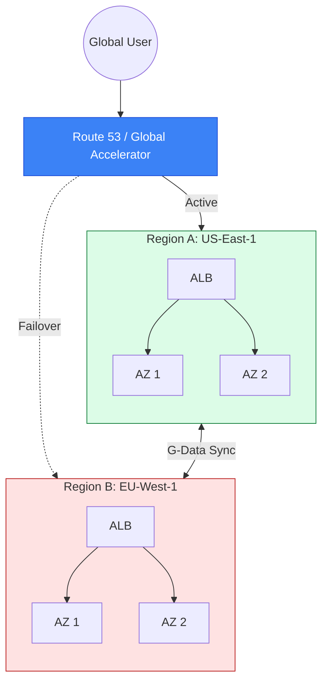

# 🌍 Module 08: High Availability & Multi-Region

> **"Everything fails, all the time. High availability isn't about preventing failure; it's about making failure invisible to the user. A global network is the ultimate airbag for your application."**

## 📚 Overview

In the world of 99.99% uptime, single-region architectures are no longer enough. Whether it's a natural disaster, a massive fiber cut, or a regional cloud outage, professional DevOps engineers must design for **Resilience at Scale**. This module dives into the strategies of **High Availability (HA)** and **Disaster Recovery (DR)**. We will explore how to use **Availability Zones** for local fault tolerance and **Multi-Region** architectures (Pilot Light, Warm Standby, Active-Active) for total business continuity.

## 🎓 Learning Objectives

By the end of this module, you will:

- ✅ Master the trade-offs between **Multi-AZ** and **Multi-Region** architectures.
- ✅ Define and calculate **RTO** (Recovery Time) and **RPO** (Data Loss) objectives.
- ✅ Implement **DNS-based Failover** using Route 53 health checks.
- ✅ Deploy **AWS Global Accelerator** for sub-30-second regional traffic steering.
- ✅ Choose the right DR strategy: **Pilot Light**, **Warm Standby**, or **Active-Active**.
- ✅ Orchestrate **Regional Data Replication** for databases and storage.

---

## 🏗️ The DR Strategy Spectrum

### 1. Pilot Light (Low Cost)
- **Concept**: Only the critical data is replicated (the "light"). Infrastructure is created only *after* a disaster.
- **RTO**: Hours.
- **RPO**: Minutes.

### 2. Warm Standby (Medium Cost)
- **Concept**: A scaled-down but functional version of the environment is always running.
- **RTO**: Minutes.
- **RPO**: Seconds.

### 3. Multi-Site / Active-Active (High Cost)
- **Concept**: Both regions serve live traffic simultaneously.
- **RTO**: Near Zero.
- **RPO**: Zero (if synchronous) or Seconds.

---

## 🚀 Professional Pattern: The "Anycast" Failover

DNS failover (Route 53) is subject to **TTL Caching**. If an ISP ignores your 60s TTL, users could be stuck on a broken region for hours.

**The Pro Standard**:
1. **Global Accelerator**: Instead of DNS names, use **Static Anycast IPs**.
2. **Network Layer Control**: Traffic is rerouted within the AWS backbone in under 30 seconds.
3. **The Benefit**: It bypasses the "Dirty DNS" of the public internet, providing consistent, reliable global steering.

---

## 🏆 Real-World DevOps Story: The DNS Cache Disaster

**The Scenario**: A major streaming service relied on Route 53 to failover between US-East and US-West. During a regional outage, their health checks triggered and DNS was updated correctly.
**The Crisis**: 30% of their users were still trying to connect to the dead region 4 hours later.
**The Discovery**: Several low-cost ISPs and corporate proxy servers were ignoring the 60-second TTL and caching the IP for 24 hours to save on their own bandwidth.
**The Fix**: They migrated to **AWS Global Accelerator**. They assigned two static Anycast IPs to their app. Now, when a region fails, AWS points those *same* IPs to the healthy region internally.
**The Result**: Failover became instantaneous and independent of the user's ISP.
**The Lesson**: **DNS is a request; Anycast is a destination.** Trust the backbone, not the cache.

---

## ❓ Interview Preparation (HA & Multi-Region)

1. **Q: What is the difference between RTO and RPO?**
    *A: **RTO (Recovery Time Objective)** is how long it takes to get back up after a failure. **RPO (Recovery Point Objective)** is how much data (measured in time) you can afford to lose. For example, an RPO of 1 hour means you might lose up to 1 hour of data.*

2. **Q: Explain 'Availability Zone' isolation.**
    *A: AZs are physically separate data centers within a region, connected by high-speed fiber. They have independent power, cooling, and networking so that a fire or flood in one AZ doesn't affect the others.*

3. **Q: When would you choose 'Warm Standby' over 'Pilot Light'?**
    *A: Choose **Warm Standby** when your business requires a recovery time in minutes rather than hours. It costs more because servers are always running, but it removes the risk of "Scaling Failures" during an emergency.*

4. **Q: What is a 'Split-Brain' scenario in Multi-Region architectures?**
    *A: It occurs when a network failure prevents two regions from talking to each other, but both stay connected to the internet. If both start accepting writes independently, the data will lose "Central Truth" and conflict when the connection returns.*

5. **Q: How does 'AWS Global Accelerator' improve performance for global users?**
    *A: It picks up the user's traffic at the nearest AWS Edge Location and carries it over the private, optimized AWS global backbone rather than the cluttered public internet.*

---

## 📝 Knowledge Check

1. **Which DR strategy is the MOST cost-effective but has the longest recovery time?**
    - [ ] a) Warm Standby
    - [x] b) Pilot Light
    - [ ] c) Multi-Site Active-Active
    - [ ] d) Multi-AZ

2. **Route 53 DNS failover is primarily limited by what factor?**
    - [ ] a) AWS API speed
    - [x] b) DNS TTL Caching at the ISP/Client level
    - [ ] c) Number of instances
    - [ ] d) Region latency

3. **Which metric measures the 'Data Loss' during a disaster?**
    - [ ] a) RTO
    - [x] b) RPO
    - [ ] c) SLA
    - [ ] d) MTBF

4. **Anycast IP addresses provided by Global Accelerator are: **
    - [x] a) Static and never change
    - [ ] b) Rotated every 24 hours
    - [ ] c) Different for every user
    - [ ] d) Only accessible via IPv6

5. **True or False: Multi-AZ architecture is sufficient to protect against a total AWS Region outage.**
    - [ ] True
    - [x] False (You need Multi-Region for that)

---

## 🔗 Next Steps

You've designed for total resilience. Now let's explore how to connect your cloud empire back to your physical data centers.

Proceed to: **[09. Hybrid Connectivity](readme.md)** →
Node: This link points to the next logical step in the curriculum.

---
## 🧭 Additional Modules
- [01 HA Fundamentals Multi AZ](01-ha-fundamentals-multi-az/readme.md)
- [02 Disaster Recovery Strategies](02-disaster-recovery-strategies/readme.md)
- [03 Global Accelerator and Route53](03-global-accelerator-and-route53/readme.md)
- [04 Multi Region Networking](04-multi-region-networking/readme.md)
