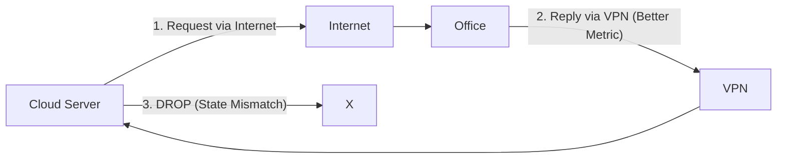

# 📂 NRE Case Studies: Validating Theory in Production

> **"Junior, theory is clean. Production is dirty. In these files, we document the messy, high-pressure incidents where 'textbook' networking collided with reality. Read them. Memorize them. Don't repeat them."**

---

## 🏗️ The Archive

| Case ID | Name | Core Concept | The "Oh No" Moment |
| :--- | :--- | :--- | :--- |
| **001** | The "Zero-Downtime" Migration | VPC Peering & DNS | "We forgot the Security Groups in the new VPC." |
| **002** | The "Asymmetric" Loop | Routing Symmetry | "Why does TCP work but ICMP fails?" |
| **003** | The "Invisible" Packet Drop | MTU & Jumbo Frames | "Ping works, but large JSON payloads timeout." |

---

## 📁 CASE FILE #001: The Zero-Downtime Connect

**Scenario**: We need to move the Primary Database (`db-legacy` in `vpc-A`) to a new instance (`db-new` in `vpc-B`) without stopping the app.

### 🔍 The Architecture
We used valid VPC Peering. But the tricky part was the **Switchover**.

```mermaid
graph TD
    User --> App[App Server (VPC A)]
    
    subgraph VPC_A [VPC A: Legacy]
        App -->|Step 1: Write| DB_Old[(DB Legacy)]
    end
    
    subgraph VPC_B [VPC B: Modern]
        DB_New[(DB New)]
    end
    
    App -.->|Step 2: Dual Write (Peering)| DB_New
    
    style VPC_A fill:#fef2f2,stroke:#b91c1c
    style VPC_B fill:#f0fdf4,stroke:#15803d
```

### 💣 The Landmine
The team tested the connection using `ping`. It worked.
They switched the App config to point to `db-new`. **Connection Timed Out.**

**The Root Cause**:
*   `ping` uses **ICMP**.
*   The Database uses **TCP Port 5432**.
*   The Security Group on `db-new` allowed `ALL ICMP` (for testing) but forgot to allow `TCP 5432` from `10.0.0.0/16` (the peer).

**Senior NRE Tip**: Never trust `ping` for service validation. Always use `nc -zv <ip> <port>` closely mimicking the actual application traffic.

---

## 📁 CASE FILE #002: The Asymmetric Routing "Blackhole"

**Scenario**: We added a VPN for office connectivity. suddenly, servers could send requests to the office, but the office got no reply.
**The Weirdness**: We saw the packets *arrive* at the office firewall, but the reply never made it back.

### 🔍 The Logic Flaw (Asymmetry)



**The Diagnosis**:
1.  Packet leaves via **Internet Gateway** (Source IP: Public).
2.  Office router receives it.
3.  Office router sees destination is the Cloud Server. It thinks: "I have a VPN tunnel to that server! It's faster!"
4.  Office router sends reply via **VPN Tunnel**.
5.  Cloud Server receives packet via VPN Interface.
6.  **KERNEL PANIC**: "I sent a SYN packet out via `eth0` (Internet), but I received the SYN-ACK on `tun0` (VPN). This is spoofing! DROP."

**The Fix**: Ensure **Routing Symmetry**. If traffic leaves via IGW, it MUST return via IGW. We fixed the route weights on the Office Router to force internet traffic back out the internet link.

---

## 📁 CASE FILE #003: The MTU Ghost (Path Discovery)

**Scenario**: A developer says "The API is broken."
*   `ping api.internal` -> **Success**.
*   `curl api.internal/health` -> **Success**.
*   `curl api.internal/large-json-dataset` -> **HANGS FOREVER**.

### 🔍 The Investigation
Why do small packets pass, but big ones die?

**The Tool**: `tracepath` or `ping -s`.
```bash
# Validating MTU (Maximum Transmission Unit)
# -M do = Don't Fragment
# -s 1472 = Size (1500 bytes - 28 bytes header)

ping -M do -s 1472 db.internal
> Message too long, mtu=1300
```

**The Root Cause**:
There was an IPSec VPN tunnel in the middle. VPN headers add 50+ bytes of overhead.
*   Standard MTU = 1500 bytes.
*   VPN Available MTU = 1500 - 50 = 1450 bytes.
*   The App was sending 1500-byte packets. The VPN router dropped them because the "Don't Fragment" bit was set.

**The Fix**: Configure **Clamping MSS (Maximum Segment Size)** on the router to tell the TCP handshake: "Hey, I can only handle 1300 bytes, please send smaller chunks."

---

## 🎫 Junior's Action Items

1.  **Validate Connectivity**: Run `nc -zv` on all new peering setups.
2.  **Check Redundancy**: If you have a VPN and an Internet Gateway, draw the triangle. Is there Asymmetry?
3.  **Stress Test**: Don't just `curl` a health check. `curl` a large payload to test MTU limits.
