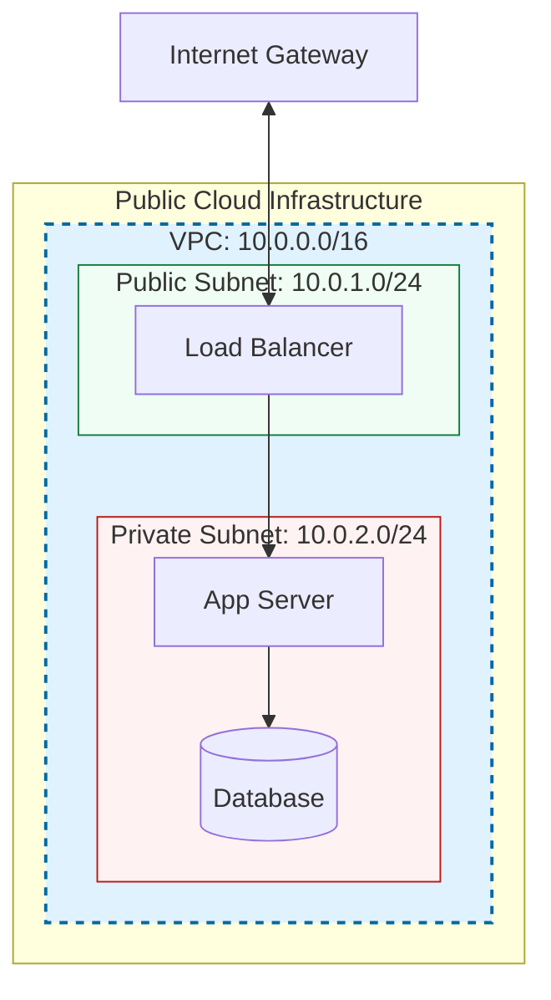

# 🌐 Module 01: What is a VPC?

> **"A VPC is your private island in the public cloud. It provides the security and isolation of a traditional data center with the speed and elasticity of a software-defined world."**

## 📚 Overview

A **Virtual Private Cloud (VPC)** is a logically isolated section of a cloud provider's network where you can launch resources in a virtual network that you define. Think of it as a "Virtual Data Center"—you own the IP space, the routing, and the security, while the cloud provider manages the physical cables, routers, and power.

## 🎓 Learning Objectives

By the end of this module, you will:

- ✅ Define the core purpose and benefits of a **VPC**.
- ✅ Understand the difference between **Physical Networking** and **SDN** (Software-Defined Networking).
- ✅ Explaining the **Logical Isolation** mechanism at the hypervisor level.
- ✅ Identify the primary components used to control traffic: **Subnets, Gateways, and Routes**.
- ✅ Internalize the **"Blast Radius"** concept in network design.

---

## 🏗️ The Networking Analogy: The Luxury Hotel

To understand how a VPC works on shared physical hardware, use the **Hotel Suite** analogy:

| Feature | The Public Cloud (The Hotel) | VPC (The Private Suite) |
| :--- | :--- | :--- |
| **Physical Space** | The entire building shared by guests. | Your specific floor or room number. |
| **Access Control** | The Lobby (Security check at entry). | Your room key (Security Groups/NACLs). |
| **Plumbing/Power** | Shared central infrastructure. | Your private bathroom and outlets. |
| **Privacy** | You share hallways and elevators. | Once inside your suite, no other guest can enter. |

---

## 🚀 Professional Pattern: The "Clean CIDR" Standard

Senior DevOps engineers don't just pick random IP ranges. They plan for the future.

**The Pro Standard**:
1. **Never overlap**: Ensure your VPC CIDR (e.g., `10.0.0.0/16`) does not overlap with your on-premise office or other VPCs you might peer with later.
2. **Standard Sizing**: `/16` is the industry standard for a production VPC, providing 65,536 IP addresses.
3. **Subnet math**: Reserve space for future Availability Zones.

---

## 🏆 Real-World DevOps Story: The Rogue Broadcast Storm

**The Scenario**: In the days of physical data centers, a misconfigured switch on one server could trigger a "Broadcast Storm," dragging down every other server connected to that switch.
**The Crisis**: A developer accidentally ran a network testing script that flooded the network layer with millions of ARP requests. In a physical environment, this would have taken down the entire company's production database.
**The Fix**: Because the developer was running inside a **VPC**, the cloud's software-defined networking layer recognized the anomalous traffic. It dropped the packets at the virtual interface (ENI) level.
**The Discovery**: The "Storm" was contained entirely within their single VPC. Other customers and even other VPCs within the same account remained at 100% health.
**The Lesson**: **VPC isolation is your strongest firewall.** It prevents a single mistake from spreading across your entire infrastructure.

---

## ❓ Interview Preparation (VPC Fundamentals)

1. **Q: How does a VPC achieve isolation even though it's on shared hardware?**
    *A: It uses Software-Defined Networking (SDN) and encapsulation (like VXLAN or Geneve). Each packet is wrapped in a header that identifies the VPC ID, and the cloud's underlying networking fabric (the 'Underlay') ensures that packets are only delivered to resources with the matching VPC ID.*

2. **Q: Is a VPC regional or global?**
    *A: In AWS and most providers, a VPC is **Regional**. It spans all Availability Zones within that region but does not cross into other regions (though VPC Peering can connect them).*

3. **Q: Why would you create multiple VPCs instead of one large one?**
    *A: To minimize the 'Blast Radius' and enforce strict boundaries. For example, keeping 'Production' and 'Development' in separate VPCs ensures that a networking error in Dev cannot affect Prod.*

4. **Q: What is a CIDR block, and why is it important in a VPC?**
    *A: CIDR (Classless Inter-Domain Routing) defines the range of private IP addresses available in the VPC. It is critical because the size of the block determines how many resources (EC2, RDS, etc.) you can launch, and it's difficult to change after creation.*

5. **Q: Can two different VPCs in two different accounts have the same IP range?**
    *A: Yes, because they are logically isolated. However, you will NOT be able to 'Peer' them or connect them via VPN without complex NAT translation, as IP routing requires unique destinations.*

---

## 📝 Knowledge Check

1. **What is the primary benefit of a VPC over a standard public network?**
    - [ ] a) It is cheaper per hour
    - [x] b) It provides logical isolation and control
    - [ ] c) It automatically installs software on your servers

2. **True or False: A VPC CIDR block is usually regional.**
    - [x] True
    - [ ] False

3. **In the "Recipe vs. Cake" analogy applied to networking, the VPC is the...**
    - [ ] a) Recipe
    - [x] b) Kitchen/Environment
    - [ ] c) Service

4. **What technology is responsible for making a VPC "software-defined"?**
    - [ ] a) Physical routers
    - [ ] b) Fiber optic cables
    - [x] c) SDN (Software-Defined Networking)

5. **Which component represents the boundary of your private network in the cloud?**
    - [ ] a) The Subnet
    - [x] b) The VPC Boundary
    - [ ] c) The CPU

---

## 🔗 Next Steps

The foundation is laid. Now let's explore the individual parts that make the VPC function.

Proceed to: **[VPC Components & Architecture](../../../../../readme.md)** →
