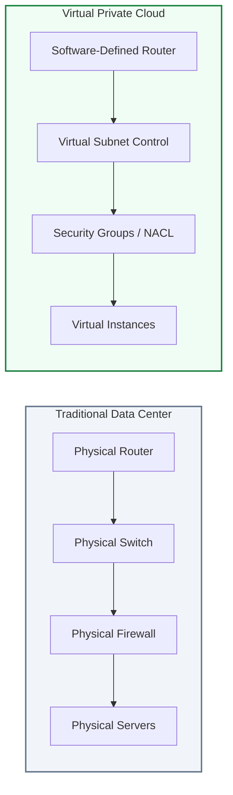

# 🏦 Module 02: VPC vs. Traditional Networks

> **"In a traditional network, you are the plumber and the architect. In a VPC, the plumbing is provided as a utility, allowing you to focus entirely on the architecture of your house."**

## 📚 Overview

Transitioning from a physical data center to the cloud is a shift from **Capitalized Hardware** to **Operational Utility**. In this module, we compare the rigid, manually-scaled world of physical routers and cables with the elastic, API-driven world of **Software-Defined Networking (SDN)**. Understanding this contrast is key to explaining the business value of the cloud to stakeholders.

## 🎓 Learning Objectives

By the end of this module, you will:

- ✅ Contrast **CapEx** (Capital Expenditure) vs. **OpEx** (Operating Expenditure) models.
- ✅ Identify the physical hardware equivalents in a **VPC** (e.g., Security Group = Firewall).
- ✅ Understand the benefits of **Infrastructure as Code (IaC)** over manual console/CLI configuration.
- ✅ Discuss the **Shared Responsibility Model** for network security.
- ✅ Analyze the "Time-to-Market" advantage of virtual infrastructure.

---

## 🏗️ Detailed Comparison: Physical vs. Virtual

| Aspect | Traditional Network (On-Prem) | VPC (Virtual Private Cloud) |
| :--- | :--- | :--- |
| **Delivery** | Physical Boxes (Cisco, Juniper, F5) | Software APIs (AWS, Azure, GCP) |
| **Setup Time** | Weeks (Shipping, Racking, Cabling) | Minutes (API call or Console click) |
| **Scale** | Discrete steps (Buy a new switch) | Fluid (Elastic scaling) |
| **Maintenance** | Manual (Hardware swaps, Firmware) | Automated by Cloud Provider |
| **Cost** | Upfront CapEx (Depreciating assets) | Monthly OpEx (Variable cost) |
| **Customization** | High (Any vendor/cable type) | Constrained by Provider Features |

---

## 🏆 Real-World DevOps Story: The 6-Month Router Wait

**The Scenario**: A growing financial services company needed to upgrade their firewall throughput to handle a sudden surge in digital banking users.
**The Crisis**: They ordered a top-of-the-line physical hardware appliance. Due to global supply chain issues, the lead time was 6 months. During that time, their existing firewalls were hitting 95% CPU, causing timeouts for thousands of customers.
**The Fix**: A DevOps consultant cloned the existing architecture into a **VPC** in just three days. By using virtual appliances and cloud-native load balancers, they shifted the traffic load to the cloud.
**The Discovery**: They realized that even with the "Premium" cloud pricing, the cost of the VPC was less than the lost revenue from a single day of system crashes.
**The Lesson**: **Hardware is a liability during growth.** VPCs remove the "Lead Time" bottleneck, allowing the network to move at the speed of the business.

---

## 🚀 Professional Pattern: The "Cattle vs. Pets" Network

In traditional networking, an expensive core router is a **"Pet"**—it has a name, engineers care for its specific firmware, and they are terrified of it breaking.

**The Pro Standard**:
In a VPC, you treat your network like **"Cattle."**
1. **Immutable Infrastructure**: If a network configuration is wrong, you don't "fix" it manually in the console. You update your **Terraform** code and redeploy/reapply the configuration.
2. **Version Control**: Every change to your subnets or route tables is checked into Git.
3. **Automated Testing**: Use tools to verify reachability before committing a network change to production.

---

## ❓ Interview Preparation (Traditional vs. Cloud)

1. **Q: What is 'Software-Defined Networking' (SDN)?**
    *A: SDN is the technology that powers VPCs. It separates the 'Control Plane' (where decisions are made) from the 'Data Plane' (where packets actually flow), allowing network behavior to be controlled entirely by software and APIs rather than physical manual patching.*

2. **Q: How does the 'Shared Responsibility Model' apply to networking?**
    *A: The cloud provider is responsible for 'Security OF the Cloud' (physical routers, fiber, hypervisors). You are responsible for 'Security IN the Cloud' (correctly configuring Security Groups, Route Tables, and NACLs).*

3. **Q: Why is 'Elasticity' better than just 'Scalability' in cloud networking?**
    *A: Scalability is the ability to grow. Elasticity is the ability to grow AND shrink. In a VPC, you only pay for what you use, so being able to de-provision network resources during low-traffic periods saves money—something you can't do with physical hardware.*

4. **Q: What is the main barrier for a traditional Network Engineer moving to the Cloud?**
    *A: The shift from 'Physical Configuration' to 'Logical Abstracting.' In the cloud, you no longer care about ports or cables; you care about CIDR blocks, peering relationships, and software-defined policies.*

5. **Q: Can you achieve 100% parity between an on-prem network and a VPC?**
    *A: No. VPCs have constraints (e.g., no Layer 2 broadcast/multicast in most cases). You must architect your application to use Layer 3 and cloud-native service discovery instead of traditional ARP/broadcast methods.*

---

## 📝 Knowledge Check

1. **Which cost model characterizes the VPC?**
    - [ ] a) CapEx (Capital Expenditure)
    - [x] b) OpEx (Operating Expenditure)
    - [ ] c) Fixed-Asset Model

2. **True or False: In a VPC, you are responsible for updating the firmware of the underlying virtual routers.**
    - [ ] True
    - [x] False (The cloud provider handles the service infrastructure)

3. **What is the cloud equivalent of a Physical Firewall Appliance?**
    - [ ] a) Subnet
    - [x] b) Security Group / NACL
    - [ ] c) Route Table

4. **What does 'Infrastructure as Code' (IaC) enable in cloud networking?**
    - [ ] a) Faster manual typing
    - [x] b) Version-controlled, repeatable network deployments
    - [ ] c) Physical cable management via software

5. **Which model describes who is responsible for different parts of cloud security?**
    - [ ] a) The Multi-Tier Model
    - [x] b) The Shared Responsibility Model
    - [ ] c) The OSI Model

---

## 🔗 Next Steps

You understand the "Why." Now let's look at the "What"—the actual gears and cogs that make a VPC work.

Proceed to: **[Module 03: VPC Components Overview](../03-vpc-components-overview/readme.md)** →
