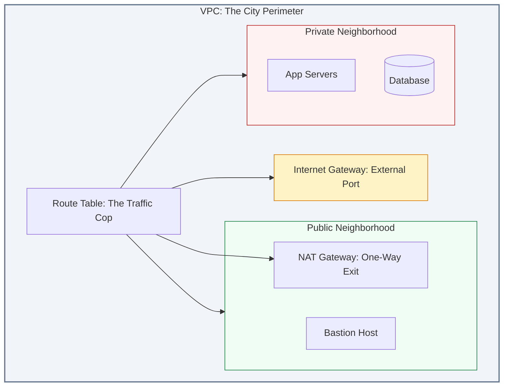

# 🏗️ Module 03: VPC Components Overview

> **"A VPC is like a city. The Subnets are the neighborhoods, the Route Tables are the GPS, the Internet Gateway is the airport, and Security Groups are the bouncers at the door."**

## 📚 Overview

To build a secure and functional VPC, you must understand the individual "gears" that make it turn. This module provides a fast-track overview of every major VPC component, from the interfaces on your servers to the gateways that connect you to the global internet.

## 🎓 Learning Objectives

By the end of this module, you will:

- ✅ Identify the 10 core components of a production-grade VPC.
- ✅ Distinguish between **Stateful** (Security Groups) and **Stateless** (NACLs) filtering.
- ✅ Understand the flow of a packet from a User to an EC2 instance.
- ✅ Configure **NAT Gateways** for secure outbound-only internet access.
- ✅ Design high-availability routing across multiple **Availability Zones**.

---

## 🛠️ The Component Anatomy

| Component | Analogy | DevOps Role |
| :--- | :--- | :--- |
| **Subnets** | Neighborhoods | Groups resources by security/purpose. |
| **Internet Gateway (IGW)** | Main City Gate | Provides a door to the public internet. |
| **NAT Gateway** | One-Way Exit | Lets private servers get updates without being seen. |
| **Route Tables** | GPS / Road Signs | Directs internal and external traffic flow. |
| **Security Groups** | Building Bouncer | Stateful firewall at the instance level. |
| **Network ACLs** | Neighborhood Checkpoint | Stateless firewall at the subnet level. |
| **ENI** | Virtual Network Card | Attaches an IP and MAC to a server. |
| **VPC Endpoints** | Secret Tunnel | Private access to AWS services (e.g., S3). |

---

## 🛡️ Security Deep Dive: SG vs NACL

Understanding the difference between these two is the #1 requirement for any DevOps interview.

| Feature | Security Group (SG) | Network ACL (NACL) |
| :--- | :--- | :--- |
| **Scope** | Instance / Interface Level | Subnet Level |
| **State** | **Stateful** (Return traffic allowed) | **Stateless** (Must allow both ways) |
| **Rules** | Allow Rules Only | Allow AND Deny Rules |
| **Processing** | All rules evaluated | Evaluated in numerical order |
| **First Line?** | Second (Inner) | First (Outer) |

---

## 🚀 Professional Pattern: The HA NAT Gateway

A common mistake is deploying a single NAT Gateway for the entire VPC. If that Availability Zone (AZ) fails, your entire private network loses internet access.

**The Pro Standard**:
1. Deploy **One NAT Gateway per Availability Zone**.
2. Configure **Route Tables** in each AZ to point to the local NAT Gateway.
3. This ensures that if AZ-A goes offline, AZ-B and AZ-C continue to function independently.

---

## 🏆 Real-World DevOps Story: The $2,000 "Hello World"

**The Scenario**: A junior engineer set up a log-processing application in a private subnet. The app was downloading 500GB of log data from S3 every hour to process it.
**The Crisis**: At the end of the month, the AWS bill had a **$2,000 surplus charge** for "NAT Gateway Data Processing."
**The Fix**: The Senior Architect replaced the NAT Gateway route for S3 traffic with a **VPC Gateway Endpoint**.
**The Discovery**: VPC Endpoints for S3 are **free**, and traffic never leaves the private AWS backbone.
**The Lesson**: **Use NAT for the Internet, but use Endpoints for AWS services.** It saves money and reduces latency.

---

## ❓ Interview Preparation (VPC Components)

1. **Q: How many Internet Gateways can you attach to a single VPC?**
    *A: Exactly one. The IGW is a horizontally scaled, highly available service provided by the cloud; you don't need multiples for redundancy, but you are limited to one per VPC boundary.*

2. **Q: A packet arrives at the VPC from the internet. In what order does it hit the security layers?**
    *A: First, it hits the **Route Table** to find the subnet. Second, it hits the **Network ACL** (Subnet level). Third, it hits the **Security Group** (Instance level) before reaching the application.*

3. **Q: Why does a NAT Gateway need an Elastic IP (EIP)?**
    *A: Because it performs Network Address Translation. External servers see the connection coming from the EIP. Since the NAT Gateway lives in the Public Subnet, it needs a static, public-facing address to communicate with the internet.*

4. **Q: What is the 'Longest Prefix Match' in a Route Table?**
    *A: It is the rule that the most specific route always wins. For example, if you have a route for `0.0.0.0/0` (Internet) and a route for `10.0.1.0/24` (Local Subnet), traffic destined for `10.0.1.5` will follow the more specific `/24` route.*

5. **Q: Can you apply a Security Group to a Lambda function?**
    *A: Yes! When a Lambda function is configured to run inside a VPC, it gets a virtual network interface (ENI), allowing you to control its egress and ingress using standard Security Groups.*

---

## 📝 Knowledge Check

1. **Which component is 'Stateless' and handles both Allow and Deny rules?**
    - [ ] a) Security Group
    - [x] b) Network ACL
    - [ ] c) Internet Gateway

2. **Where must a NAT Gateway be physically located?**
    - [ ] a) In a Private Subnet
    - [x] b) In a Public Subnet
    - [ ] c) Outside of the VPC

3. **What happens to the return traffic in a Security Group if the outbound request was allowed?**
    - [x] a) It is automatically allowed (Stateful)
    - [ ] b) It is blocked unless a manual Inbound rule exists
    - [ ] c) It is only allowed if it uses Port 80

4. **Which service provides a private connection to S3 without using a NAT Gateway?**
    - [ ] a) VPC Peering
    - [x] b) VPC Gateway Endpoint
    - [ ] c) Client VPN

5. **True or False: A Subnet can span multiple Availability Zones.**
    - [ ] True
    - [x] False (A subnet is mapped to exactly one AZ)

---

## 🔗 Next Steps

You've met the team. Now let's learn how to address them using the language of the internet.

Proceed to: **[04. IP Addressing Basics](../04-ip-addressing-basics/readme.md)** →
