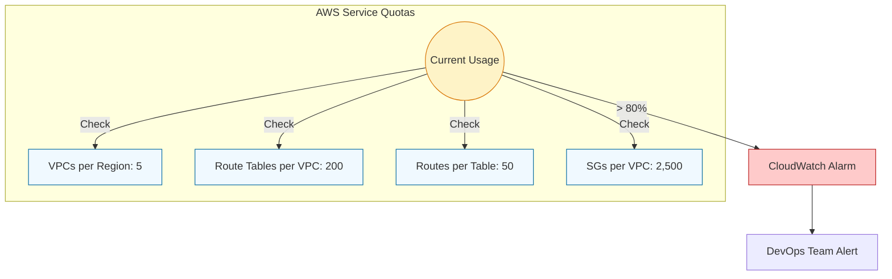

# ⚖️ Module 06: VPC Limits & Quotas

> **"In the physical world, limits are defined by cables and space. In the cloud, they are defined by software quotas. Designing for the cloud means knowing where the invisible walls are before you crash into them."**

## 📚 Overview

AWS provides a massive infrastructure, but to maintain stability and prevent accidental runaway costs, every account has **Service Quotas** (formerly called Limits). Some limits are soft (adjustable), while others are hard (physical or architectural constraints). This module covers the "hidden speed limits" you must track to ensure your environment scales seamlessly.

## 🎓 Learning Objectives

By the end of this module, you will:

- ✅ Distinguish between **Soft Limits** and **Hard Limits**.
- ✅ Identify the 5 most common quotas that cause production outages.
- ✅ Master the process for requesting **Quota Increases**.
- ✅ Implement automated **Monitoring** for network limits.
- ✅ Understand **Architectural Patterns** that bypass standard limits.

---

## 🏗️ The Most Critical VPC Quotas

| Resource | Default Limit | Adjustable? | Impact of Hitting Limit |
| :--- | :--- | :--- | :--- |
| **VPCs per Region** | 5 | ✅ Yes | Cannot create new environments. |
| **Subnets per VPC** | 200 | ✅ Yes | Blocked microservice expansion. |
| **IPv4 CIDRs per VPC** | 5 | ❌ No | Cannot expand IP space further. |
| **Internet Gateways** | 1 | ❌ No | Fixed architecture per VPC boundary. |
| **Elastic IPs (EIPs)** | 5 | ✅ Yes | Cannot allocate public IPs for NAT/EC2. |
| **Routes per Table** | 50 | ✅ Yes | Blocked VPN/Direct Connect growth. |

---

## 🗺️ Routing & Security Limits

Routing limits are often the first to be hit in a growing enterprise. 

### Why the 50 Route limit?
AWS enforces a default of 50 routes per table to ensure high-performance packet switching. While you can request an increase to 1,000, doing so can slightly impact network latency as the underlying routers have more entries to look up.

### Security Group Rule Limits
- **Security Groups per VPC**: 2,500 (Soft)
- **Rules per Security Group**: 60 Inbound / 60 Outbound (Soft)
- **SGs per Network Interface (ENI)**: 5 (Soft)

---

## 🚀 Professional Pattern: The Pro-Active Guardrail

Senior DevOps engineers don't wait for a `QuotaExceeded` error to appear in the logs.

**The Pro Standard**:
1. **Service Quotas Console**: Use the AWS Service Quotas dashboard to see "Usage vs. Quota" in real-time.
2. **80% Alarm Rule**: Set a CloudWatch alarm to trigger when any networking quota hits 80% utilization. This gives you a weeks-long lead time to request an increase.
3. **Justification Templates**: Keep a document of business justifications for common increases (e.g., "Scaling to 3 AZs for High Availability requires X additional subnets").

---

## 🏆 Real-World DevOps Story: The Black Friday Routing Crash

**The Scenario**: A retail giant was prepping for Black Friday. They had 45 VPN connections to various distribution centers.
**The Crisis**: Two days before the event, they added 6 more distribution centers. The first 5 worked, but the 6th failed to connect. Every time they tried to update the route table, they got an error: `RouteLimitExceeded`.
**The Impact**: The 51st distribution center could not process orders, causing a massive backlog of shipping during the highest revenue window of the year.
**The Fix**: A frantic emergency support ticket to AWS to increase the `Routes per Route Table` limit. 
**The Discovery**: They had hit the default limit of 50. Because they hadn't monitored the count, they didn't realize they were at 45.
**The Lesson**: **Limits are silent until they are fatal.** Monitor your route counts as closely as you monitor your CPU usage.

---

## ❓ Interview Preparation (Limits & Quotas)

1. **Q: What is the difference between a Soft Limit and a Hard Limit?**
    *A: A **Soft Limit** is a default setting that AWS can increase upon request (e.g., VPCs per region). A **Hard Limit** is a physical or architectural constraint that cannot be changed (e.g., exactly 1 Internet Gateway per VPC).*

2. **Q: How would you request a limit increase for your VPCs?**
    *A: Navigate to the **Service Quotas** console in the AWS dashboard, select 'Amazon VPC', find the specific quota, and click 'Request quota increase'. Alternatively, this can be done via the AWS CLI or Support Center.*

3. **Q: You need to connect 200 VPCs together. You know the VPC Peering limit is 125. What is your solution?**
    *A: I would use **AWS Transit Gateway**. It acts as a network hub that can connect thousands of VPCs, effectively bypassing the point-to-point limitations of VPC Peering.*

4. **Q: Why does AWS limit the number of VPCs per region?**
    *A: To protect both the customer and AWS. For the customer, it prevents "runaway resources" from inflating the bill. For AWS, it helps manage the underlying physical capacity and control-plane load.*

5. **Q: Can you increase the number of IPv4 CIDR blocks in a VPC beyond 5?**
    *A: No. The limit of 1 primary and 4 secondary CIDR blocks is currently a hard limit. If you need more IP space, you must create a new VPC or use IPv6.*

---

## 📝 Knowledge Check

1. **What is the default limit for VPCs per region?**
    - [ ] a) 1
    - [x] b) 5
    - [ ] c) 20

2. **Which of these is typically a HARD limit that cannot be increased?**
    - [ ] a) Total Subnets per VPC
    - [x] b) Internet Gateways per VPC
    - [ ] c) Elastic IPs per Region

3. **What is the default number of routes allowed in a single Route Table?**
    - [ ] a) 10
    - [x] b) 50
    - [ ] c) 100

4. **Which AWS service is used to monitor and request limit increases?**
    - [ ] a) CloudTrail
    - [x] b) Service Quotas
    - [ ] c) Trusted Advisor

5. **At what percentage of quota usage is it recommended to set a warning alarm?**
    - [ ] a) 50%
    - [x] b) 80%
    - [ ] c) 99%

---

## 🔗 Next Steps

You've learned the rules of the road. Now let's explore how to scale across multiple VPCs for massive enterprise environments.

Proceed to: **[07. Multi-VPC Strategies](../07-multi-vpc-strategies/readme.md)** →
