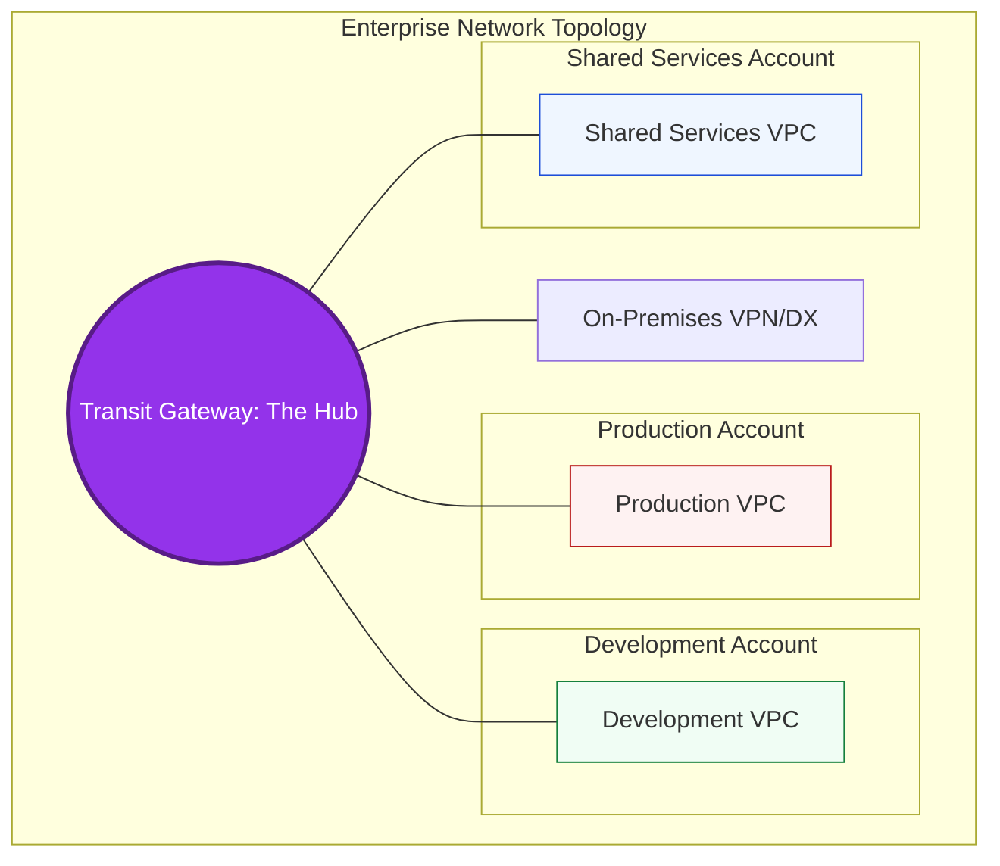

# 🕸️ Module 07: Multi-VPC Strategies

> **"A single VPC is a single point of failure. Modern cloud architecture is about many interconnected networks, each designed for a specific purpose and isolated from unrelated risks."**

## 📚 Overview

As organizations outgrow a single VPC, the complexity of managing multiple networks increases exponentially. This module explores when to split your infrastructure across multiple VPCs and accounts, and how to connect them using **VPC Peering** or **Transit Gateway** without creating a "Network Spaghetti" mess.

## 🎓 Learning Objectives

By the end of this module, you will:

- ✅ Identify the 4 main drivers for **Multi-VPC** design.
- ✅ Compare and contrast **VPC Peering** vs. **Transit Gateway (TGW)**.
- ✅ Understand the concept of **Transitive Routing** and its limitations.
- ✅ Design a **Shared Services** VPC for centralizing DNS, Logging, and Auth.
- ✅ Plan a **Non-Overlapping CIDR** strategy for the entire organization.

---

## 🏗️ Why Use Multiple VPCs?

1.  **Environment Isolation**: Keep `Production` and `Development` physically separate. A misconfiguration in Dev should never take down Prod.
2.  **Blast Radius Containment**: Limit the damage of a security breach or a "broadcast storm" to a single VPC.
3.  **Compliance boundaries**: Keep PCI-DSS (Credit Card) or HIPAA (Healthcare) data in a hyper-secure VPC with stricter audits.
4.  **Organizational Boundaries**: Different teams (Finance vs. Engineering) can manage their own costs and permissions.

---

## 🔗 Connectivity Patterns

### 1. VPC Peering (The Direct Route)
- **Use Case**: Connecting 2-3 VPCs one-on-one.
- **Cost**: Free (only cross-AZ data transfer fees).
- **Cons**: **Not Transitive**. If A is peered with B, and B is peered with C, A CANNOT talk to C through B.
- **Scaling**: Becomes unmanageable after ~10 VPCs due to the mesh complexity.

### 2. Transit Gateway (The Network Hub)
- **Use Case**: Connecting 5 to 5,000 VPCs and On-Prem sites.
- **Cost**: $0.05/hour/attachment + data processing.
- **Pros**: **Transitive Routing**. All VPCs connect to one hub, making the routing table simple and centralized.
- **Scaling**: The industry standard for Enterprise scale.

---

## 📐 Professional Pattern: The Hub-and-Spoke Standard

Don't peer every VPC with every other VPC. Use a "Hub" for common resources.

**The Pro Standard**:
1. **The Shared Services Hub**: Create one VPC for your CI/CD runners (Jenkins/GitLab), Monitoring (Prometheus/Grafana), and Directory Services (AD/LDAP).
2. **Transit Gateway Connect**: Connect every branch (Spoke) VPC to the Transit Gateway.
3. **Route Propagation**: Use TGW to automatically broadcast routes so new VPCs can find the Shared Services Hub without manual configuration.

---

## 🏆 Real-World DevOps Story: The Peering Mesh Nightmare

**The Scenario**: A growing startup had 15 VPCs (one for each microservice). To make communication easy, they used VPC Peering to connect every VPC to every other VPC in a "Full Mesh."
**The Crisis**: To connect 15 VPCs, they needed **105 peering connections** (`n * (n-1) / 2`). When they hired a new engineer and needed to add a 16th VPC, they had to manually update **15 separate route tables**. They accidentally messed up one route, routing production traffic for "Service A" into the development environment of "Service B."
**The Discovery**: They hit the hard limit for VPC Peering connections and spent 40 hours a month just managing networking links.
**The Fix**: They deleted the 105 peering links and replaced them with a single **Transit Gateway**.
**The Lesson**: **Peering is for pairs; Gateway is for groups.** If your network looks like a bowl of spaghetti, you need a Hub.

---

## ❓ Interview Preparation (Multi-VPC)

1. **Q: What does it mean that VPC Peering is "Non-Transitive"?**
    *A: It means that if VPC A is peered with VPC B, and VPC B is peered with VPC C, traffic from A cannot reach C via B. You would need a direct peering connection between A and C, or a Transit Gateway.*

2. **Q: When would you choose Transit Gateway over VPC Peering despite the higher cost?**
    *A: When managing more than 10 VPCs, when you need transitive routing, or when you need to connect hundreds of VPCs to an On-Premises data center via a single VPN/Direct Connect link.*

3. **Q: What is a Shared Services VPC?**
    *A: It is a centralized VPC that houses resources used by all other VPCs, such as Active Directory, log aggregators, security scanning tools, and CI/CD build agents.*

4. **Q: Why is CIDR planning important in a Multi-VPC strategy?**
    *A: If you ever plan to connect VPCs via Peering or TGW, their CIDR blocks **cannot overlap**. If two VPCs both use 10.0.0.0/16, they cannot talk to each other because a router wouldn't know which "10.0.0.5" you are trying to reach.*

5. **Q: Can you peer two VPCs that are in different AWS Accounts or different Regions?**
    *A: Yes! You can peer across accounts (with the owner's permission) and across regions (Inter-Region Peering). The traffic stays on the AWS global backbone and is encrypted.*

---

## 📝 Knowledge Check

1. **What is the main disadvantage of VPC Peering at scale?**
    - [ ] a) High latency
    - [x] b) Mesh complexity and lack of transitivity
    - [ ] c) High hourly cost

2. **Which connectivity service acts as a 'Hub-and-Spoke' router?**
    - [ ] a) NAT Gateway
    - [ ] b) Internet Gateway
    - [x] c) Transit Gateway

3. **In the 'Full Mesh' formula n*(n-1)/2, if you have 10 VPCs, how many peering links do you need?**
    - [ ] a) 10
    - [x] b) 45
    - [ ] c) 100

4. **True or False: Traffic between peered VPCs goes over the public internet.**
    - [ ] True
    - [x] False (It stays on the AWS private backbone)

5. **Which pattern is used to centralize tools like Jenkins and Monitoring?**
    - [ ] a) Multi-Account
    - [x] b) Shared Services VPC
    - [ ] c) Public Subnet

---

## 🔗 Next Steps

Scale is nothing without safety. Now that you know how to build a massive network, let's look at the "Checklist for Success"—the Best Practices every pro lives by.

Proceed to: **[08. VPC Best Practices](../08-vpc-best-practices/readme.md)** →
