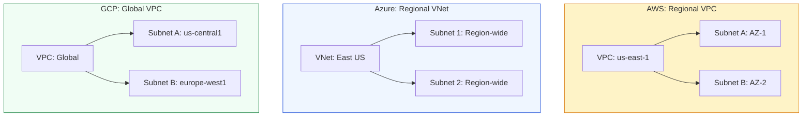

# ☁️ Module 09: Cloud Provider Comparison

> **"AWS, Azure, and Google Cloud speak the same language of packets and routes, but they have different accents. Understanding these differences is the key to mastering multi-cloud architecture."**

## 📚 Overview

While this course focuses on AWS, the concepts of **VPC**, **Subnets**, and **Gateways** are universal. However, each provider has a unique "Networking Philosophy." AWS is strictly regional, Azure emphasizes ease of global peering, and Google Cloud treats the entire planet as a single network. This module compares the "Big Three" to prepare you for multi-cloud environments.

## 🎓 Learning Objectives

By the end of this module, you will:

- ✅ Compare the **Network Scope** (Regional vs. Global) of major providers.
- ✅ Identify the equivalent of an **AWS Security Group** in Azure and GCP.
- ✅ Understand the **Pricing Models** for NAT and Data Transfer across clouds.
- ✅ Map **AWS Terminology** to Azure and Google Cloud equivalents.
- ✅ Design a **Cloud-Agnostic** IP schema strategy.

---

## ⚖️ Feature Comparison Table

| Feature | AWS VPC | Azure VNet | GCP VPC |
| :--- | :--- | :--- | :--- |
| **Scope** | Regional | Regional | **Global** |
| **Max CIDR Size** | `/16` (65k IPs) | `/8` (16M IPs) | `/8` (16M IPs) |
| **Subnet Scope** | Availability Zone | Regional | Regional |
| **Default Network** | Yes (Public) | No | Yes (Auto-mode) |
| **NAT Gateway Cost** | $0.045/hr + Data | $0.045/hr + Data | **Free** (Cloud NAT) |
| **Hub Connectivity** | Transit Gateway | Virtual WAN | Shared VPC |

---

## 🛡️ Security Equivalent Map

| Security Layer | AWS | Azure | GCP |
| :--- | :--- | :--- | :--- |
| **Instance Firewall** | Security Groups | Network Security Groups | VPC Firewall Rules |
| **Subnet Firewall** | Network ACLs | Network Security Groups | VPC Firewall Rules |
| **Stateful?** | Security Groups | Yes | Yes |
| **Stateless?** | Network ACLs | No | No |

---

## 🚀 Professional Pattern: The Cloud-Agnostic Blueprint

If you are working in a multi-cloud environment, don't use provider-specific quirks inside your application logic.

**The Pro Standard**:
1. **The /16 Anchor**: Even though Azure/GCP allow `/8`, stick to `/16` for your VPC/VNet size. It is large enough for any workload and consistent across all providers.
2. **Region-Symmetry**: Even though GCP subnets are global, design your architecture as if they were regional. This makes migrating the same Terraform code between AWS and GCP much easier.
3. **External Secrets**: Use a centralized tool (like HashiCorp Vault) for networking credentials rather than cloud-specific secret managers, keeping your network automation portable.

---

## 🏆 Real-World DevOps Story: The Multi-Cloud Migration

**The Scenario**: A major media company wanted to move their transcoding engine from AWS to Google Cloud to take advantage of GCP's specialized hardware and global network.
**The Crisis**: The AWS team had designed the app assuming subnets were locked to an AZ. When they moved to GCP's **Global VPC**, the developers were confused that a "Web Subnet" could exist in both New York and London simultaneously.
**The Discovery**: They realized that by using GCP's Global VPC, they could connect their London transcoding farm to their New York database using internal IPs without setting up complex VPNs or Peering.
**The Impact**: Latency dropped by 40%, and they saved $2,000/month by eliminating cross-region peering charges.
**The Lesson**: **Know your provider's strengths.** GCP's global network is its "superpower," while AWS's AZ isolation is its "fortress."

---

## ❓ Interview Preparation (Cloud Comparison)

1. **Q: What is the biggest difference between an AWS VPC and a Google Cloud VPC?**
    *A: Scope. An AWS VPC is regional (it lives in one region like us-east-1), while a GCP VPC is global (it can have subnets in every region in the world, all connected on the same private network).*

2. **Q: How does Azure handle subnet security compared to AWS?**
    *A: Azure uses **Network Security Groups (NSGs)** which can be applied to both subnets and individual network interfaces. Unlike AWS, which has both SGs (stateful) and NACLs (stateless), Azure NSGs are stateful and handle both levels of security.*

3. **Q: Which provider offers the most cost-effective NAT solution?**
    *A: **Google Cloud**. GCP's Cloud NAT is a software-defined service that doesn't charge an hourly fee for the "gateway" itself (you only pay for data and IPs). AWS and Azure both charge ~ $32/month per gateway before data processing fees.*

4. **Q: Can you connect an AWS VPC to an Azure VNet?**
    *A: Yes. You can use a Site-to-Site VPN or a dedicated circuit like AWS Direct Connect + Azure ExpressRoute (usually via a third-party provider like Megaport or Equinix).*

5. **Q: In AWS, a subnet spans one AZ. What is the scope of a subnet in Azure?**
    *A: In Azure, a subnet is **Regional**. It spans the entire region unless you specifically place resources within certain Availability Zones manually.*

---

## 📝 Knowledge Check

1. **Which cloud provider's VPC is global by default?**
    - [ ] a) AWS
    - [ ] b) Azure
    - [x] c) Google Cloud

2. **What is the AWS equivalent of GCP's 'Firewall Rules'?**
    - [ ] a) Route Tables
    - [x] b) Security Groups
    - [ ] c) Internet Gateways

3. **Which provider does NOT provide a default network in a new account?**
    - [ ] a) AWS
    - [x] b) Azure
    - [ ] c) Google Cloud

4. **True or False: All three major providers charge for traffic between regions.**
    - [x] True
    - [ ] False

5. **Which service is the Azure equivalent of AWS Transit Gateway?**
    - [ ] a) VNet Peering
    - [x] b) Virtual WAN
    - [ ] c) ExpressRoute

---

## 🔗 Next Steps

You've finished the theory. Now it's time to build. Let's get your hands on the keyboard and deploy a production-grade VPC.

Proceed to: **[10. Getting Started Guide](../10-getting-started-guide/readme.md)** →
