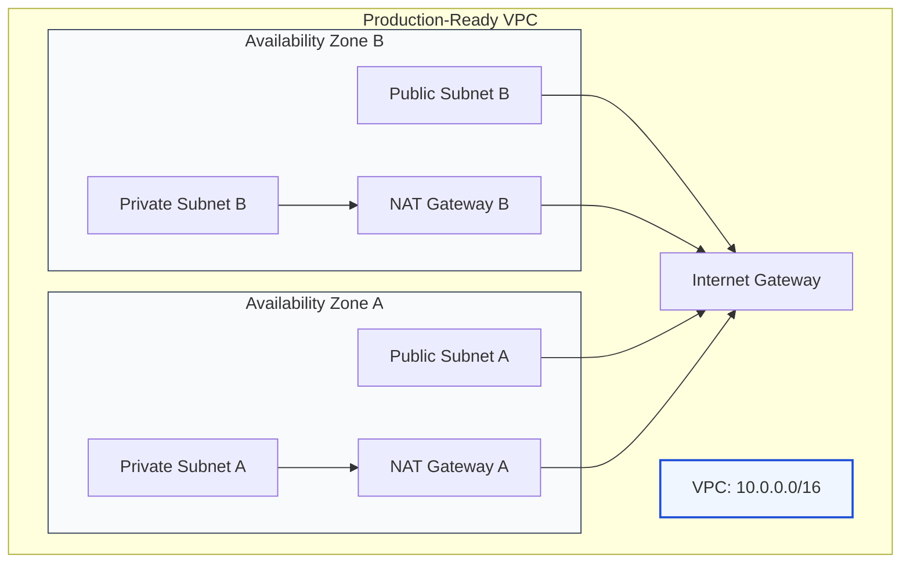

# 🚀 Module 10: Getting Started Guide

> **"Theory without practice is just talk. In this guide, you will transition from a consumer of cloud services to an architect, building the foundational network where your entire infrastructure will live."**



## 📚 Overview

This is your mission: Deploy a high-availability, professional-grade VPC from scratch. We will walk through the design, the manual console creation, and the automated CLI script. By the end of this module, you will have a live environment capable of hosting production databases and web servers with the security and redundancy of a Fortune 500 company.

## 🎓 Learning Objectives

By the end of this guide, you will:

- ✅ Design an **IP Schema** that balances scalability and clarity.
- ✅ Deploy a **Multi-AZ** network to survive a data center outage.
- ✅ Configure **NAT Gateways** for secure private instance updates.
- ✅ Master the **AWS CLI** for rapid, repeatable network deployment.
- ✅ Verify end-to-end **Connectivity** from the internet to your private instances.

---

## 🏗️ Step 1: Design & Planning

Before touching the console, you must have a "Blueprint." We will use the following parameters:

- **CIDR Block**: `10.0.0.0/16` (65,536 IPs).
- **AZs**: 2 (Ensures High Availability).
- **Public Subnets**: 2 (`10.0.1.0/24`, `10.0.2.0/24`). For Load Balancers & Jump Hosts.
- **Private Subnets**: 2 (`10.0.11.0/24`, `10.0.12.0/24`). For App & DB tiers.

---

## 🖱️ Step 2: The Console Path (VPC Wizard)

The fastest way to learn is using the AWS Console "VPC and More" wizard:

1.  Navigate to the **VPC Dashboard**.
2.  Click **Create VPC**.
3.  Select **VPC and more**.
4.  **Name Tag**: `production-vpc`.
5.  **IPv4 CIDR**: `10.0.0.0/16`.
6.  **Number of AZs**: `2`.
7.  **Public Subnets**: `2`.
8.  **Private Subnets**: `2`.
9.  **NAT Gateways**: `1 per AZ` (Critical for redundancy).
10. **VPC Endpoints**: `S3 Gateway`.
11. Click **Create VPC**.

---

## 💻 Step 3: The CLI Path (DevOps Style)

Copy and run this script to deploy the same environment in seconds using the AWS CLI.

```bash
#!/bin/bash
set -e

# Setup Variables
VPC_NAME="pro-vpc-cli"
CIDR="10.0.0.0/16"
REGION="us-east-1"

# 1. Create VPC
VPC_ID=$(aws ec2 create-vpc --cidr-block $CIDR --query 'Vpc.VpcId' --output text)
aws ec2 create-tags --resources $VPC_ID --tags Key=Name,Value=$VPC_NAME
echo "✅ VPC Created: $VPC_ID"

# 2. Attach Internet Gateway
IGW_ID=$(aws ec2 create-internet-gateway --query 'InternetGateway.InternetGatewayId' --output text)
aws ec2 attach-internet-gateway --vpc-id $VPC_ID --internet-gateway-id $IGW_ID
echo "✅ IGW Attached: $IGW_ID"

# 3. Create Public Subnet (AZ-A)
PUB_SUB=$(aws ec2 create-subnet --vpc-id $VPC_ID --cidr-block 10.0.1.0/24 --availability-zone ${REGION}a --query 'Subnet.SubnetId' --output text)
aws ec2 create-tags --resources $PUB_SUB --tags Key=Name,Value="public-a"
echo "✅ Public Subnet Created: $PUB_SUB"

# 4. Create Route Table for Public Subnet
RT_ID=$(aws ec2 create-route-table --vpc-id $VPC_ID --query 'RouteTable.RouteTableId' --output text)
aws ec2 create-route --route-table-id $RT_ID --destination-cidr-block 0.0.0.0/0 --gateway-id $IGW_ID
aws ec2 associate-route-table --subnet-id $PUB_SUB --route-table-id $RT_ID
echo "✅ Public Routing Configured"
```

---

## 🚀 Professional Pattern: The IaC First Mindset

Manual creation is for learning; **Infrastructure as Code (IaC)** is for the job.

**The Pro Standard**:
1. **Never Click-to-Prod**: The AWS Console is great for checking status, but you should never rely on it for creating production resources. Use **Terraform** or **AWS CDK**.
2. **Standardized Tags**: Tag everything with `Environment: Prod` and `ManagedBy: Terraform`.
3. **Automated Cleanup**: Write a "destroy" script or use `terraform destroy` during your learning process to ensure you aren't paying for NAT Gateways ($32/month/each) when you aren't using them.

---

## 🏆 Real-World DevOps Story: The First VPC

**The Scenario**: A junior DevOps engineer spent three hours manually configuring a VPC. They created subnets, attached an IGW, and set up Security Groups.
**The Crisis**: When they tried to access their "Web Server" from the internet, it timed out. They checked the Security Group—it allowed Port 80. They checked the Routing Table—it had a route to the IGW.
**The Discovery**: They had forgotten the **Subnet Association**. The Route Table existed, but it wasn't "assigned" to the subnet where the server lived, so the server didn't know how to reach the gateway.
**The Lesson**: **Networking is a chain.** If one link (VPC -> Subnet -> Route Table -> Gateway) is broken, the whole thing fails. Always verify your associations.

---

## ❓ Interview Preparation (Hands-on)

1. **Q: What is the first thing you check if an instance in a public subnet cannot reach the internet?**
    *A: I verify three things in order: 1) Does the subnet have a route to an Internet Gateway? 2) Does the instance have a Public IP assigned? 3) Does the outbound Security Group allow traffic to destination 0.0.0.0/0?*

2. **Q: How can you automate the creation of a VPC without using the Console?**
    *A: You can use the AWS CLI for quick scripts, but for production, the industry standard is Infrastructure as Code (IaC) tools like Terraform, Pulumi, or AWS CloudFormation.*

3. **Q: Why does a NAT Gateway need an Elastic IP (EIP)?**
    *A: NAT Gateways reside in the public subnet and must have a static, public-facing IP so that external servers know where to send the return traffic for requests originating from your private subnet.*

4. **Q: How do you verify that your VPC is truly Highly Available (HA)?**
    *A: By confirming that resources (like Subnets and NAT Gateways) are distributed across at least two separate Availability Zones. If one AZ goes offline, the resources in the second AZ should continue to function.*

5. **Q: What is the benefit of using 'VPC and More' wizard vs 'VPC only'?**
    *A: 'VPC and More' automatically handles the complex associations between subnets, route tables, and gateways. 'VPC only' creates a blank container, requiring you to manually wire everything together.*

---

## 📝 Knowledge Check

1. **Which AWS service provides 'VPC and More' to simplify networking setup?**
    - [ ] a) CloudFormation
    - [x] b) VPC Dashboard
    - [ ] c) Route 53

2. **What is the default CIDR range we used for this production-ready blueprint?**
    - [ ] a) 192.168.1.0/24
    - [x] b) 10.0.0.0/16
    - [ ] c) 172.31.0.0/16

3. **True or False: A Private Subnet should have a route to an Internet Gateway.**
    - [ ] True
    - [x] False (It should route to a NAT Gateway or stay internal)

4. **Which CLI tool is used to manage AWS resources?**
    - [ ] a) Git
    - [x] b) AWS CLI
    - [ ] c) Docker

5. **What must you do before you can delete a VPC?**
    - [x] a) Delete all resources inside it (EC2, NAT, etc.)
    - [ ] b) Rename it
    - [ ] c) Contact AWS Support

---

## 🏁 VPC Mastery Complete!

Congratulations! You have transformed from a networking novice to a cloud architect. You've built the foundation. Now it's time to build the applications that live inside it.

**Continue to the next section: [DNS & DHCP Concepts](../../../../../readme.md)** →
