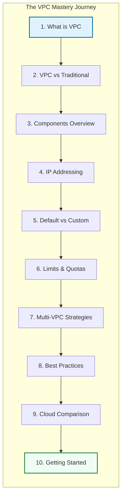
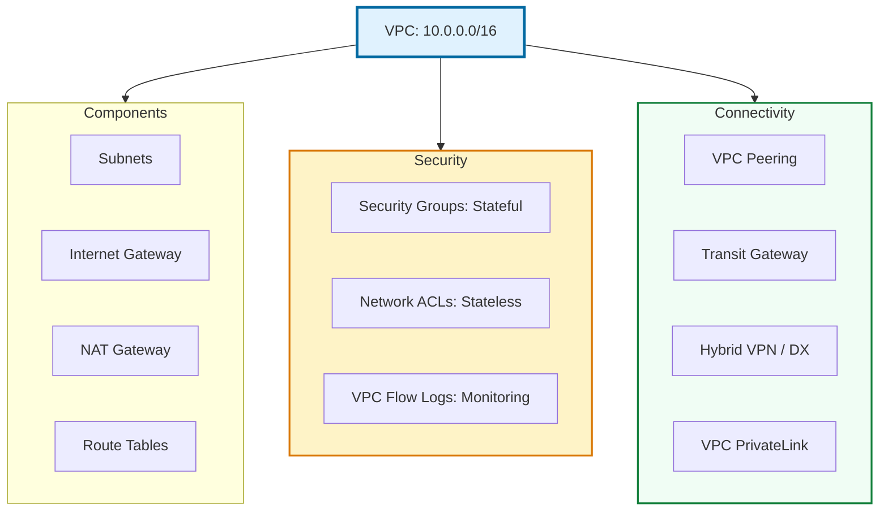

# 🌐 VPC Fundamentals: Building Blocks of Cloud Networking

> **"In the cloud, networking is no longer a physical constraint; it is a software asset. Mastering the VPC is the first step in moving from a 'System Administrator' to a 'Cloud Architect'."**

## 📚 Overview

Mastering **Virtual Private Clouds (VPC)** is essential for any DevOps engineer. This module transitions you from basic connectivity to designing high-availability, multi-region, and hybrid architectures. We explore how to isolate workloads, secure production data, and scale networks across thousands of IP addresses without ever touching a physical wire.

## 🎓 Curriculum Modules

| Module | Level | Focus | Key Deliverable |
| :--- | :--- | :--- | :--- |
| **[01. What is a VPC?](./01-what-is-a-vpc/readme.md)** | 🟢 Beginner | Definitions | Define logical isolation & SDN |
| **[02. VPC vs. Traditional](./02-vpc-vs-traditional-networks/readme.md)** | 🟢 Beginner | Comparison | Understand hardware vs. software ops |
| **[03. Core Components](./03-vpc-components-overview/readme.md)** | 🟡 Inter | Architecture | Map Subnets, RTs, and Gateways |
| **[04. IP Addressing](./04-ip-addressing-basics/readme.md)** | 🟡 Inter | Strategy | Master CIDR & RFC 1918 planning |
| **[05. Custom VPCs](./05-default-vs-custom-vpc/readme.md)** | 🟡 Inter | Compliance | Build a 3-tier isolated VPC |
| **[06. Limits & Quotas](./06-vpc-limits-and-quotas/readme.md)** | 🟢 Beginner | Constraints | Plan for regional design limits |
| **[07. Multi-VPC Prep](./07-multi-vpc-strategies/readme.md)** | 🔴 Advanced | Scale | Peer-to-Peer vs. Hub-and-Spoke |
| **[08. Best Practices](./08-vpc-best-practices/readme.md)** | 🔴 Advanced | Governance | HA, DR, and Least-Privilege design |
| **[09. Cloud Comp](./09-cloud-provider-comparison/readme.md)** | 🔴 Advanced | Multi-Cloud | AWS vs. Azure vs. GCP networking |
| **[10. Start Guide](./10-getting-started-guide/readme.md)** | 🟢 Beginner | Hands-on | Deploy your first Production-grade VPC |

---

## 🏗️ The Master Architecture Map

Success in networking requires a "Mental Map" of how data flows. This diagram represents the standard enterprise 3-tier pattern you will build.

---

## 🏆 Real-World DevOps Stories

### 🌑 The "IP Exhaustion" Crisis

**The Scenario**: A fast-growing startup used a small `/24` CIDR block for their migration, assuming 256 IPs were enough for their first cluster.
**The Crisis**: Six months later, they launched an Auto-Scaling Group. Within hours, new pods failed because they ran out of available private IPs.
**The Fix**: The team had to build a new VPC with a `/16` range and perform a risky midnight migration.
**The Lesson**: **IP addresses are free; downtime is expensive.** Always start with a `/16` (65,536 IPs) to ensure you have 20 years of room to grow.

### 🛡️ The "Open Door" Breach

**The Scenario**: A developer attached an Internet Gateway to a database server to "debug" a connection issue, setting the Security Group to `0.0.0.0/0`.
**The Crisis**: Within 48 hours, ransomware encrypted the data because the server was directly reachable from the public internet.
**The Fix**: Implementation of **Private Subnets**. Databases should *never* have a public IP.
**The Lesson**: **Network layer isolation is non-negotiable.** If a resource doesn't *need* the internet, it shouldn't have a path to it.

---

## ❓ Interview Preparation (Master Level)

1. **Q: How does Software-Defined Networking (SDN) differ from traditional hardware networking?**
    *A: SDN abstracts hardware into software. In a VPC, routers and switches are APIs. This allows for near-instant provisioning and programmatic control (Terraform) that physical hardware cannot match.*

2. **Q: Explain 'Blast Radius' in the context of VPC design.**
    *A: It is the potential impact of a single failure or breach. By using multiple VPCs for different stages (Dev, Staging, Prod), you ensure that a mistake in Dev cannot reach and destroy Production data.*

3. **Q: Why is CIDR overlapping the 'Cardinal Sin' of cloud networking?**
    *A: Overlapping IP ranges make it impossible to connect networks later (via Peering or VPN). Routing requires unique destination IPs; if two VPCs have the same IP range, a router won't know where to send the packet.*

4. **Q: In a 3-tier architecture, which tiers should live in a Private Subnet?**
    *A: The Application and Database tiers. Only the Load Balancer (Tier 1) should reside in a Public Subnet with direct internet access.*

5. **Q: What is the 'Default VPC' and why do enterprise environments delete them?**
    *A: Default VPCs are for testing. They have public subnets and open routing by default. Enterprises build 'Custom VPCs' from scratch to enforce strict security controls and regulatory compliance.*

---

## 📝 Mastery Knowledge Check

1. **What is the maximum standard CIDR block size for a VPC?**
    - [ ] a) /8
    - [x] b) /16
    - [ ] c) /32

2. **A 'Subnet' is a subset of a VPC and resides within a single:**
    - [ ] a) Region
    - [x] b) Availability Zone (AZ)
    - [ ] c) Data Center Rack

3. **Which component is required for a subnet to be considered 'Public'?**
    - [ ] a) NAT Gateway
    - [x] b) Internet Gateway (IGW)
    - [ ] c) S3 Endpoint

4. **Which security component is 'Stateful'?**
    - [x] a) Security Groups
    - [ ] b) Network ACLs
    - [ ] c) IAM Policies

5. **True or False: VPCs share the same physical hardware but are logically isolated.**
    - [x] True
    - [ ] False

---

## 🔗 Next Steps

You've got the map. Now let's dive into the first module.

Proceed to: **[01. What is a VPC?](./01-what-is-a-vpc/readme.md)** →
