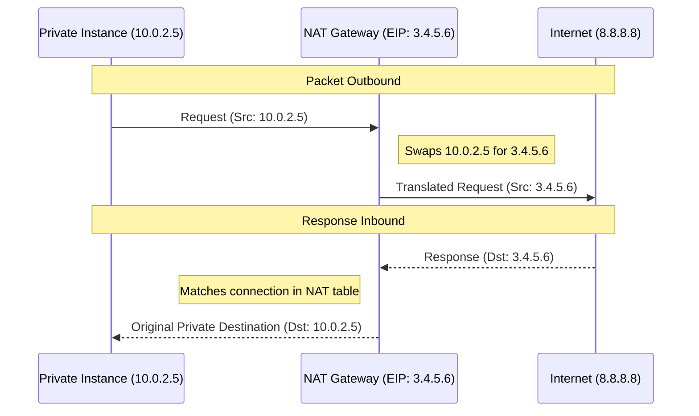

# 🚪 Module 03.02: NAT Gateway Deep Dive

> **"A NAT Gateway is a one-way security valve. It allows your private servers to fetch what they need from the world without ever letting the world see where they live."**

## 📚 Overview

A **NAT Gateway** (Network Address Translation) is a managed service that allows instances in a **Private Subnet** to connect to the internet (one-way outbound) while remaining invisible to external entities. This is the cornerstone of secure cloud architecture, ensuring that your databases and app servers can download updates and call APIs without being exposed to brute-force attacks from the public web.

## 🎓 Learning Objectives

By the end of this module, you will:

- ✅ Trace a **Packet Flow** from an internal instance to the internet.
- ✅ Understand the role of **Elastic IPs (EIPs)** in NAT.
- ✅ Distinguish between **Managed NAT** and legacy **NAT Instances**.
- ✅ Master **Port Address Translation (PAT)** mechanics.
- ✅ Design for **Reliability** using multi-AZ NAT deployment.

---

## 🏗️ How it Works: The Magic of PAT

NAT Gateways don't just swap IPs; they perform **Port Address Translation (PAT)**.

1. **Mapping**: When multiple private instances talk to the internet simultaneously using the *same* NAT Gateway, the gateway assigns each request a different "Source Port."
2. **The Table**: It keeps a stateful table of which port belongs to which private IP.
3. **The Return**: When the response comes back to a specific port, the gateway knows exactly which internal instance to send it to.

---

## 🚀 Professional Pattern: Managed over Manual

While AWS still allows you to build your own NAT using a regular EC2 instance ("NAT Instance"), it is a legacy pattern that professional DevOps teams avoid.

| Feature | Managed NAT Gateway | NAT Instance (Legacy EC2) |
| :--- | :--- | :--- |
| **Maintenance** | **Managed by AWS**. No patching needed. | You must patch and manage the OS. |
| **Reliability** | Inherently redundant within an AZ. | Single point of failure (if EC2 dies, NAT dies). |
| **Performance** | Scales automatically to **100 Gbps**. | Limited by the EC2 instance size. |
| **Security** | Optimized for network throughput. | You must manage Security Groups & CPU. |

---

## 🏆 Real-World DevOps Story: The Deployment Blackout

**The Scenario**: A company was using a single `t3.medium` instance as a "NAT Instance" to save money. During a massive deployment, 200 containers attempted to pull Docker images from an external registry simultaneously.
**The Crisis**: The NAT Instance's CPU pegged to 100%, and the internal network buffer overflowed. Half the containers failed to start, the deployment rolled back, and the site became unstable.
**The Fix**: The team immediately replaced the instance with a **Managed NAT Gateway**.
**The Lesson**: **Infrastructure is not where you skip on costs.** The $32/month for a Managed NAT Gateway is insurance against the complexity and frailty of managing your own network translation logic.

---

## ❓ Interview Preparation (NAT Gateways)

1. **Q: Where must a NAT Gateway physically reside?**
    *A: In a **Public Subnet** that has a route to an Internet Gateway. Even though it serves private instances, the NAT Gateway itself needs public access to perform its job.*

2. **Q: Is a NAT Gateway Stateful or Stateless?**
    *A: It is **Stateful**. It maintains a table of the requests initiated from the private subnet so it can correctly route the returning response traffic back to the originating instance.*

3. **Q: How do you allow a private instance to use a NAT Gateway?**
    *A: You update the **Route Table** associated with the instance's private subnet. Add a route for `0.0.0.0/0` with the Target as the `nat-xxxxxxxx` ID.*

4. **Q: Can you use a NAT Gateway to SSH *into* a private instance from the internet?**
    *A: **No.** NAT Gateways only support outbound-initiated traffic. To SSH into a private instance, you must use a Bastion Host, Client VPN, or AWS SSM Session Manager.*

5. **Q: What happens if the Elastic IP associated with a NAT Gateway is deleted?**
    *A: The NAT Gateway will lose its ability to communicate with the internet, effectively cutting off internet access for all private subnets that rely on it.*

---

## 📝 Knowledge Check

1. **Which component is required for a NAT Gateway to communicate with the internet?**
    - [ ] a) Private IP only
    - [x] b) Elastic IP (EIP)
    - [ ] c) Virtual Private Gateway
    - [ ] d) IAM Role

2. **In which subnet should the NAT Gateway be deployed?**
    - [ ] a) Private Subnet
    - [x] b) Public Subnet
    - [ ] c) Isolated Subnet
    - [ ] d) On-Premises

3. **What is the maximum bandwidth of a single Managed NAT Gateway?**
    - [ ] a) 1 Gbps
    - [ ] b) 10 Gbps
    - [x] c) Up to 100 Gbps (scales automatically)
    - [ ] d) 1 Tbps

4. **True or False: NAT Gateways can only support IPv4 traffic.**
    - [x] True (For IPv6, you use an Egress-Only Internet Gateway)
    - [ ] False

5. **Which protocol allows multiple private IPs to share one public IP source?**
    - [ ] a) BGP
    - [ ] b) OSPF
    - [x] c) PAT (Port Address Translation)
    - [ ] d) ICMP

---

## 🔗 Next Steps

IPv4 is the current standard, but the future is IPv6. Let's see how we handle egress in a world where "everything is public."

Proceed to: **[03. IPv6 and Egress-Only Gateways](../../../../../readme.md)** →