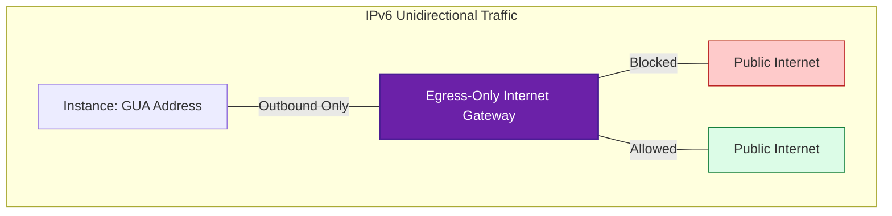

# 🌐 Module 03.03: IPv6 and Egress-Only Gateways

> **"In the world of IPv4, we hide behind NAT. In IPv6, we stand in the open, but we use an Egress-Only Gateway to ensure we can see the world without the world seeing us."**

## 📚 Overview

In the world of IPv4, we use NAT to hide private instances. In IPv6, there is no NAT. Every instance receives a **Globally Unique Address (GUA)** that is potentially reachable from anywhere on the planet. To maintain the "Outbound Only" security of a private subnet in an IPv6 environment, AWS provides the **Egress-Only Internet Gateway**. This module explains how to secure the next generation of networking.

## 🎓 Learning Objectives

By the end of this module, you will:

- ✅ Understand why **IPv6 does not use NAT**.
- ✅ Identify the role of the **Egress-Only Internet Gateway (EIGW)**.
- ✅ Contrast **IGW vs. EIGW** for inbound security.
- ✅ Configure **::/0 Routing** for private IPv6 subnets.
- ✅ Explain the concept of the **Globally Unique Address**.

---

## 🏗️ The End of NAT

IPv6 has a massive address space (2¹²⁸), containing roughly 340 undecillion addresses. We no longer need to "save" addresses by hiding thousands of instances behind one IP. 

| Layer | IPv4 Strategy | IPv6 Strategy |
| :--- | :--- | :--- |
| **Translation** | Uses NAT Gateway to change IP. | **No translation**. IP stays the same. |
| **Security** | Hidden via Private IP. | Protected via **Directional Routing**. |
| **Gateway** | NAT Gateway + IGW. | **Egress-Only IGW**. |

**The Magic**: An Egress-Only IGW allows your instance to send a request to a server in Japan, but if a hacker in Japan tries to send an unsolicited packet to your instance's IPv6 address, the EIGW drops it immediately.

---

## 🚀 Professional Pattern: IPv6-First Design

Modern DevOps teams are increasingly moving toward **IPv6-Only subnets** to avoid the cost of NAT Gateways and the complexity of CIDR math.

**The Pro Standard**:
1. **Cost Savings**: Unlike NAT Gateways (~$32/month), **Egress-Only IGWs are FREE**. 
2. **Simplified Routing**: You don't have to manage Elastic IPs or port exhaustion pools.
3. **Dual-Stack Transition**: While moving to IPv6, keep a small IPv4 CIDR for legacy compatibility but move all primary service-to-service traffic to IPv6 with Egress-Only protection.

---

## 🏆 Real-World DevOps Story: The IPv6 Security Gap

**The Scenario**: A major SaaS provider migrated their application servers to IPv6 to save on NAT costs. After the migration, their security logs showed thousands of direct pings and port scans hitting their "private" app servers from the public internet.
**The Crisis**: The team was using a standard **Internet Gateway** for their IPv6 default route (`::/0`). Because IPv6 doesn't use NAT, the standard IGW allowed traffic in both directions—effectively turning their private servers into public targets.
**The Discovery**: They realized that the "NAT security" they were used to in IPv4 didn't exist in IPv6 unless explicitly enforced.
**The Fix**: They replaced the `::/0` route to the IGW with a route to an **Egress-Only Internet Gateway**.
**The Lesson**: **Address type is not security.** A global IP is public by definition; only an Egress-Only gateway or a strict firewall can make it private again.

---

## ❓ Interview Preparation (IPv6 Networking)

1. **Q: Does IPv6 use NAT in a VPC?**
    *A: **No.** IPv6 addresses are globally unique and routable. We use Egress-Only Internet Gateways to simulate the "outbound-only" behavior of NAT without the overhead of IP translation.*

2. **Q: What is an Egress-Only Internet Gateway (EIGW)?**
    *A: It is a stateful, horizontally scaled VPC component that allows outbound IPv6 traffic while preventing the public internet from initiating a connection to your instances.*

3. **Q: Can an Egress-Only IGW handle IPv4 traffic?**
    *A: **No.** It is a protocol-specific resource designed exclusively for IPv6.*

4. **Q: What is the CIDR equivalent of '0.0.0.0/0' in IPv6?**
    *A: **::/0**. This represents all possible IPv6 addresses.*

5. **Q: Is there a cost for using an Egress-Only Internet Gateway?**
    *A: **No.** The resource itself is free, and there are no data processing fees like there are with NAT Gateways. You only pay standard AWS Data Transfer Out rates.*

---

## 📝 Knowledge Check

1. **Which component provides 'Outbound-Only' security for IPv6?**
    - [ ] a) NAT Gateway
    - [ ] b) Internet Gateway (IGW)
    - [x] c) Egress-Only Internet Gateway
    - [ ] d) Transit Gateway

2. **True or False: IPv6 instances in a private subnet require an Elastic IP.**
    - [ ] True
    - [x] False (Every IPv6 address is globally unique by default)

3. **What happens to inbound connection attempts from the internet in an Egress-Only IGW?**
    - [ ] a) They are translated
    - [x] b) They are dropped/blocked
    - [ ] c) They are forwarded to the instance
    - [ ] d) They are redirected to a Load Balancer

4. **Which protocol does the target '::/0' represent?**
    - [ ] a) IPv4
    - [x] b) IPv6
    - [ ] c) Binary
    - [ ] d) Hexadecimal

5. **What is a 'Globally Unique Address' (GUA)?**
    - [x] a) An IPv6 address that can be reached from anywhere in the world
    - [ ] b) An IP that only works inside a VPC
    - [ ] c) A MAC address
    - [ ] d) A reserved AWS internal address

---

## 🔗 Next Steps

You've mastered the gateways. Now let's see how to combine them into a high-availability architecture that never goes down.

Proceed to: **[04. High Availability and Optimization](../../../../../readme.md)** →