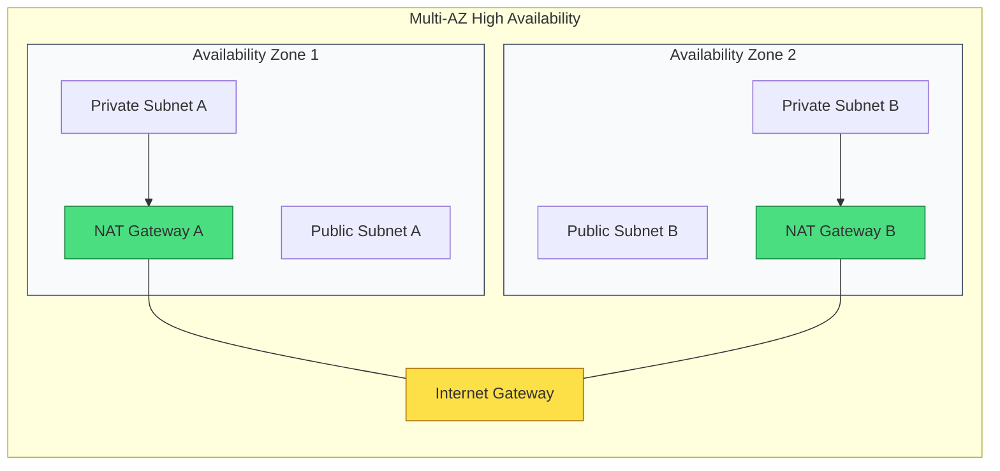

# ⚖️ Module 03.04: High Availability and Optimization

> **"A single NAT Gateway is a single point of failure. In the cloud, hope is not a strategy—redundancy is. Design for the failure of an entire data center, and you will never spend your weekend on an emergency bridge."**

## 📚 Overview

Designing gateways is not just about basic connectivity; it is about ensuring that a failure in one Availability Zone (AZ) doesn't bring down your entire architecture. This module focuses on the **Reliability** and **Efficiency** pillars of the Well-Architected Framework, teaching you how to build redundant egress paths and how to optimize your network bill by bypassing the "NAT Tax."

## 🎓 Learning Objectives

By the end of this module, you will:

- ✅ Identify the **Single Point of Failure** in common NAT designs.
- ✅ Implement a **Multi-AZ NAT Architecture** for maximum uptime.
- ✅ Utilize **VPC Gateway Endpoints** to eliminate S3/DynamoDB NAT costs.
- ✅ Analyze **VPC Flow Logs** to find "Ghost Traffic" and bill spikes.
- ✅ Configure **Local-Only Routing** to minimize Cross-AZ data charges.

---

## 🏗️ The Single-NAT Fallacy

Many teams deploy a single NAT Gateway in "Subnet A" and point all routes from all AZs to it. While this saves ~$32/month, it is a catastrophic risk for production.

1. **Failure Impact**: If AZ-1 experiences an outage, your NAT Gateway dies. Your servers in AZ-2 and AZ-3 are still running, but they can no longer talk to the internet. They crash, and your site goes down.
2. **The "Inter-AZ Tax"**: AWS charges for data moving between AZs. Sending data from an App Server in AZ-2 to a NAT in AZ-1 costs more than keeping it local.

**The Solution**: Deploy **One NAT per AZ**.

---

## 🚀 Professional Pattern: Bypassing the "NAT Tax"

NAT Gateways are expensive ($0.045/GB). If you are processing petabytes of data from S3, a NAT Gateway can easily cost thousands of dollars a month.

**The Pro Standard**:
1. **S3 Gateway Endpoints**: Always create a Gateway Endpoint for S3 and DynamoDB. These are **FREE** and ensure that traffic to these services never hits the NAT Gateway or the public internet.
2. **Interface Endpoints**: For other services (SQS, SNS, Kinesis), use **Interface Endpoints** (PrivateLink). While these have a cost, they are often cheaper and more secure than routing through a NAT.
3. **Flow Log Audits**: Schedule a monthly audit of your `nat-gateway-id` in CloudWatch to see which instances are the "top talkers" and move them to Endpoints where possible.

---

## 🏆 Real-World DevOps Story: The S3 Bill Spike

**The Scenario**: A data-science startup was running intensive training jobs on private GPU instances. They were using a standard NAT Gateway for all internet access.
**The Crisis**: Their monthly AWS bill arrived, and the Networking section showed a $15,000 charge just for "NAT Gateway Data Processing."
**The Discovery**: The GPU jobs were downloading terabytes of training data from an S3 bucket. Because the instances were in a private subnet, every byte was transiting the NAT Gateway.
**The Fix**: A senior engineer deployed an **S3 Gateway Endpoint** in 30 seconds.
**The Impact**: The NAT bill dropped from $15,000 to $50. The S3 traffic became free and stayed within the AWS backbone.
**The Lesson**: **Endpoints are not optional.** Never route S3 traffic through a NAT Gateway in a data-heavy environment.

---

## ❓ Interview Preparation (HA & Optimization)

1. **Q: How do you achieve High Availability for a NAT Gateway?**
    *A: You must deploy one NAT Gateway per Availability Zone. NAT Gateways are highly available within an AZ, but they cannot failover across AZs. By having one in each zone, you ensure that an outage in one AZ doesn't impact the others.*

2. **Q: What is 'Cross-AZ Data Transfer' and why does it matter for NAT?**
    *A: It is a charge for data moving between different AZs. If your App server in AZ-1 uses a NAT Gateway in AZ-2, you pay for the data processing AND the cross-AZ transfer. Using a local NAT Gateway avoids the cross-AZ fee.*

3. **Q: How can you identify which instance is causing high NAT Gateway costs?**
    *A: Enable **VPC Flow Logs** and filter for the NAT Gateway's private IP. You can then see which internal Source IP addresses are sending the most traffic to the NAT Gateway.*

4. **Q: What is a Gateway Endpoint?**
    *A: It is a free VPC component that provides a private connection to S3 or DynamoDB without using an IGW or NAT. It works by updating your subnet's Route Table automatically.*

5. **Q: Can a NAT Gateway scale beyond 45 Gbps?**
    *A: Yes. While it starts with a baseline, it scales automatically up to **100 Gbps**. If you need more than that, you should distribute your traffic across multiple NAT Gateways.*

---

## 📝 Knowledge Check

1. **What is the most cost-effective way to access S3 from a private subnet?**
    - [ ] a) NAT Gateway
    - [ ] b) Internet Gateway
    - [x] c) Gateway Endpoint
    - [ ] d) Direct Connect

2. **To achieve regional high availability, how many NAT Gateways should you have in a 3-AZ VPC?**
    - [ ] a) 1
    - [ ] b) 2
    - [x] c) 3
    - [ ] d) 6

3. **Which logging service allows you to audit NAT Gateway traffic?**
    - [ ] a) CloudTrail
    - [ ] b) S3 Access Logs
    - [x] c) VPC Flow Logs
    - [ ] d) Inspector

4. **True or False: Gateway Endpoints (for S3/DynamoDB) have an hourly charge.**
    - [ ] True
    - [x] False (They are free of charge)

5. **A NAT Gateway in AZ-A can support instances in AZ-B, but what is the disadvantage?**
    - [ ] a) No internet access
    - [b] b) Cross-AZ data transfer fees and single point of failure
    - [ ] c) Lower bandwidth
    - [ ] d) Incompatibility with IPv6

---

## 🔗 Next Steps

You've built a rock-solid gateway architecture. Now let's explore the "Brain" of the VPC—the Route Tables that tell every packet where to go.

Proceed to: **[Module 04: Routing & Route Tables](../../../../../readme.md)** →