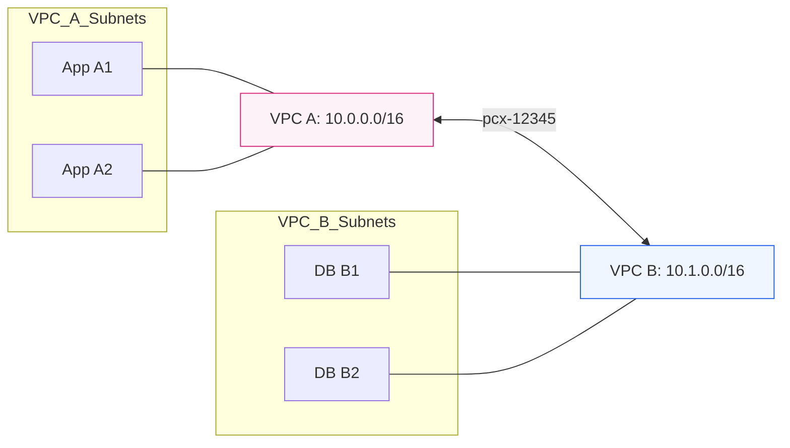

# 🔗 Module 06.01: VPC Peering Basics

> **"A VPC Peering connection is a networking connection between two VPCs that enables you to route traffic between them using private IP addresses. It's essentially a virtual fiber-optic cable between two separate cloud networks."**

## 📚 Overview

**VPC Peering** is the simplest way to connect two VPCs. Unlike a VPN, it doesn't use the public internet and doesn't have an encryption overhead bottleneck. Traffic travels entirely on the AWS global network backbone, providing high bandwidth and consistent low latency. It is a "point-to-point" relationship, meaning to connect three VPCs (A, B, and C) so they can all talk to each other, you need three separate peering connections.

## 🎓 Learning Objectives

By the end of this module, you will:

- ✅ Understand the **Point-to-Point** nature of peering.
- ✅ Navigate the **Request/Accept** lifecycle for cross-account connectivity.
- ✅ Identify and prevent **CIDR Overlap** conflicts.
- ✅ Understand the cost structure (Inter-Region vs. Intra-Region).
- ✅ Recognize the limitations of **Non-Transitive** routing.

---

## 🏗️ Core Concepts

### 1. The Handshake Process
Peering is a mutual agreement. One VPC owner initiates the request, and the other must explicitly accept it within 7 days. This applies even if both VPCs are in the same account.

### 2. Constraints & Limits
- **Overlap**: You cannot peer VPCs with overlapping CIDRs (e.g., `10.0.0.0/16` and `10.0.1.0/24`).
- **Scale**: You can have up to 50-125 peering connections per VPC. Beyond that, you should move to Transit Gateway.
- **Service Continuity**: You cannot add or remove CIDR blocks from a VPC while it has an active peering connection.

---

## 🚀 Professional Pattern: The "Shared Services" VPC

A common pattern for smaller startups is to have a "Tools" or "Shared Services" VPC.

**The Pro Standard**:
1. **The Hub**: Create one VPC for shared tools like Jenkins, Grafana, or Active Directory.
2. **The Spokes**: Peer your Prodn, Staging, and Dev VPCs to the Hub.
3. **The Benefit**: You only maintain one instance of each tool, and they all talk securely to your workloads via private peering.
4. **The Security**: Use Security Group referencing (available in same-region peering) to allow only specific tools to talk to specific production databases.

---

## 🏆 Real-World DevOps Story: The 7-Day Expiration Ghost

**The Scenario**: A junior admin was tasked with peering a Client's VPC (Account B) with the company's "Logging VPC" (Account A). He sent the request on a Friday.
**The Crisis**: On the following Monday, the networking team tried to configure the routes, but they couldn't find the `pcx-` ID in Account B.
**The Discovery**: The Client's manager didn't log in to accept the request. Because peering requests expire after 7 days, and the manager was on vacation, the request simply "vanished" from the active view.
**The Fix**: A new request was sent, and the team waited for a "Slack Confirmation" from the client that it was accepted before proceeding with route table updates.
**The Lesson**: **Networking is 50% technical and 50% communication.** Always track the lifecycle of your requests.

---

## ❓ Interview Preparation (Peering Basics)

1. **Q: Can you peer two VPCs across different AWS Accounts?**
    *A: Yes. You only need the Account ID and the VPC ID of the target to initiate the request.*

2. **Q: Does VPC Peering traffic go over the public internet?**
    *A: No. All peering traffic (even inter-region) travels over the private AWS global network backbone.*

3. **Q: What happens if you try to peer VPC A (10.0.0.0/16) with VPC B (10.0.0.0/24)?**
    *A: The request will fail. Even if the CIDRs are not identical, an overlap (where one is a subset of the other) prevents the routing logic from distinguishing local traffic from peered traffic.*

4. **Q: Is there an hourly charge for a VPC Peering connection?**
    *A: No. Peering is free to set up. You only pay standard AWS data transfer charges (Inter-AZ or Inter-Region) for the data that actually travels through the link.*

5. **Q: Is VPC Peering transitive?**
    *A: No. If A is peered with B, and B is peered with C, A cannot reach C through B. You must create a direct peer between A and C.*

---

## 📝 Knowledge Check

1. **What is the default prefix for a VPC Peering connection ID?**
    - [ ] a) vpc-
    - [x] b) pcx-
    - [ ] c) tgw-
    - [ ] d) vpn-

2. **How long does a peering request stay in 'Pending Acceptance' before expiring?**
    - [ ] a) 24 Hours
    - [ ] b) 3 Days
    - [x] c) 7 Days
    - [ ] d) 30 Days

3. **True or False: Inters-Region Peering traffic is encrypted on the AWS backbone.**
    - [x] True 
    - [ ] False

4. **Which condition MUST be met to peer two VPCs?**
    - [ ] a) They must be in the same region
    - [ ] b) They must be in the same account
    - [x] c) They must have non-overlapping CIDR blocks
    - [ ] d) They must have an Internet Gateway

5. **Who initiates a VPC Peering connection?**
    - [x] a) The Requester
    - [ ] b) The Accepter
    - [ ] c) AWS Support
    - [ ] d) Route 53

---

## 🔗 Next Steps

You've built the bridge. Now let's see how to tell your servers how to use it by updating Route Tables and Security Groups.

Proceed to: **[02. Routing & Security in Peering](../02-routing-and-security-in-peering/readme.md)** →
Node: This link points to the next lesson.