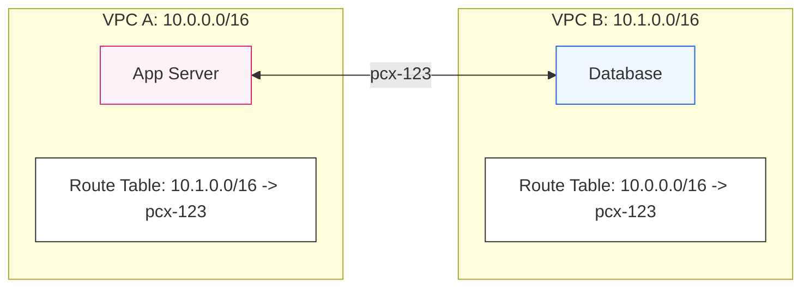

# 🚏 Module 06.02: Routing & Security in Peering

> **"Connectivity is only half the battle. In a peered environment, the 'Invisible Walls' of Route Tables and Security Groups are what truly define whether data flows or dies at the border."**

## 📚 Overview

Establishing a **VPC Peering** connection is like plugging in a network cable. However, just plugging it in doesn't mean your devices know how to talk across it. This module covers the critical post-connection steps: manual **Route Table** updates, enabling **Private DNS Resolution**, and the strict rules governing **Transitive Routing** (or the lack thereof). We will also explore how **Security Groups** can work across accounts to provide a truly integrated security posture.

## 🎓 Learning Objectives

By the end of this module, you will:

- ✅ Configure **Static Routes** for bidirectional traffic flow.
- ✅ Understand the **Non-Transitive** limitation and its architectural impact.
- ✅ Enable **DNS Resolution Support** for private EC2 hostnames.
- ✅ Implement **Cross-VPC Security Group Referring** (Same Region).
- ✅ Identify **Edge-to-Edge** routing violations (IGW/VPN bypass).

---

## 🏗️ Core Rules

### 1. The Non-Transitive Law
VPC Peering is a direct 1-to-1 relationship. If A is peered with B, and B is peered with C, **A cannot reach C through B**. This prevents unplanned "transit" through your network. To link A to C, you need a direct peering connection or a Transit Gateway.

### 2. Manual Routing
AWS does NOT automatically update your route tables when a peer is accepted. You must manually add a route in **both VPCs** pointing to the other's CIDR range with the target set to the `pcx-` ID.

### 3. DNS Resolution
By default, you can only ping a peer's IP address. To resolve private DNS names (e.g., `ip-10-0-1-5.ec2.internal`), you must enable "DNS Resolution Support" in the Peering Connection options for both the requester and the accepter.

---

## 🚀 Professional Pattern: Cross-VPC "Least Privilege"

Instead of allowing "All traffic from 10.0.0.0/16," senior architects use **Security Group Referencing**.

**The Pro Standard**:
1. **The Peered Link**: Ensure VPC A and VPC B are in the **same region**.
2. **The Database (VPC B)**: Set a rule to "Allow MySQL (3306) from `sg-12345 (VPC A)`".
3. **The Web Server (VPC A)**: Has `sg-12345` assigned.
4. **The Benefit**: If you add 10 more web servers, they automatically have access. If a server is compromised and you remove it from the SG, it loses access instantly. No IP maintenance required.

---

## 🏆 Real-World DevOps Story: The "Hidden Hop" Failure

**The Scenario**: A company had a secure VPC A connected via VPN to their on-premise office. They peered VPC A with a new "Dev VPC" (VPC B).
**The Crisis**: Developers in the physical office could SSH into servers in VPC A, but they couldn't reach VPC B, even though the routes in VPC A seemed correct.
**The Discovery**: They were attempting **Edge-to-Edge Routing**. The VPN traffic entered VPC A, but AWS routing logic forbade it from "hopping" over the peering link to VPC B.
**The Fix**: They had to establish a separate VPN for VPC B, or (the better long-term fix) migrate all connections to a **Transit Gateway**, which *does* support edge-to-edge transit.
**The Lesson**: **Peering is a bridge, not a bypass.** It won't carry traffic from other gateways (VPN, DX, or IGW).

---

## ❓ Interview Preparation (Routing & Security)

1. **Q: Can you reach a peered VPC's Internet Gateway (IGW)?**
    *A: **No.** VPC Peering does not support 'Edge-to-Edge' routing. You cannot use a peer's internet connection or VPN gateway to reach a third party.*

2. **Q: What happens if you forget to add a route in the 'Accepter' VPC?**
    *A: Traffic will reach the destination server, but the server won't know how to send the 'Reply' back. The connection will time out, even if the Security Groups are correct.*

3. **Q: Can you resolve cross-account private DNS hostnames?**
    *A: Yes, but only if 'DNS Resolution Support' is enabled on the peering connection for both the requester and the accepter accounts.*

4. **Q: Is it possible to reference a Security Group from a different region in a peering rule?**
    *A: **No.** Security Group referencing only works within the same region (though the VPCs can be in different accounts).*

5. **Q: Why is 'Non-Transitivity' considered a security feature?**
    *A: It prevents "lateral movement" by default. If a hacker compromises one network, they can't automatically hop through all your peered networks unless you've explicitly built a mesh.*

---

## 📝 Knowledge Check

1. **VPC A is peered with VPC B. For A to talk to B, you must add a route to:**
    - [ ] a) Only VPC A's Route Table
    - [ ] b) Only VPC B's Route Table
    - [x] c) Both VPC A and VPC B's Route Tables
    - [ ] d) The Internet Gateway

2. **If VPC A is peered to VPC B and VPC B is peered to VPC C, can A talk to C through B?**
    - [ ] a) Yes, by default
    - [ ] b) Yes, if routes are added
    - [x] c) No, this is non-transitive and forbidden
    - [ ] d) Only if they are in the same account

3. **Which option must be enabled to resolve cross-VPC private hostnames?**
    - [ ] a) Public IP address
    - [x] b) DNS Resolution Support
    - [ ] c) DHCP Option Sets
    - [ ] d) Route 53 Resolver

4. **True or False: You can reference a Security Group ID from a peered VPC in a different region.**
    - [ ] True 
    - [x] False (Same region only)

5. **A 'pcx' target in a route table refers to:**
    - [ ] a) A VPN Gateway
    - [x] b) A VPC Peering Connection
    - [ ] c) A Transit Gateway
    - [ ] d) A NAT Gateway

---

## 🔗 Next Steps

Peering works for pairs, but what happens when you have 100 VPCs? Let's look at the centralized "Cloud Router" that solves the mesh complexity.

Proceed to: **[03. Transit Gateway Architecture](../03-transit-gateway-architecture/readme.md)** →
Node: This link points to the next lesson.