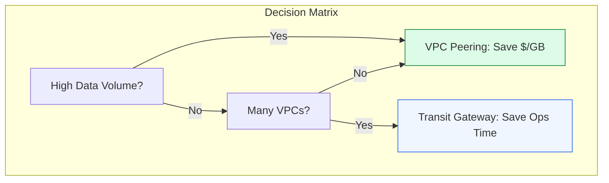

# 📉 Module 06.04: Interconnectivity Optimization

> **"Choosing between VPC Peering and Transit Gateway isn't just a technical decision; it's a financial one. One is a free, manual bridge; the other is a paid, managed highway. Build for the scale you have, but plan for the budget you want."**

## 📚 Overview

The choice between **VPC Peering** and **Transit Gateway** is one of the most common architectural debates in AWS. While TGW offers incredible management simplicity and transitive routing, it comes with a "hidden" **$0.02/GB processing fee** that can break the bank for high-volume data workloads. This module explores the trade-offs in performance (MTU), cost (Data Processing vs. Ops Hours), and complexity (The mesh explosion) to help you choose the right tool for the job.

## 🎓 Learning Objectives

By the end of this module, you will:

- ✅ Compare **VPC Peering** and **Transit Gateway** across cost and performance metrics.
- ✅ Identify "Cost Hotspots" where TGW processing fees overwhelm the budget.
- ✅ Understand **MTU (Maximum Transmission Unit)** limits and their impact on throughput.
- ✅ Architect a **Hybrid Model** that uses both TGW and Peering for optimal efficiency.
- ✅ Calculate the **Return on Investment (ROI)** of moving to a hub-and-spoke model.

---

## 🏗️ The Decision Matrix

| Feature | VPC Peering | Transit Gateway |
| :--- | :--- | :--- |
| **Setup Fee** | **$0** (No hourly charge) | **~$36/month** per attachment |
| **Processing Fee**| **$0** (Standard traffic rates only) | **$0.02 per GB** (In & Out) |
| **Max Scale** | 50-125 Peering connections | 5,000 VPC attachments |
| **MTU** | 9001 (Jumbo Frames) | 8500 (VPC) / 1500 (VPN/Peering) |
| **Transitive?** | No | Yes |

---

## 🚀 Professional Pattern: The "Data Lake" Bridge

Imagine you have many VPCs connected via TGW. One of them (VPC A) is a "Data Lake" that receives 500TB of logs every month from VPC B.

**The Pro Standard**:
1. **The Management**: Keep both VPC A and VPC B connected to the **Transit Gateway** for general management, SSH, and monitoring.
2. **The Data Path**: Create a **Direct VPC Peering** connection solely for the 500TB log transfer.
3. **The Savings**: 500,000 GB * $0.02 = **$10,000 saved per month.**
4. **The Routing**: Update the route tables in VPC B so that specifically the Data Lake's CIDR points to the `pcx-` ID, while all other traffic goes to the `tgw-` ID.

---

## 🏆 Real-World DevOps Story: The $40k Surprise

**The Scenario**: A startup migrated from 10 VPC Peering connections to a single Transit Gateway to "simplify their Terraform code."
**The Crisis**: Their monthly AWS bill arrived, and the "Transit Gateway" line item was $40,000.
**The Discovery**: They had a high-frequency synchronization job between two databases that moved 2 Petabytes of data a month. In their previous peering setup, this was "free" (only internal traffic rates). Through TGW, they were being charged $0.02 per GB for every byte.
**The Fix**: They kept the TGW for their 100+ other low-volume services but re-established a dedicated Peering link for the database sync.
**The Lesson**: **Simplicity has a Price.** For high-volume data flows, the "Old School" peering method is still the gold standard for cost optimization.

---

## ❓ Interview Preparation (Optimization)

1. **Q: When is VPC Peering more performant than Transit Gateway?**
    *A: Peering supports **Jumbo Frames (9001 MTU)** across the entire link in the same region, whereas TGW is limited to **8500 MTU**. Peering also has no bandwidth "middleman," meaning it is only limited by the capacity of the instance and the AWS network fabric.*

2. **Q: How does TGW help consolidate NAT Gateway costs?**
    *A: Instead of putting a NAT Gateway in every VPC ($32/month each), you can create a single 'Central Egress VPC' with one pair of NAT Gateways. All other VPCs route their 0.0.0.0/0 traffic through the TGW to that central hub.*

3. **Q: What is the 'Data Processing Fee' in TGW?**
    *A: It is a charge of $0.02 for every Gigabyte of data that passes through the Transit Gateway. This is in addition to the hourly fee for the attachment and any standard inter-region data transfer fees.*

4. **Q: Does TGW Peer across regions support Jumbo Frames?**
    *A: **No.** Traffic that travels over a TGW Peering connection (Inter-Region) is limited to a **1500 MTU**.*

5. **Q: Is there any scenario where TGW is cheaper than Peering?**
    *A: From a 'Human Cost' perspective, yes. If managing a mesh of 50 peering connections takes 20 hours of a Senior Engineer's time every month ($2,000+), the $36/month TGW attachment fee is a bargain. However, from a 'Traffic Cost' perspective, peering is almost always cheaper.*

---

## 📝 Knowledge Check

1. **What is the MTU limit for traffic traveling between two VPCs via Transit Gateway?**
    - [ ] a) 1500
    - [ ] b) 9001
    - [x] c) 8500
    - [ ] d) Unlimited

2. **Which connectivity option has a $0.00 hourly fee per connection?**
    - [x] a) VPC Peering
    - [ ] b) Transit Gateway Attachment
    - [ ] c) Site-to-Site VPN
    - [ ] d) NAT Gateway

3. **Transferring 100 TB of data through a TGW costs approximately how much in processing fees?**
    - [ ] a) $20
    - [ ] b) $200
    - [x] c) $2,000
    - [ ] d) $20,000

4. **Which tool would you use to share a TGW across multiple AWS accounts to simplify architecture?**
    - [ ] a) VPC Peering
    - [x] b) AWS RAM (Resource Access Manager)
    - [ ] c) IAM Roles
    - [ ] d) Organizations SCP

5. **True or False: Using a central 'Egress VPC' can reduce the total count of NAT Gateways needed in a large organization.**
    - [x] True 
    - [ ] False

---

## 🔗 Next Steps

You've mastered the interconnectivity layer. Now let's dive into distributing traffic across your servers using Cloud Load Balancers.

Proceed to: **[Module 07: Load Balancing (ALB/NLB)](../../../../../readme.md)** →
Node: This link points to the next level of the curriculum.